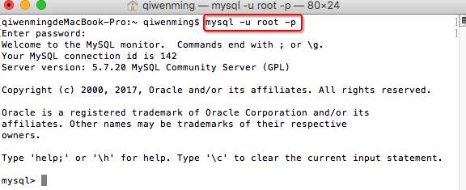
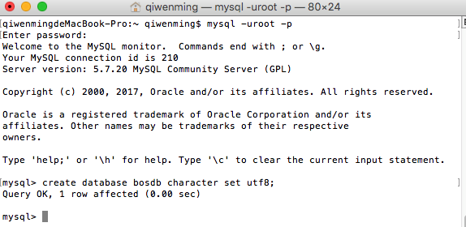
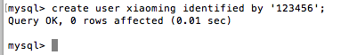
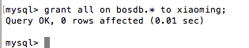
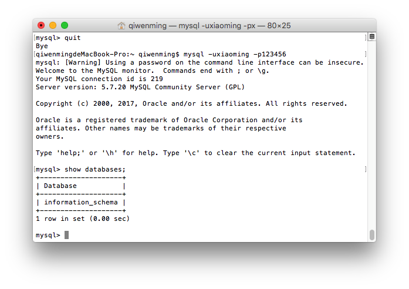
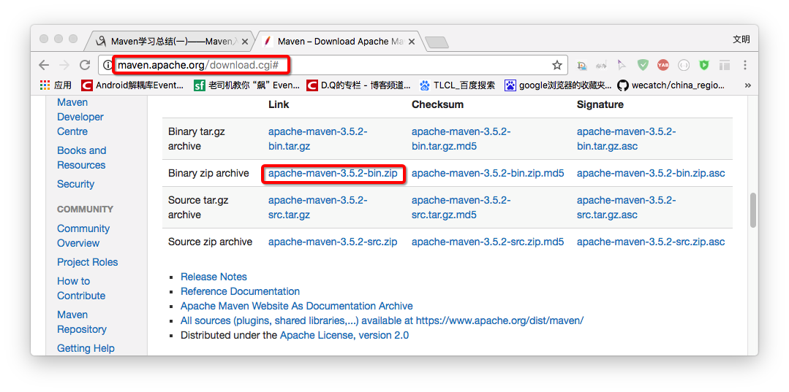
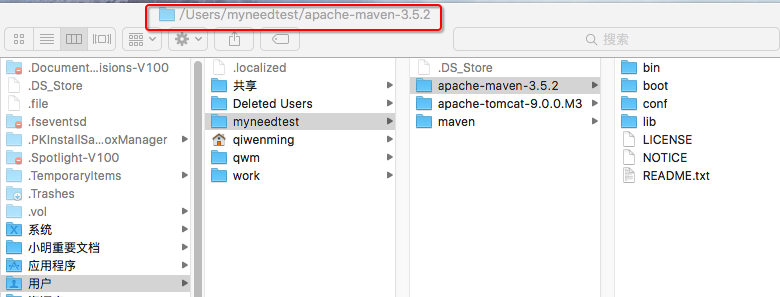
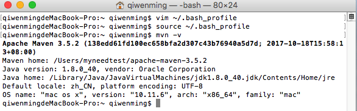

[TOC]

# BOS物流项目笔记


[BOS物流项目01———项目开发准备](blog/01.md)


----

[TOC]

# BOS物流项目01———项目开发准备

## 一、项目说明

**BOS**：Bussiness Operating System 业务操作系统


**常见的软件类型**

OA:办公自动化系统

CRM:客户关系管理系统

ERP:综合的企业解决方案（平台）


这个项目只是物流中的一小部分而已。


---

## 二、准备数据库

### 2.1 安装 MySql 数据库

我使用的使用 mac 按照步骤很简单，可以查看下面的文章

[Mac下安装mysql5.7 完整步骤（图文详解）](http://www.jb51.net/article/103841.htm)


### 2.1 创建 bosdb 数据库

数据库使用 MySql5.7,需要创建一个 名为 **bosdb**的数据，添加一个账号为 **xiaoming** 密码为 **123456**的用户 。

1 打开数据库


2 使用 root 账户登录进入

```sql
 mysql -u root -p
```



3 创建数据库 **bosdb**

```sql
create database bosdb character set utf8;
```



4 创建用户 **xiaoming** 密码是 **123456**

```sql
create user xiaoming identified by '123456' ;
```




5 为**xiaoming** 授权
```sql
grant all on bosdb.* to xiaoming;
```



6 使用新用户**xiaoming** 登录





----

## 三、安装maven

maven 的具体使用可以查看

[Maven学习总结](http://www.cnblogs.com/xdp-gacl/category/544719.html)

### 3.1 maven 下载

下载地址是：

[http://maven.apache.org/download.cgi#](http://maven.apache.org/download.cgi#)




### 3.2 解压安装


解压到 **/usr/local/**

例如

```
/Users/myneedtest/apache-maven-3.5.2
```



### 3.3 配置maven

在终端，输入

```
vim /.bash_profile
```

在文件中加入下面的代码

```
export M2_HOME=/Users/myneedtest/apache-maven-3.5.2
export PATH=${PATH}:${M2_HOME}/bin
```

保存退出 **wq!**

然后在终端输入 

```
source ~/.bash_profile
maven -version
```




### 3.4 配置本地仓库

打开 Maven home 中 conf 中的 settings.xml 配置本地仓库，如下


```xml
<?xml version="1.0" encoding="UTF-8"?>
<settings xmlns="http://maven.apache.org/SETTINGS/1.0.0"
          xmlns:xsi="http://www.w3.org/2001/XMLSchema-instance"
          xsi:schemaLocation="http://maven.apache.org/SETTINGS/1.0.0 http://maven.apache.org/xsd/settings-1.0.0.xsd">
  <localRepository>/Users/myneedtest/maven/repository</localRepository>
  ..........
</settings>  
```


----


