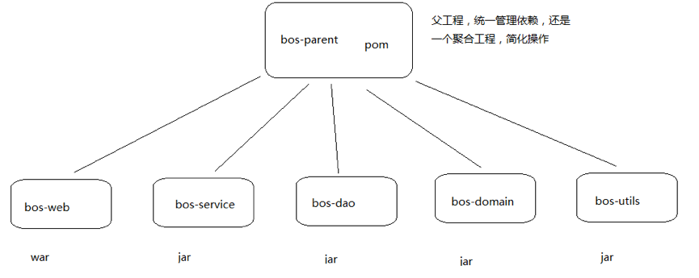
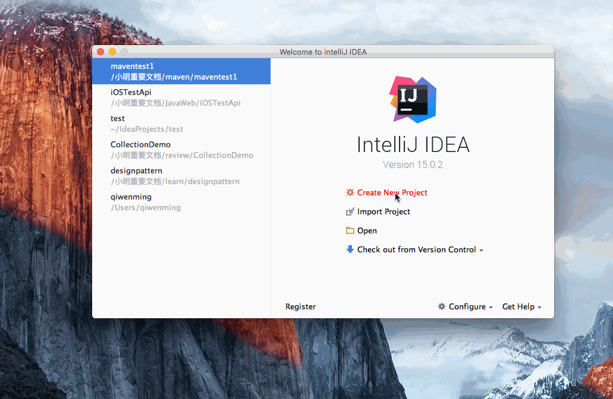
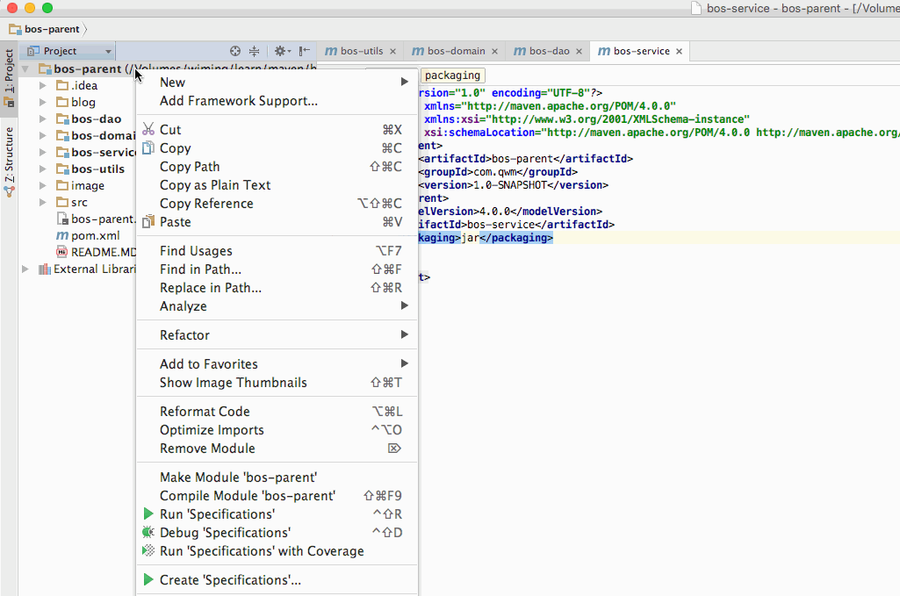
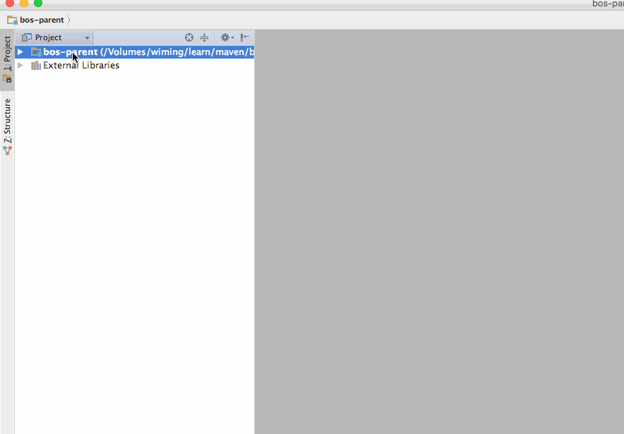
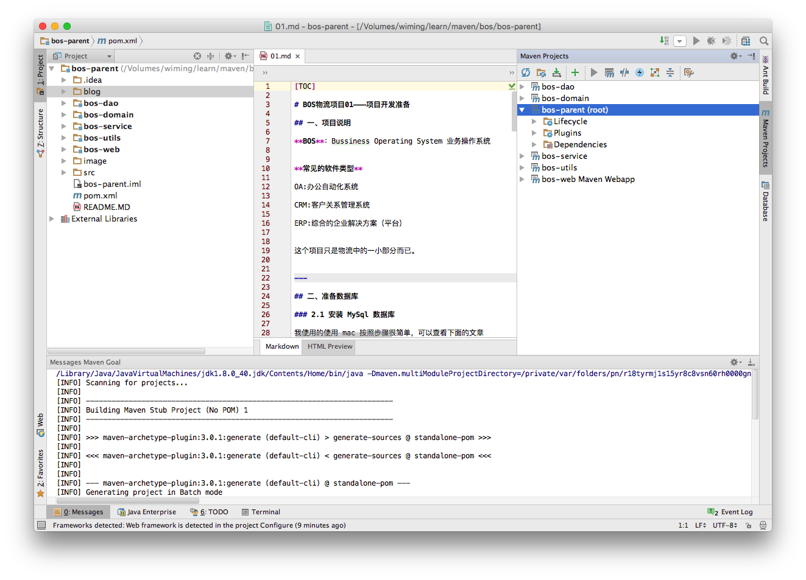

[TOC]

# BOS物流项目01———创建项目

## 一、项目创建说明

使用 maven 作为依赖管理和项目构建的工具

项目分模块开发,如下




----


## 二、创建 bos-parent

创建项目



选择maven


创建的项目的 pom.xml 中，包的类型是 pom

```xml
<?xml version="1.0" encoding="UTF-8"?>
<project xmlns="http://maven.apache.org/POM/4.0.0"
         xmlns:xsi="http://www.w3.org/2001/XMLSchema-instance"
         xsi:schemaLocation="http://maven.apache.org/POM/4.0.0 http://maven.apache.org/xsd/maven-4.0.0.xsd">
    <modelVersion>4.0.0</modelVersion>
    <groupId>com.qwm</groupId>
    <artifactId>bos-parent</artifactId>
    <version>1.0-SNAPSHOT</version>
    <packaging>pom</packaging>
</project>
```


---

## 三、创建 bos-web



创建的项目的 pom.xml 中，包的类型是 war

```xml
<project xmlns="http://maven.apache.org/POM/4.0.0" xmlns:xsi="http://www.w3.org/2001/XMLSchema-instance"
         xsi:schemaLocation="http://maven.apache.org/POM/4.0.0 http://maven.apache.org/maven-v4_0_0.xsd">
    <parent>
        <artifactId>bos-parent</artifactId>
        <groupId>com.qwm</groupId>
        <version>1.0-SNAPSHOT</version>
    </parent>
    <modelVersion>4.0.0</modelVersion>
    <artifactId>bos-web</artifactId>
    <packaging>war</packaging>
    <name>bos-web Maven Webapp</name>
    <url>http://maven.apache.org</url>
    <build>
        <finalName>bos-web</finalName>
    </build>
</project>
```

---

## 四、创建其他

创建其他模块是一样，如下

**bos-utils**

**bos-dao**

**bos-domain**

**bos-service**




创建的项目的 pom.xml 中，包的类型是 jar

```xml
<?xml version="1.0" encoding="UTF-8"?>
<project xmlns="http://maven.apache.org/POM/4.0.0"
         xmlns:xsi="http://www.w3.org/2001/XMLSchema-instance"
         xsi:schemaLocation="http://maven.apache.org/POM/4.0.0 http://maven.apache.org/xsd/maven-4.0.0.xsd">
    <parent>
        <artifactId>bos-parent</artifactId>
        <groupId>com.qwm</groupId>
        <version>1.0-SNAPSHOT</version>
    </parent>
    <modelVersion>4.0.0</modelVersion>
    <artifactId>bos-utils</artifactId>
    <packaging>jar</packaging>
</project>
```


---

## 五、父工程中添加依赖

父工程的 pom.xml 如下

```xml
<?xml version="1.0" encoding="UTF-8"?>
<project xmlns="http://maven.apache.org/POM/4.0.0"
         xmlns:xsi="http://www.w3.org/2001/XMLSchema-instance"
         xsi:schemaLocation="http://maven.apache.org/POM/4.0.0 http://maven.apache.org/xsd/maven-4.0.0.xsd">
    <modelVersion>4.0.0</modelVersion>

    <groupId>com.qwm</groupId>
    <artifactId>bos-parent</artifactId>
    <version>1.0-SNAPSHOT</version>
    <packaging>pom</packaging>

     <description>这是一个父工程，同时也是一个聚合工程</description>
  <!-- 通过属性定义指定jar的版本 -->
    <properties>
        <spring.version>4.2.4.RELEASE</spring.version>
        <hibernate.version>5.0.7.Final</hibernate.version>
        <struts2.version>2.3.24</struts2.version>
        <slf4j.version>1.6.6</slf4j.version>
        <log4j.version>1.2.12</log4j.version>
        <shiro.version>1.2.3</shiro.version>
    </properties>

    <dependencies>
        <dependency>
            <groupId>org.springframework</groupId>
            <artifactId>spring-context</artifactId>
            <version>${spring.version}</version>
        </dependency>

        <dependency>
            <groupId>org.springframework</groupId>
            <artifactId>spring-context-support</artifactId>
            <version>${spring.version}</version>
        </dependency>

        <dependency>
            <groupId>org.springframework</groupId>
            <artifactId>spring-web</artifactId>
            <version>${spring.version}</version>
        </dependency>

        <dependency>
            <groupId>org.springframework</groupId>
            <artifactId>spring-orm</artifactId>
            <version>${spring.version}</version>
        </dependency>

        <dependency>
            <groupId>org.springframework</groupId>
            <artifactId>spring-beans</artifactId>
            <version>${spring.version}</version>
        </dependency>

        <dependency>
            <groupId>org.springframework</groupId>
            <artifactId>spring-core</artifactId>
            <version>${spring.version}</version>
        </dependency>

        <dependency>
            <groupId>org.aspectj</groupId>
            <artifactId>aspectjweaver</artifactId>
            <version>1.7.4</version>
        </dependency>

        <!-- struts2 begin -->
        <dependency>
            <groupId>org.apache.struts</groupId>
            <artifactId>struts2-core</artifactId>
            <version>${struts2.version}</version>
            <!-- 排除传递的依赖 -->
            <exclusions>
                <exclusion>
                    <artifactId>javassist</artifactId>
                    <groupId>javassist</groupId>
                </exclusion>
            </exclusions>
        </dependency>
        <dependency>
            <groupId>org.apache.struts</groupId>
            <artifactId>struts2-spring-plugin</artifactId>
            <version>${struts2.version}</version>
        </dependency>
        <dependency>
            <groupId>org.apache.struts</groupId>
            <artifactId>struts2-convention-plugin</artifactId>
            <version>${struts2.version}</version>
        </dependency>
        <!-- struts2 end -->

        <!-- hibernate begin -->
        <dependency>
            <groupId>org.hibernate</groupId>
            <artifactId>hibernate-core</artifactId>
            <version>${hibernate.version}</version>
        </dependency>
        <!-- hibernate end -->

        <!-- log start -->
        <dependency>
            <groupId>log4j</groupId>
            <artifactId>log4j</artifactId>
            <version>${log4j.version}</version>
        </dependency>

        <dependency>
            <groupId>org.slf4j</groupId>
            <artifactId>slf4j-api</artifactId>
            <version>${slf4j.version}</version>
        </dependency>

        <dependency>
            <groupId>org.slf4j</groupId>
            <artifactId>slf4j-log4j12</artifactId>
            <version>${slf4j.version}</version>
        </dependency>
        <!-- log end -->

        <dependency>
            <groupId>org.apache.poi</groupId>
            <artifactId>poi</artifactId>
            <version>3.11</version>
        </dependency>

        <dependency>
            <groupId>org.apache.cxf</groupId>
            <artifactId>cxf-rt-frontend-jaxws</artifactId>
            <version>3.0.1</version>
        </dependency>
        <dependency>
            <groupId>org.apache.cxf</groupId>
            <artifactId>cxf-rt-transports-http</artifactId>
            <version>3.0.1</version>
        </dependency>
        <dependency>
            <groupId>junit</groupId>
            <artifactId>junit</artifactId>
            <version>4.10</version>
            <scope>test</scope>
        </dependency>

        <!-- 加入servlet和jsp的依赖 -->
        <dependency>
            <groupId>javax.servlet</groupId>
            <artifactId>servlet-api</artifactId>
            <version>2.5</version>
            <scope>provided</scope>
        </dependency>
        <dependency>
            <groupId>javax.servlet</groupId>
            <artifactId>jsp-api</artifactId>
            <version>2.0</version>
            <scope>provided</scope>
        </dependency>

        <!-- 引入pinyin4J的依赖 -->
        <dependency>
            <groupId>com.belerweb</groupId>
            <artifactId>pinyin4j</artifactId>
            <version>2.5.0</version>
        </dependency>
        
        <!-- 引入json-lib的依赖 -->
        <dependency>
            <groupId>net.sf.json-lib</groupId>
            <artifactId>json-lib</artifactId>
            <version>2.4</version>
        </dependency>
        
        <!-- 引入c3p0jar包 -->
        <dependency>
            <groupId>c3p0</groupId>
            <artifactId>c3p0</artifactId>
            <version>0.9.1.2</version>
        </dependency>
        
        <!-- 引入ehcache的依赖 -->
        <dependency>
            <groupId>net.sf.ehcache</groupId>
            <artifactId>ehcache-core</artifactId>
            <version>2.6.6</version>
        </dependency>
        <!-- 引入shiro框架的依赖 -->
        <dependency>
            <groupId>org.apache.shiro</groupId>
            <artifactId>shiro-all</artifactId>
            <version>1.2.2</version>
        </dependency>
        <!-- 引入MySQL数据库驱动依赖 -->
        <dependency>
            <groupId>mysql</groupId>
            <artifactId>mysql-connector-java</artifactId>
            <version>5.1.32</version>
        </dependency>
    </dependencies>

    <build>
        <!-- 插件 -->
        <plugins>
            <plugin>
                <groupId>org.apache.maven.plugins</groupId>
                <artifactId>maven-resources-plugin</artifactId>
                <version>2.5</version>
            </plugin>
            <plugin>
                <groupId>org.apache.maven.plugins</groupId>
                <artifactId>maven-compiler-plugin</artifactId>
                <version>2.3.2</version>
                <configuration>
                    <source>1.7</source>
                    <target>1.7</target>
                </configuration>
            </plugin>
            <!-- 引入tomcat插件 -->
            <plugin>
                <groupId>org.apache.tomcat.maven</groupId>
                <artifactId>tomcat7-maven-plugin</artifactId>
                <version>2.2</version>
                <configuration>
                    <path>/bos</path>
                    <port>8888</port>
                </configuration>
            </plugin>
        </plugins>
        <resources>
            <resource>
                <directory>src/main/java</directory>
                <includes>
                    <include>**/*.properties</include>
                    <include>**/*.xml</include>
                </includes>
                <filtering>false</filtering>
            </resource>
            <resource>
                <directory>src/main/resources</directory>
                <includes>
                    <include>**/*.properties</include>
                    <include>**/*.xml</include>
                </includes>
                <filtering>false</filtering>
            </resource>
        </resources>
    </build>


    <modules>
        <module>bos-utils</module>
        <module>bos-domain</module>
        <module>bos-dao</module>
        <module>bos-service</module>
        <module>bos-web</module>
    </modules>


</project>

```

项目的最终界面结构是这样的




