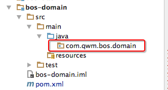
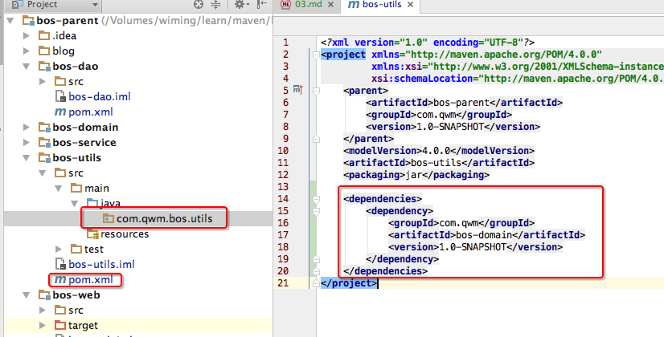
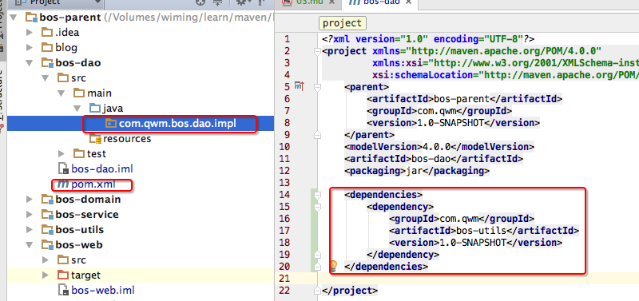
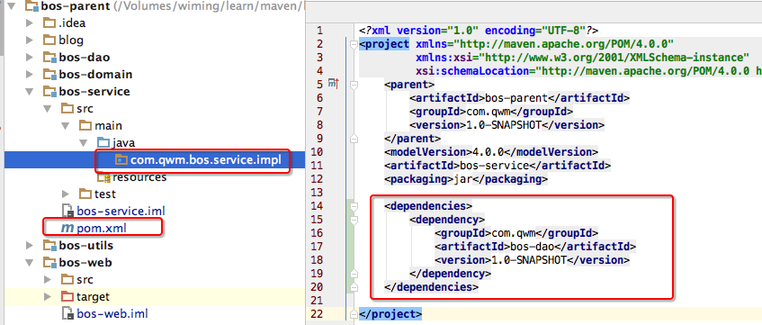
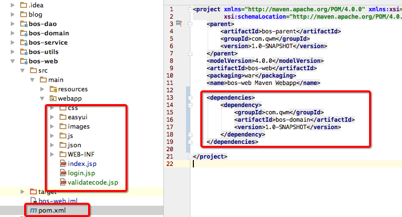

[TOC]

# BOS物流项目03———模块间的依赖引用


各个模块之间存在引用的关系,那么我们下面来看一下

## 一、bos-domain模块

这个模块依赖就不需要导入了,但是我们需要创建包(空的)

**com.qwm.bos.domain**



----

## 二、bos-utils模块

这个模块依赖就需要导入**bos-domain**,而且我们需要创建包(空的)

**com.qwm.bos.utils**

```xml
<?xml version="1.0" encoding="UTF-8"?>
<project xmlns="http://maven.apache.org/POM/4.0.0"
         xmlns:xsi="http://www.w3.org/2001/XMLSchema-instance"
         xsi:schemaLocation="http://maven.apache.org/POM/4.0.0 http://maven.apache.org/xsd/maven-4.0.0.xsd">
    <parent>
        <artifactId>bos-parent</artifactId>
        <groupId>com.qwm</groupId>
        <version>1.0-SNAPSHOT</version>
    </parent>
    <modelVersion>4.0.0</modelVersion>
    <artifactId>bos-utils</artifactId>
    <packaging>jar</packaging>

    <dependencies>
        <dependency>
            <groupId>com.qwm</groupId>
            <artifactId>bos-domain</artifactId>
            <version>1.0-SNAPSHOT</version>
        </dependency>
    </dependencies>
</project>
```



----

## 三、bos-dao模块

这个模块依赖就需要导入**bos-domain**,而且我们需要创建包(空的)

**com.qwm.bos.dao**

```xml
<?xml version="1.0" encoding="UTF-8"?>
<project xmlns="http://maven.apache.org/POM/4.0.0"
         xmlns:xsi="http://www.w3.org/2001/XMLSchema-instance"
         xsi:schemaLocation="http://maven.apache.org/POM/4.0.0 http://maven.apache.org/xsd/maven-4.0.0.xsd">
    <parent>
        <artifactId>bos-parent</artifactId>
        <groupId>com.qwm</groupId>
        <version>1.0-SNAPSHOT</version>
    </parent>
    <modelVersion>4.0.0</modelVersion>
    <artifactId>bos-dao</artifactId>
    <packaging>jar</packaging>

    <dependencies>
        <dependency>
            <groupId>com.qwm</groupId>
            <artifactId>bos-utils</artifactId>
            <version>1.0-SNAPSHOT</version>
        </dependency>
    </dependencies>

</project>
```



----

## 四、bos-service模块

这个模块依赖就需要导入**bos-domain**,而且我们需要创建包(空的)

**com.qwm.bos.service**

```xml
<?xml version="1.0" encoding="UTF-8"?>
<project xmlns="http://maven.apache.org/POM/4.0.0"
         xmlns:xsi="http://www.w3.org/2001/XMLSchema-instance"
         xsi:schemaLocation="http://maven.apache.org/POM/4.0.0 http://maven.apache.org/xsd/maven-4.0.0.xsd">
    <parent>
        <artifactId>bos-parent</artifactId>
        <groupId>com.qwm</groupId>
        <version>1.0-SNAPSHOT</version>
    </parent>
    <modelVersion>4.0.0</modelVersion>
    <artifactId>bos-service</artifactId>
    <packaging>jar</packaging>

    <dependencies>
        <dependency>
            <groupId>com.qwm</groupId>
            <artifactId>bos-dao</artifactId>
            <version>1.0-SNAPSHOT</version>
        </dependency>
    </dependencies>

</project>
```



----

## 五、bos-web模块

这个模块依赖就需要导入**bos-domain**,而且我们需要导入 下面的文件

[https://github.com/wimingxxx/bos-parent/tree/master/bos-web/src/main/webapp](https://github.com/wimingxxx/bos-parent/tree/master/bos-web/src/main/webapp)


```xml
<project xmlns="http://maven.apache.org/POM/4.0.0" xmlns:xsi="http://www.w3.org/2001/XMLSchema-instance"
         xsi:schemaLocation="http://maven.apache.org/POM/4.0.0 http://maven.apache.org/maven-v4_0_0.xsd">
    <parent>
        <artifactId>bos-parent</artifactId>
        <groupId>com.qwm</groupId>
        <version>1.0-SNAPSHOT</version>
    </parent>
    <modelVersion>4.0.0</modelVersion>
    <artifactId>bos-web</artifactId>
    <packaging>war</packaging>
    <name>bos-web Maven Webapp</name>

    <dependencies>
        <dependency>
            <groupId>com.qwm</groupId>
            <artifactId>bos-domain</artifactId>
            <version>1.0-SNAPSHOT</version>
        </dependency>
    </dependencies>

</project>
```



---

## 六、源码下载

[https://github.com/wimingxxx/bos-parent](https://github.com/wimingxxx/bos-parent/)
