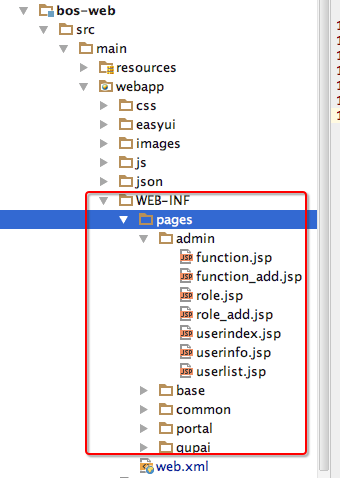
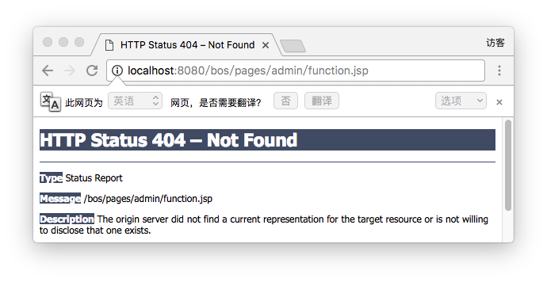
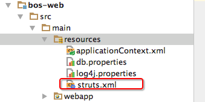
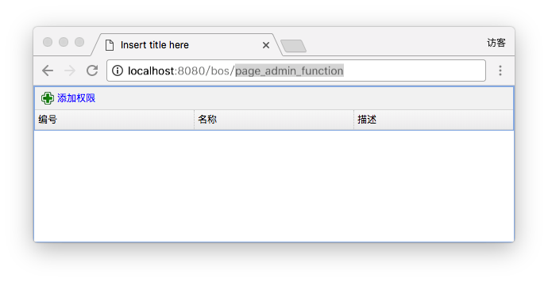

[TOC]


# BOS物流项目05———bos-web模块配置之struts.xml

这个文件现在主要配置**WEB-INF**下jsp文件的访问。以后配置，后面再加上。

## 一、WEB-INF 下的jsp无法直接访问

我们的放在 **WEB-INF** 下的jsp文件是无法直接访问的，那么我们就需要通过后台内部转发的方式来是实现对其的访问。

如下图



网页中访问




----

## 二、struts.xml配置

我们知道上面的方式是无法访问 **WEB-INF**的jsp页面的访问。所以我们的 struts.xml配置。

配置文件放在 **src/main/resources** 下面，如图



配置如下应该如下

```xml
<?xml version="1.0" encoding="UTF-8"?>

<!DOCTYPE struts PUBLIC
        "-//Apache Software Foundation//DTD Struts Configuration 2.3//EN"
        "http://struts.apache.org/dtds/struts-2.3.dtd">

<struts>
    <constant name="struts.devMode" value="false"/>

    <package name="basicstruts2" extends="struts-default">
        <!-- 需要进行权限控制的页面访问 -->
        <action name="page_*_*">
            <result type="dispatcher">/WEB-INF/pages/{1}/{2}.jsp</result>
        </action>
    </package>
</struts>
```

我们把 **page_\*_\*** 这种方式的访问，转发到了 **/WEB-INF/pages/{1}/{2}.jsp**上来，第一个\*对应的是 {1}，第二个\*对应{2}

这样一来，我们访问，上面的页面就可以这样访问了 **page_admin_function** 如图




---


## 三、struts.xml位置

[https://github.com/wimingxxx/bos-parent/blob/master/bos-web/src/main/resources/struts.xml](https://github.com/wimingxxx/bos-parent/blob/master/bos-web/src/main/resources/struts.xml)

----

## 四、源码下载

[https://github.com/wimingxxx/bos-parent](https://github.com/wimingxxx/bos-parent/)
