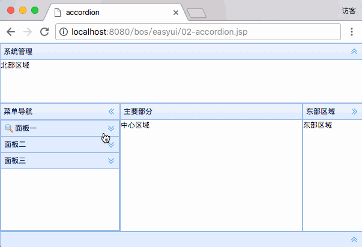
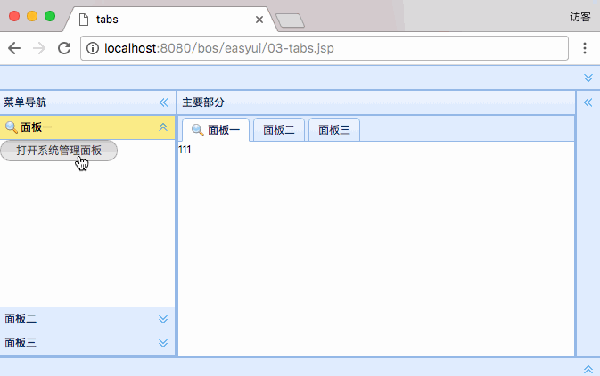

[TOC]


# BOS物流项目08———主页设计(easyui)


## 一、说明

主页设计，使用的是 **easyui** 

网站 [http://www.jeasyui.com/index.php](http://www.jeasyui.com/index.php)

中文网站 [http://www.jeasyui.net/](http://www.jeasyui.net/)

----

## 二、基本的主页

### 2.1 主页布局图示


### 2.2 页面说明

**边框布局（border layout）提供五个区域：east、west、north、south、center。以下是一些通常用法：**
> north 区域可以用来显示网站的标语。
> 
> south 区域可以用来显示版权以及一些说明。
> 
> west 区域可以用来显示导航菜单。
> 
> east 区域可以用来显示一些推广的项目。
> 
> center 区域可以用来显示主要的内容。


### 2.3 代码

```jsp
<%@ page language="java" contentType="text/html; charset=UTF-8"
	pageEncoding="UTF-8"%>
<!DOCTYPE html PUBLIC "-//W3C//DTD HTML 4.01 Transitional//EN" "http://www.w3.org/TR/html4/loose.dtd">
<html>
<head>
<meta http-equiv="Content-Type" content="text/html; charset=UTF-8">
<title>layout</title>
<link rel="stylesheet" type="text/css" href="${pageContext.request.contextPath }/js/easyui/themes/default/easyui.css">
<link rel="stylesheet" type="text/css" href="${pageContext.request.contextPath }/js/easyui/themes/icon.css">
<script type="text/javascript" src="${pageContext.request.contextPath }/js/jquery-1.8.3.js"></script>
<script type="text/javascript" src="${pageContext.request.contextPath }/js/easyui/jquery.easyui.min.js"></script>

</head>
<body class="easyui-layout">
	<!-- 使用div元素描述每个区域 -->
	<div title="系统管理" style="height: 100px" region="north">北部区域</div>
	<div title="菜单导航-" style="width: 200px" region="west">西部区域</div>
	<div title="主要部分" region="center">中心区域</div>
	<div title="东部区域" style="width: 100px" region="east">东部区域</div>
	<div title="南部区域" style="height:100px" region="south">南部区域</div>

</body>
</html>
```


### 2.4 源码位置

[https://github.com/wimingxxx/bos-parent/blob/master/bos-web/src/main/webapp/easyui/01-layout.jsp](https://github.com/wimingxxx/bos-parent/blob/master/bos-web/src/main/webapp/easyui/01-layout.jsp)


---


## 三、面板

### 3.1 面板图示




### 3.2 页面说明

**面板** 在**div**中使用的样式是 **easyui-accordion**

例如

```html
	<div class="easyui-accordion" data-options="fit:true">
			<!-- 使用子div表示每个面板 -->
			<div title="面板一" iconCls="icon-search">111</div>
			<div title="面板二">222</div>
			<div title="面板三">333</div>
	</div>
```


### 3.3 代码

```jsp
<%@ page language="java" contentType="text/html; charset=UTF-8"
	pageEncoding="UTF-8"%>
<!DOCTYPE html PUBLIC "-//W3C//DTD HTML 4.01 Transitional//EN" "http://www.w3.org/TR/html4/loose.dtd">
<html>
<head>
<meta http-equiv="Content-Type" content="text/html; charset=UTF-8">
<title>accordion</title>
<link rel="stylesheet" type="text/css" href="${pageContext.request.contextPath }/js/easyui/themes/default/easyui.css">
<link rel="stylesheet" type="text/css" href="${pageContext.request.contextPath }/js/easyui/themes/icon.css">
<script type="text/javascript" src="${pageContext.request.contextPath }/js/jquery-1.8.3.js"></script>
<script type="text/javascript" src="${pageContext.request.contextPath }/js/easyui/jquery.easyui.min.js"></script>

</head>
<body class="easyui-layout">

	<!-- 使用div元素描述每个区域 -->
	<div title="系统管理" style="height: 100px" region="north">北部区域</div>

	<!-- 制作accordion折叠面板
			fit:true----自适应(填充父容器)
	-->
	<div title="菜单导航" style="width: 200px" region="west">
		<div class="easyui-accordion" data-options="fit:true">
			<!-- 使用子div表示每个面板 -->
			<div title="面板一" iconCls="icon-search">111</div>
			<div title="面板二">222</div>
			<div title="面板三">333</div>
		</div>
	</div>

	<div title="主要部分" region="center">中心区域</div>
	<div title="东部区域" style="width: 100px" region="east">东部区域</div>
	<div title="南部区域" style="height:100px" region="south">南部区域</div>

</body>
</html>
```


### 3.4 源码位置

[https://github.com/wimingxxx/bos-parent/blob/master/bos-web/src/main/webapp/easyui/02-accordion.jsp](https://github.com/wimingxxx/bos-parent/blob/master/bos-web/src/main/webapp/easyui/02-accordion.jsp)


----


## 四、tab

### 4.1 主页布局图示



### 4.2 页面说明

**tab** 在**div**中使用的样式是 **easyui-tabs**

例如

```html
<div class="easyui-tabs" style="width:400px;height:100px;">
	<div title="First Tab" style="padding:10px;">
		First Tab
	</div>
	<div title="Second Tab" closable="true" style="padding:10px;">
		Second Tab
	</div>
	<div title="Third Tab" iconCls="icon-reload" closable="true" style="padding:10px;">
		Third Tab
	</div>
</div>

```

这里我们我们使用的是动态添加 tab,只需要调用 **add** 方法即可。

例如：

```js
function addTab(title, url){
	if ($('#tt').tabs('exists', title)){
		$('#tt').tabs('select', title);
	} else {
		var content = '<iframe scrolling="auto" frameborder="0"  src="'+url+'" style="width:100%;height:100%;"></iframe>';
		$('#tt').tabs('add',{
			title:title,
			content:content,
			closable:true
		});
	}
}

```

title：是标题

content:内容

closable：是否可以关闭


### 4.3 代码

```jsp
<%@ page language="java" contentType="text/html; charset=UTF-8"
	pageEncoding="UTF-8"%>
<!DOCTYPE html PUBLIC "-//W3C//DTD HTML 4.01 Transitional//EN" "http://www.w3.org/TR/html4/loose.dtd">
<html>
<head>
<meta http-equiv="Content-Type" content="text/html; charset=UTF-8">
<title>tabs</title>
<link rel="stylesheet" type="text/css" href="${pageContext.request.contextPath }/js/easyui/themes/default/easyui.css">
<link rel="stylesheet" type="text/css" href="${pageContext.request.contextPath }/js/easyui/themes/icon.css">
<script type="text/javascript" src="${pageContext.request.contextPath }/js/jquery-1.8.3.js"></script>
<script type="text/javascript" src="${pageContext.request.contextPath }/js/easyui/jquery.easyui.min.js"></script>

</head>
<body class="easyui-layout">

	<!-- 使用div元素描述每个区域 -->
	<div title="系统管理" style="height: 100px" region="north">北部区域</div>

	<!-- 制作accordion折叠面板
			fit:true----自适应(填充父容器)
	-->
	<div title="菜单导航" style="width: 200px" region="west">
		<div class="easyui-accordion" data-options="fit:true">
			<!-- 使用子div表示每个面板 -->
			<div title="面板一" iconCls="icon-search">
				<a id="but1" class="easyui-linkbutton">打开系统管理面板</a>
				<script type="text/javascript">
					$(function(){
						//页面加载完成,为but1添加上点击事件
						$("#but1").click(function(){
							var name = "系统管理";
							//判断系统管理是否存在
							var e = $("#mytabs").tabs("exists",name);
							if(e){
								//存在,选中
								$("#mytabs").tabs("select",name);
							}else{
								//不存在,添加
								$("#mytabs").tabs("add",{
									title:name,
									iconCls:'ion-edit',
									closable:true,
									content:'<iframe frameborder="0" height="100%" width="100%" src="https://www.baidu.com"></iframe>'
								});
							}
						});
					});
				</script>
			</div>
			<div title="面板二">222</div>
			<div title="面板三">333</div>
		</div>
	</div>

    <!-- 制作一个tabs选项卡面板 -->
	<div title="主要部分" region="center">
		<div id="mytabs" class="easyui-tabs" data-options="fit:true">
			<!-- 使用子div表示每个面板 -->
			<div title="面板一" iconCls="icon-search">111</div>
			<div title="面板二">222</div>
			<div title="面板三">333</div>
		</div>
	</div>

	<div title="东部区域" style="width: 100px" region="east">东部区域</div>
	<div title="南部区域" style="height:100px" region="south">南部区域</div>

</body>
</html>
```


### 4.4 源码位置

[https://github.com/wimingxxx/bos-parent/blob/master/bos-web/src/main/webapp/easyui/01-layout.jsp](https://github.com/wimingxxx/bos-parent/blob/master/bos-web/src/main/webapp/easyui/01-layout.jsp)


----

## 五、源码下载

[https://github.com/wimingxxx/bos-parent](https://github.com/wimingxxx/bos-parent/)

