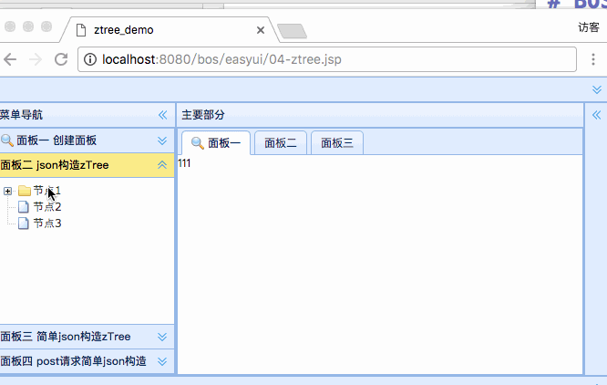
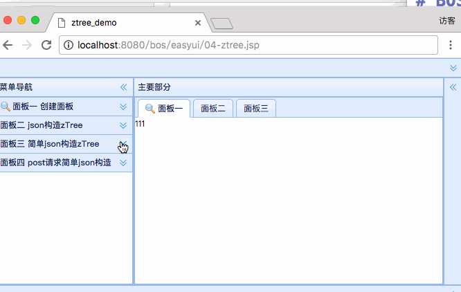
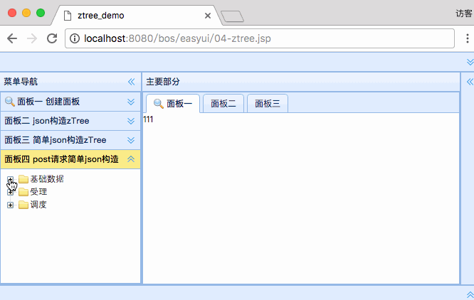

[TOC]


# BOS物流项目09———添加树形结构(zTree)


## 一、zTree说明

 zTree 是一个依靠 jQuery 实现的多功能 “树插件”。优异的性能、灵活的配置、多种功能的组合是 zTree 最大优点。
 
 
 **地址：** [http://www.treejs.cn/v3/main.php#_zTreeInfo](http://www.treejs.cn/v3/main.php#_zTreeInfo)
 
 
 ---
 
## 二、标准json构造zTree

### 2.1 界面演示




### 2.2 页面说明

添加树形结构很容易，只需要调用 **init**方法就行了。但是需要添加设置和json.

json的设置很需要有 **name**代表名称,**children**子节点。它被添加到的控件必须是 **<ul>**


### 2.3 代码

```html
<!-- 展示ztree效果 :使用标准json数据构造ztree-->
<ul id="ztree1" class="ztree"></ul>
<script type="text/javascript">
    $(function(){
        var setting = {};
        //构造节点数据
        var zNodes = [
            {"name":"节点1","children":[
                {"name":"节点1——1"},
                {"name":"节点1——2"},
                {"name":"节点1——3"},
                {"name":"节点1——4"},
                {"name":"节点1——5"}
            ]},
            {"name":"节点2"},
            {"name":"节点3"}
        ];
        //调用API初始化ztree
        $.fn.zTree.init($("#ztree1"),setting,zNodes);
    });
</script>
```

-----


## 三、简单json构造zTree

### 3.1 界面演示



### 3.2 页面说明

使用简单json构造zTree 必须开启相关属性

```js
var setting2 = {
        data:{
            simpleData:{
                enable:true //使用简单json数据构造ztree节点
            }
        }
    };
```

设置json的时候，主要就是通过 **pId** 来指定父节点

```js
var zNodes2 = [
    {"id":"1" ,  "name":"节点1"},
    {"id":"11" , "pId":"1" , "name":"节点1——1"},
    {"id":"12" , "pId":"1" , "name":"节点1——2"},

    {"id":"2" ,  "name":"节点2"},
    {"id":"21" , "pId":"2" , "name":"节点2——2"},

    {"id":"3" , "name":"节点3"}
];
```


### 3.3 代码

```html
<ul id="ztree2" class="ztree"></ul>
<script type="text/javascript">
    $(function(){
        var setting2 = {
            data:{
                simpleData:{
                    enable:true //使用简单json数据构造ztree节点
                }
            }
        };
        var zNodes2 = [
            {"id":"1" ,  "name":"节点1"},
            {"id":"11" , "pId":"1" , "name":"节点1——1"},
            {"id":"12" , "pId":"1" , "name":"节点1——2"},

            {"id":"2" ,  "name":"节点2"},
            {"id":"21" , "pId":"2" , "name":"节点2——2"},

            {"id":"3" , "name":"节点3"}
        ];
        $.fn.zTree.init($("#ztree2"),setting2,zNodes2);
    });
</script>
```

----

## 三、post请求简单json数据来构造zTree

### 3.1 界面演示



### 3.2 页面说明

比起上面，其实就是json不在是写死的，是通过请求后台来获取。在加上，点击的时候，打开tab


### 3.3 代码

```html
<ul id="ztree3" class="ztree"></ul>
<script type="text/javascript">
    $(function(){
       var settings3 = {
           data:{
               simpleData:{
                   enable:true
               }
           },
           callback:{
               //为ztree节点绑定单击事件
               onClick:function(event,treeId,treeNode){
                   //page这个属性不为空,才去打开面板
                   if(treeNode.page != undefined){
                       var e = $("#mytabs").tabs("exists",treeNode.name);
                       if(e){
                           $("#mytabs").tabs("select",treeNode.name);
                       }else{
                           $("#mytabs").tabs("add",{
                               title:treeNode.name,
                               closable:true,
                               content:'<iframe frameborder="0" height="100%" width="100%" src="'+treeNode.page+'"></iframe>'
                           });
                       }
                   }
               }
           }
       };
        //发送ajax请求，获取json数据
        //jQuery提供 的ajax方法：ajax、post、get、load、getJSON、getScript
        var url = "${pageContext.request.contextPath}/json/menu.json";
        $.post(url,function(data){
            $.fn.zTree.init($("#ztree3"),settings3,data);
        },'json');
    });
</script>
```

----

## 四、完整代码

```jsp
<%--
  Created by IntelliJ IDEA.
  User: qiwenming
  Date: 17/12/10
  Time: 下午6:25
  To change this template use File | Settings | File Templates.
--%>
<%@ page contentType="text/html;charset=UTF-8" language="java" %>
<html>
<head>
    <title>ztree_demo</title>
    <link rel="stylesheet" type="text/css" href="${pageContext.request.contextPath }/js/easyui/themes/default/easyui.css">
    <link rel="stylesheet" type="text/css" href="${pageContext.request.contextPath }/js/easyui/themes/icon.css">
    <script type="text/javascript" src="${pageContext.request.contextPath }/js/jquery-1.8.3.js"></script>
    <script type="text/javascript" src="${pageContext.request.contextPath }/js/easyui/jquery.easyui.min.js"></script>
    <link rel="stylesheet" href="${pageContext.request.contextPath }/js/ztree/zTreeStyle.css" type="text/css">
    <script type="text/javascript" src="${pageContext.request.contextPath }/js/ztree/jquery.ztree.all-3.5.js"></script>
</head>
<body class="easyui-layout">

<!-- 使用div元素描述每个区域 -->
<div title="系统管理" style="height: 100px" region="north">北部区域</div>

<!-- 制作accordion折叠面板
        fit:true----自适应(填充父容器)
-->
<div title="菜单导航" style="width: 200px" region="west">
    <div class="easyui-accordion" data-options="fit:true">
        <!-- 使用子div表示每个面板 -->
        <div title="面板一 创建面板" iconCls="icon-search">
            <a id="but1" class="easyui-linkbutton">打开系统管理面板</a>
            <script type="text/javascript">
                $(function(){
                    //页面加载完成,为but1添加上点击事件
                    $("#but1").click(function(){
                        var name = "系统管理";
                        //判断系统管理是否存在
                        var e = $("#mytabs").tabs("exists",name);
                        if(e){
                            //存在,选中
                            $("#mytabs").tabs("select",name);
                        }else{
                            //不存在,添加
                            $("#mytabs").tabs("add",{
                                title:name,
                                iconCls:'ion-edit',
                                closable:true,
                                content:'<iframe frameborder="0" height="100%" width="100%" src="https://www.baidu.com"></iframe>'
                            });
                        }
                    });
                });
            </script>
        </div>
        <div title="面板二 json构造zTree">
            <!-- 展示ztree效果 :使用标准json数据构造ztree-->
            <ul id="ztree1" class="ztree"></ul>
            <script type="text/javascript">
                $(function(){
                    var setting = {};
                    //构造节点数据
                    var zNodes = [
                        {"name":"节点1","children":[
                            {"name":"节点1——1"},
                            {"name":"节点1——2"},
                            {"name":"节点1——3"},
                            {"name":"节点1——4"},
                            {"name":"节点1——5"}
                        ]},
                        {"name":"节点2"},
                        {"name":"节点3"}
                    ];
                    //调用API初始化ztree
                    $.fn.zTree.init($("#ztree1"),setting,zNodes);
                });
            </script>
        </div>
        <div title="面板三 简单json构造zTree">
            <ul id="ztree2" class="ztree"></ul>
            <script type="text/javascript">
                $(function(){
                    var setting2 = {
                        data:{
                            simpleData:{
                                enable:true //使用简单json数据构造ztree节点
                            }
                        }
                    };
                    var zNodes2 = [
                        {"id":"1" ,  "name":"节点1"},
                        {"id":"11" , "pId":"1" , "name":"节点1——1"},
                        {"id":"12" , "pId":"1" , "name":"节点1——2"},

                        {"id":"2" ,  "name":"节点2"},
                        {"id":"21" , "pId":"2" , "name":"节点2——2"},

                        {"id":"3" , "name":"节点3"}
                    ];
                    $.fn.zTree.init($("#ztree2"),setting2,zNodes2);
                });
            </script>
        </div>
        <div title="面板四 post请求简单json构造">
            <ul id="ztree3" class="ztree"></ul>
            <script type="text/javascript">
                $(function(){
                   var settings3 = {
                       data:{
                           simpleData:{
                               enable:true
                           }
                       },
                       callback:{
                           //为ztree节点绑定单击事件
                           onClick:function(event,treeId,treeNode){
                               //page这个属性不为空,才去打开面板
                               if(treeNode.page != undefined){
                                   var e = $("#mytabs").tabs("exists",treeNode.name);
                                   if(e){
                                       $("#mytabs").tabs("select",treeNode.name);
                                   }else{
                                       $("#mytabs").tabs("add",{
                                           title:treeNode.name,
                                           closable:true,
                                           content:'<iframe frameborder="0" height="100%" width="100%" src="'+treeNode.page+'"></iframe>'
                                       });
                                   }
                               }
                           }
                       }
                   };
                    //发送ajax请求，获取json数据
                    //jQuery提供 的ajax方法：ajax、post、get、load、getJSON、getScript
                    var url = "${pageContext.request.contextPath}/json/menu.json";
                    $.post(url,function(data){
                        $.fn.zTree.init($("#ztree3"),settings3,data);
                    },'json');
                });
            </script>
        </div>
    </div>
</div>

<!-- 制作一个tabs选项卡面板 -->
<div title="主要部分" region="center">
    <div id="mytabs" class="easyui-tabs" data-options="fit:true">
        <!-- 使用子div表示每个面板 -->
        <div title="面板一" iconCls="icon-search">111</div>
        <div title="面板二">222</div>
        <div title="面板三">333</div>
    </div>
</div>

<div title="东部区域" style="width: 100px" region="east">东部区域</div>
<div title="南部区域" style="height:100px" region="south">南部区域</div>

</body>
</html>

```


---

## 五、源码文件位置

[https://github.com/wimingxxx/bos-parent/blob/master/bos-web/src/main/webapp/easyui/04-ztree.jsp](https://github.com/wimingxxx/bos-parent/blob/master/bos-web/src/main/webapp/easyui/04-ztree.jsp)

---


## 六、源码下载

[https://github.com/wimingxxx/bos-parent](https://github.com/wimingxxx/bos-parent/)


