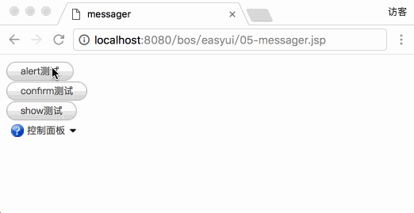
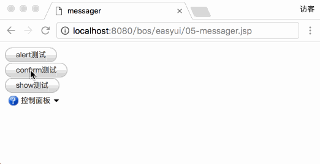
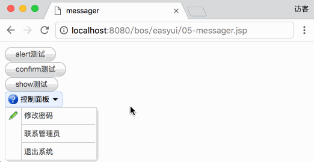

[TOC]


# BOS物流项目10———easyui中messager和menubutton基本使用


## 一、EasyUI Messager 消息框

### 1.1 说明

通过 $.messager.defaults 重写默认的 defaults。

消息框（messager）提供不同样式的消息框，包括警示（alert）、确认（confirm）、提示（prompt）、进展（progress）等等。所有的消息框都是异步的。用户可以在与消息框交互后使用回调函数来完成一些动作。

主要使用说以下三个方法：show,alert,confirm

|  名称 | 参数 |  说明 |
|---|---|---|
| $.messager.alert  |  title, <br> msg, <br> icon,<br> fn | 显示一个警告提示窗口。参数：<br> title：显示在头部面板上的标题文本。<br>msg：要显示的消息文本。<br>icon：要显示的图标图片。可用的值是：error、question、info、warning。<br>fn：当窗口关闭时触发的回调函数。<br><br>代码实例：<br>``` $.messager.alert('My Title','Here is a info message!','info');``` |
|$.messager.confirm	| title,<br> msg, <br>fn	| 显示一个带"确定"和"取消"按钮的确认消息窗口。参数：<br>title：显示在头部面板上的标题文本。<br>msg：要显示的消息文本。<br>fn(b)：回调函数，当用户点击确认按钮时传递一个 true 参数给函数，否则给它传递一个 false 参数。<br><br>代码实例：```$.messager.confirm('Confirm', 'Are you sure to exit this system?', function(r){ if (r){}});``` |
|$.messager.show	|options	| 在屏幕的右下角显示一个消息窗口，options 参数是一个配置对象：<br>showType： 定义消息窗口如何显示。可用的值是：null、slide、fade、show。默认是 slide。<br>showSpeed： 定义消息窗口完成显示所需的以毫秒为单位的时间。默认是 600。<br>width：定义消息窗口的宽度。默认是 250。<br>height：定义消息窗口的高度。默认是 100。<br>title：头部面板上显示的标题文本。<br>msg：要显示的消息文本。<br>style：定义消息窗口的自定义样式。<br>timeout：如果定义为 0，除非用户关闭，消息窗口将不会关闭。如果定义为非 0 值，消息窗口将在超时后自动关闭。默认是 4 秒。|

### 1.2 alert测试图示


### 1.3 alert 代码

```html
<a id="but1" class="easyui-linkbutton">alert测试</a>
<script type="text/javascript">
    $(function(){
        $("#but1").click(function(){
            $.messager.alert('测试','这个这是测试而已','error',function(){
                alert("点击了 确定");
            });
        });
    });
</script>
```


### 1.4 confirm测试图示


### 1.5 confirm 代码

```html
<a id="but2" class="easyui-linkbutton">confirm测试</a>
<script type="text/javascript">
    $(function(){
        $("#but2").click(function(){
            $.messager.confirm("测试","您确定是测试吗?",function(r){
                if(r){
                    alert("点击了 确定");
                }else{
                    alert("点击了 取消");
                }
            });
        });
    });
</script>
```

### 1.6 show测试图示


### 1.7 show 代码

```html
<a id="but3" class="easyui-linkbutton">show测试</a>
<script type="text/javascript">
    $(function(){
        $("#but3").click(function(){
            $.messager.show({
                title:'这是标题',
                msg:'这个消息在2秒后关闭',
                timeout:2000,
                showType:'slide'
            });
        });
    });
</script>
```


### 1.8 中文提示说明
默认是提示，例如：确定、取消 是英文的，如果需要中文提示，需要引入中的js文件。

例如 

```html
<script type="text/javascript" src="${pageContext.request.contextPath }/js/easyui/locale/easyui-lang-zh_CN.js"></script>
```


---


## 二、EasyUI Menu 菜单

### 2.1 说明

通过 $.fn.menu.defaults 重写默认的 defaults。

菜单（Menu）通常用于上下文菜单。它是创建其他菜单组件（比如：menubutton、splitbutton）的基础组件。它也能用于导航和执行命令。

通过标记创建菜单（menu）应该添加 'easyui-menu' class 到 <div> 标记。每个菜单项（menu item）通过 <div> 标记创建。我们可以添加 'iconCls' 属性到菜单项（menu item），以定义一个显示在菜单项（menu item）左边的图标。添加 'menu-sep' class 到菜单项（menu item）将产生一个菜单（menu）分隔符。

### 2.2 菜单图示



### 2.3 菜单测试代码

```html
<a data-options="iconCls:'icon-help',menu:'#mm'" class="easyui-menubutton">控制面板</a>
<div id="mm">
    <div onclick="alert('修改密码')" data-options="iconCls:'icon-edit'">修改密码</div>
    <div class="menu-sep"></div>
    <div>联系管理员</div>
    <div class="menu-sep"></div>
    <div>退出系统</div>
</div>
```

---

## 三、完整代码

```jsp
<%--
  Created by IntelliJ IDEA.
  User: qiwenming
  Date: 17/12/11
  Time: 下午11:16
  To change this template use File | Settings | File Templates.
--%>
<%@ page contentType="text/html;charset=UTF-8" language="java" %>
<html>
<head>
    <title>messager</title>
    <link rel="stylesheet" type="text/css" href="${pageContext.request.contextPath }/js/easyui/themes/default/easyui.css">
    <link rel="stylesheet" type="text/css" href="${pageContext.request.contextPath }/js/easyui/themes/icon.css">
    <script type="text/javascript" src="${pageContext.request.contextPath }/js/jquery-1.8.3.js"></script>
    <script type="text/javascript" src="${pageContext.request.contextPath }/js/easyui/jquery.easyui.min.js"></script>
    <script type="text/javascript" src="${pageContext.request.contextPath }/js/easyui/locale/easyui-lang-zh_CN.js"></script>
</head>
<body>

<a id="but1" class="easyui-linkbutton">alert测试</a>
<script type="text/javascript">
    $(function(){
        $("#but1").click(function(){
            $.messager.alert('测试','这个这是测试而已','error',function(){
                alert("点击了 确定");
            });
        });
    });
</script>

<br>

<a id="but2" class="easyui-linkbutton">confirm测试</a>
<script type="text/javascript">
    $(function(){
        $("#but2").click(function(){
            $.messager.confirm("测试","您确定是测试吗?",function(r){
                if(r){
                    alert("点击了 确定");
                }else{
                    alert("点击了 取消");
                }
            });
        });
    });
</script>

<br>
<a id="but3" class="easyui-linkbutton">show测试</a>
<script type="text/javascript">
    $(function(){
        $("#but3").click(function(){
            $.messager.show({
                title:'这是标题',
                msg:'这个消息在2秒后关闭',
                timeout:2000,
                showType:'slide'
            });
        });
    });
</script>

<br>

<a data-options="iconCls:'icon-help',menu:'#mm'" class="easyui-menubutton">控制面板</a>
<div id="mm">
    <div onclick="alert('修改密码')" data-options="iconCls:'icon-edit'">修改密码</div>
    <div class="menu-sep"></div>
    <div>联系管理员</div>
    <div class="menu-sep"></div>
    <div>退出系统</div>
</div>

</body>
</html>
```


---


## 三、源码下载

[https://github.com/wimingxxx/bos-parent](https://github.com/wimingxxx/bos-parent/)
