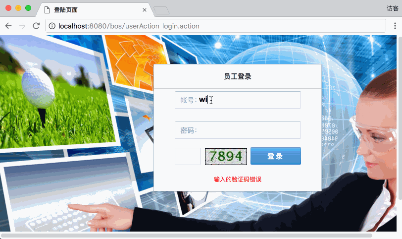
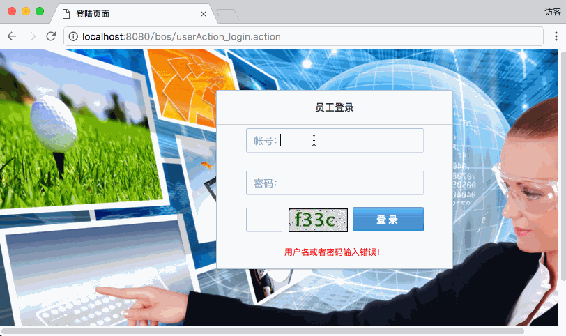
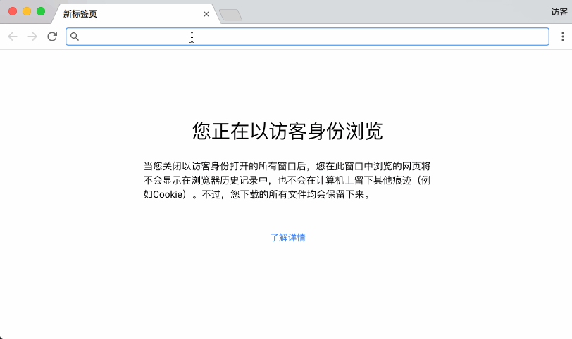
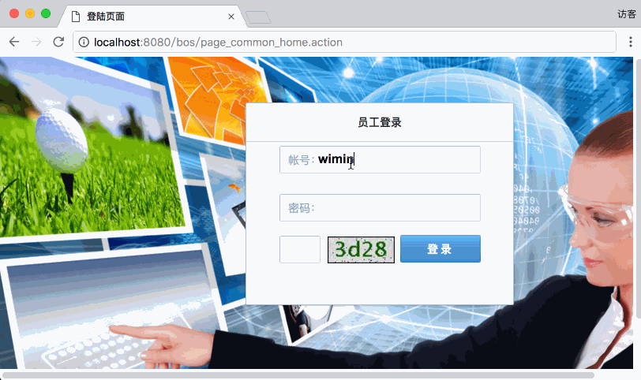

[TOC]


# BOS物流项目11———登陆和验证登陆的实现


## 一、演示与说明

### 1.1 验证码错误的演示


### 1.2 账号或密码错误演示


### 1.3 登陆成功演示



页面的提交，我们已经有了登录页，基本不用做什么修改，所以不考虑页面的问题，只需要操作后端就行了。


---

## 二、bos-domain中User类书写

```java
public class User implements java.io.Serializable {

	// Fields

	private String id;
	private String username;
	private String password;
	private Double salary;
	private Date birthday;
	private String gender;
	private String station;
	private String telephone;
	private String remark;
	
	.....省略了get/set方法.....
	
}	

```

配置都很简单，只是属性的书写，详细看源码。

---

## 三、bos-dao中UserDao的书写

这里面，我们使用 **BaseDao** 来实现了，基本的 CRUD ,具体可以查看

[SSH与SSM学习之SSH实现CRM练习07——BaseDao封装](http://blog.csdn.net/qiwenmingshiwo/article/details/78682661)

但是，这里面我们需要一个根据用户名和密码查询的**DAO方法**，现在没有，所以我们得加一个，这里我们使用注册的方式来使用Spring来管理 UserDao 如下

**IUserDao**

```java
package com.qwm.bos.dao;

import com.qwm.bos.dao.base.IBaseDao;
import com.qwm.bos.domain.User;

/**
 * @author: qiwenming(杞文明)
 * @date: 17/12/11 下午10:02
 * @className: IUserDao
 * @description:
 */
public interface IUserDao extends IBaseDao<User>{
    /**
     * 获取用户
     * @param username
     * @param password
     * @return
     */
    public User findUserByUsernameAndPassword(String username, String password);
}
```

**UserDaoImpl**

```java
package com.qwm.bos.dao.impl;

import com.qwm.bos.dao.IUserDao;
import com.qwm.bos.dao.base.impl.BaseDaoImpl;
import com.qwm.bos.domain.User;
import org.springframework.stereotype.Repository;

import java.util.List;

/**
 * @author: qiwenming(杞文明)
 * @date: 17/12/11 下午10:03
 * @className: UserDaoImpl
 * @description:
 */

@Repository //Spring注解
public class UserDaoImpl extends BaseDaoImpl<User> implements IUserDao{
    /**
     * 获取用户
     *
     * @param username
     * @param password
     * @return
     */
    @Override
    public User findUserByUsernameAndPassword(String username, String password) {
        String hql = "FROM User u WHERE u.username=? AND u.password=?";
        List<User> list = (List<User>)getHibernateTemplate().find(hql,username,password);
        if(list!=null && list.size()>0){
            return list.get(0);
        }
        return null;
    }
}
```

---


## 四、bos-service中UserService的书写

同样的，我们使用 Spring 注解来管理

**IUserService**

```java
package com.qwm.bos.service;

import com.qwm.bos.domain.User;

/**
 * @author: qiwenming(杞文明)
 * @date: 17/12/11 下午10:16
 * @className: IUserService
 * @description:
 * 用户Service
 */
public interface IUserService {
    public User login(User model);
}

```

**UserServiceImpl**

```java
package com.qwm.bos.service.impl;

import com.qwm.bos.dao.IUserDao;
import com.qwm.bos.domain.User;
import com.qwm.bos.service.IUserService;
import com.qwm.bos.utils.MD5Utils;
import org.springframework.beans.factory.annotation.Autowired;
import org.springframework.stereotype.Service;
import org.springframework.transaction.annotation.Transactional;

/**
 * @author: qiwenming(杞文明)
 * @date: 17/12/11 下午10:16
 * @className: UserServiceImpl
 * @description:
 */
@Service
@Transactional
public class UserServiceImpl implements IUserService{

    @Autowired
    private IUserDao userDao;

    /**
     * 用户登录
     * @param model
     * @return
     */
    @Override
    public User login(User model) {
        //使用MD5加密密码
        String password = MD5Utils.md5(model.getPassword());
        return userDao.findUserByUsernameAndPassword(model.getUsername(),password);
    }
}

```


---

## 五、bos-utils中BOSUtils的书写

```java
package com.qwm.bos.utils;

import com.qwm.bos.domain.User;
import org.apache.struts2.ServletActionContext;

import javax.servlet.http.HttpSession;

/**
 * @author: qiwenming(杞文明)
 * @date: 17/12/13 下午9:04
 * @className: BOSUtils
 * @description:
 * 工具类
 */
public class BOSUtils {

    private static final String LOGINUSER = "loginUser";

    /**
     * 获取Session对象
     * @return
     */
    public static HttpSession getSession(){
        return ServletActionContext.getRequest().getSession();
    }

    /**
     * 获取登录的对象
     * @return
     */
    public static User getLoginUser(){
        return (User)getSession().getAttribute(LOGINUSER);
    }

    /**
     * 保存登录对象
     * @param user
     */
    public static void setLoginUser(User user){
        getSession().setAttribute(LOGINUSER,user);
    }
}

```


---

## 六、bos-web中UserAction的书写

我们使用的参数驱动方式，主要是**模型驱动**配合其它驱动的方式，可以查看[ SSH与SSM学习之Struts206——参数获取](http://blog.csdn.net/qiwenmingshiwo/article/details/78068288)

那么，我们的每个 Action 都要去重写 **getModel()**。所以这里，我们把它提出来，写成 **BaseAction**

### 6.1 BaseAction

```java
package com.qwm.bos.web.action.base;

import com.opensymphony.xwork2.ActionSupport;
import com.opensymphony.xwork2.ModelDriven;

import java.lang.reflect.ParameterizedType;
import java.lang.reflect.Type;

/**
 * @author: qiwenming(杞文明)
 * @date: 17/12/11 下午10:11
 * @className: BaseAction
 * @description:
 *  表现层通用实现
 */
public class BaseAction<T> extends ActionSupport implements ModelDriven<T>{
    public static final String HOME = "home";
    //模型对象那个
    protected  T model;
    @Override
    public T getModel() {
        return model;
    }

    //在构造方法中动态获取实体类型，通过反射创建model对象
    public BaseAction() {
        ParameterizedType genericSuperclass = (ParameterizedType) this.getClass().getGenericSuperclass();
        //获得BaseAction上声明的泛型数组
        Type[] actualTypeArguments = genericSuperclass.getActualTypeArguments();
        Class<T> entityClass = (Class<T>) actualTypeArguments[0];
        //通过反射创建对象
        try {
            model = entityClass.newInstance();
        } catch (InstantiationException e) {
            e.printStackTrace();
        } catch (IllegalAccessException e) {
            e.printStackTrace();
        }
    }
}
```

### 6.2 UserAction

我们继承 **BaseAction**，验证码的接收，不能添加到 User 对象中，所以这里，我们使用 属性驱动的方式来接收验证码。

这里面主要实现登陆和退出登陆的方法。同样的，这里也是使用 Spring 的注解来实现对象的管理。注意的是 Action 必须配置为 多例 的方式。

```java
package com.qwm.bos.web.action;

import com.qwm.bos.domain.User;
import com.qwm.bos.service.IUserService;
import com.qwm.bos.utils.BOSUtils;
import com.qwm.bos.web.action.base.BaseAction;
import org.apache.commons.lang3.StringUtils;
import org.apache.struts2.ServletActionContext;
import org.springframework.beans.factory.annotation.Autowired;
import org.springframework.context.annotation.Scope;
import org.springframework.stereotype.Controller;

/**
 * @author: qiwenming(杞文明)
 * @date: 17/12/11 下午10:13
 * @className: UserAction
 * @description:
 * 用户Action
 */
@Controller
@Scope("prototype")
public class UserAction extends BaseAction<User>{

    //属性驱动，接收页面输入的验证码
    private String checkcode;
    public void setCheckcode(String checkcode) {
        this.checkcode = checkcode;
    }

    @Autowired
    private IUserService userService;

    /**
     * 用户登陆
     * @return
     */
    public String login(){
        //从Session中获取生成的验证码
        String validatecode = (String) ServletActionContext.getRequest().getSession().getAttribute("key");
        //校验验证码是否正确
        if(StringUtils.isNotBlank(checkcode) && checkcode.equals(validatecode)){
            //验证码正确
            User user = userService.login(model);
            if(user!=null){
                //登陆成功,将User对象,放入到session中,跳转到首页
                BOSUtils.setLoginUser(user);
                return HOME;
            }else{
                //登录失败，,设置提示信息，跳转到登录页面
                //输入的验证码错误,设置提示信息，跳转到登录页面
                this.addActionError("用户名或者密码输入错误！");
                return LOGIN;
            }
        }else{
            this.addActionError("输入的验证码错误");
            return LOGIN;
        }
    }

    /**
     * 用户注销
     * @return
     */
    public String logout(){
        BOSUtils.getSession().invalidate();
        return LOGIN;
    }
}

```

---

## 七、struts.xml中添加 UserAcion的相关配置

添加如下配置

```xml
        <!--全局结果集配置-->
        <global-results>
            <result name="login">/login.jsp</result>
        </global-results>
        <!--用户管理-->
        <action name="userAction_*" class="userAction" method="{1}">
            <result name="home">/index.jsp</result>
        </action>
	
```


## 八、登陆验证拦截器

只有登陆了，才能访问，所以书写这个拦截器

### 8.1 BOSLoginInterceptor

```java
package com.qwm.bos.web.interceptor;

import com.opensymphony.xwork2.ActionInvocation;
import com.opensymphony.xwork2.interceptor.MethodFilterInterceptor;
import com.qwm.bos.domain.User;
import com.qwm.bos.utils.BOSUtils;

/**
 * @author: qiwenming(杞文明)
 * @date: 17/12/13 下午9:01
 * @className: BOSLoginInterceptor
 * @description: 登录的拦截器,没有登陆跳到登录页面上
 */
public class BOSLoginInterceptor extends MethodFilterInterceptor{

    @Override
    protected String doIntercept(ActionInvocation actionInvocation) throws Exception {
        //取出登录对象,如果登录对象不存在,那么跳转到登陆页面,如果存在,那么放行
        User user = BOSUtils.getLoginUser();
        if(user!=null){
            actionInvocation.invoke();
        }
        return "login";
    }
}
```

### 8.2 struts.xml中添加配置

添加如下配置

```xml
 <interceptors>
            <!--注册拦截器-->
            <interceptor name="loginInterceptor" class="com.qwm.bos.web.interceptor.BOSLoginInterceptor">
                <!--指定哪些方法不需要拦截-->
                <param name="excludeMethods">login,regist</param>
            </interceptor>
            <!--定义拦截器栈-->
            <interceptor-stack name="myStack" >
                <interceptor-ref name="loginInterceptor"/>
                <interceptor-ref name="defaultStack"/>
            </interceptor-stack>
        </interceptors>
       <default-interceptor-ref name="myStack"/>
```

### 8.3 拦截器的演示

这里我们直接访问主页看看，如果没有登陆，会直接跳到登陆页面上。



登陆以后就可以访问了




----

## 九、源码下载

[https://github.com/wimingxxx/bos-parent](https://github.com/wimingxxx/bos-parent/)