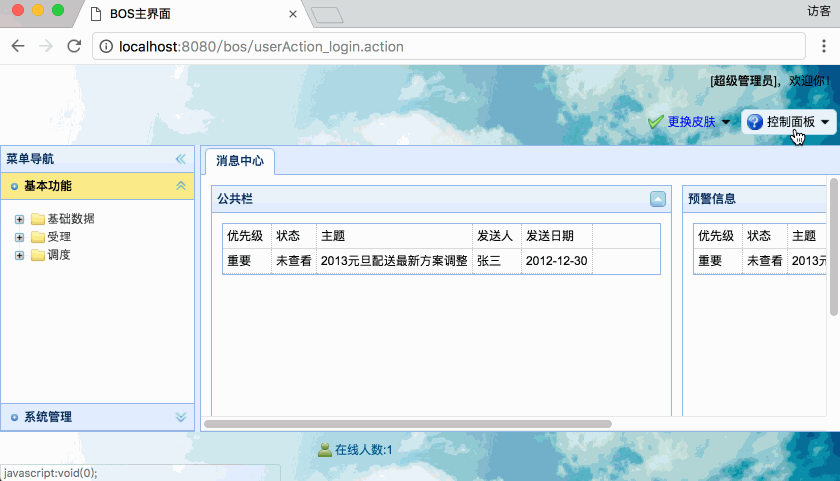
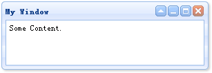

[TOC]


# BOS物流项目12———easyui弹框修改密码


## 一、修改密码图示




----


## 二、bos-domain中定义查询

在 **User.hbm.xml** 中添加以下查询

```xml
    <query name="user.editpassword">
        update User set password = ? where id = ?
    </query>
```


---

## 三、bos-dao 中 BaseDao添加方法


我们可以直接使用使用 **BaseDao** 中的 **update** 方法，但是我们需要修改一个密码字段，就去更新所有，这有点不合常理吧，所以我们需要重新定义方法。在 BaseDao 中添加如下方法

```java
    /**
     * 执行更新
     * @param queryName
     * @param objects
     */
    @Override
    public void executeUpdate(String queryName, Object... objects) {
        Session session = getSessionFactory().getCurrentSession();
        Query query = session.getNamedQuery(queryName);
        for (int i = 0; i < objects.length; i++) {
            //为HQL语句中 ? 赋值
            query.setParameter(i,objects[i]);
        }
        //执行更新
        query.executeUpdate();
    }
```

---

## 四、bos-service 中 UserService 添加方法

UserService 中添加修改密码的方法

这里修改密码的方法，调用 **BaseDao** 中上面我们添加的方法 **executeUpdate** 就行了。其中的 **queryName**

是查询的名称，也就是上面我们在 **User.hbm.xml** 中定义的 **user.editpassword**。

添加如下方法

```java
    @Override
    public void editPassword(String id, String password) {
        password = MD5Utils.md5(password);
        userDao.executeUpdate("user.editpassword",password,id);
    }
```

---

## 五、bos-web中 UserAction 添加修改方法

```java

    /**
     * 修改密码
     * @return
     * @throws IOException
     */
    public String editPassword() throws IOException {
        String str = "1";
        //获取当前登录用户
        User user = BOSUtils.getLoginUser();
        try {
            userService.editPassword(user.getId(),model.getPassword());
        }catch (Exception e){
            str = "0";
            e.printStackTrace();
        }
        ServletActionContext.getResponse().setContentType("text/html;charset=utf-8");
        ServletActionContext.getResponse().getWriter().print(str);
        return NONE;
    }
```


---

## 六、修改密码界面

### 6.1 EasyUI 创建简单窗口

创建一个窗口（window）非常简单，我们创建一个 DIV 标记，使用**class**是 “easyui-window”

例如

```java
<div id="win" class="easyui-window" title="My Window" style="width:300px;height:100px;padding:5px;">
	Some Content.
</div>
```




---

### 6.2 Validatebox 验证框


Validatebox 验证框 主要使用的class是“easyui-validatebox”，

required是boolean值，定义是否字段应被输入。

验证规则

验证规则是通过使用 required 和 validType 属性来定义的，这里是已经实施的规则：
>email：匹配 email 正则表达式规则。
>
>url：匹配 URL 正则表达式规则。
>
>length[0,100]：允许从 x 到 y 个字符。
>
>remote['http://.../action.do','paramName']：发送 ajax 请求来验证值，成功时返回 'true' 。

具体可以查看

[EasyUI Validatebox 验证框](http://www.jeasyui.net/plugins/167.html)


### 6.3 修改界面，主要代码

修改界面，主要代码可以如下。

```jsp

.............
<script type="text/javascript">
        $(function(){
            $("#btnCancel").click(function(){
                $('#editPwdWindow').window('close');
            });

            //为确定按钮绑定事件
            $("#btnEp").click(function(){
                //进行表单校验
                var v = $("#editPasswordForm").form("validate");
                if(v){
                    //表单校验通过，手动校验两次输入是否一致
                    var v1 = $("#txtNewPass").val();
                    var v2 = $("#txtRePass").val();
                    if(v1 == v2){
                        //两次输入一致，发送ajax请求
                        $.post("userAction_editPassword.action",{"password":v1},function(data){
                            if(data == '1'){
                                //修改成功，关闭修改密码窗口
                                $("#editPwdWindow").window("close");
                                $.messager.alert("提示信息","密码修成功！","info");
                            }else{
                                //修改密码失败，弹出提示
                                $.messager.alert("提示信息","密码修改失败！","error");
                            }
                        });
                    }else{
                        //两次输入不一致，弹出错误提示
                        $.messager.alert("提示信息","两次密码输入不一致！","warning");
                    }
                }
            });
        });
        function editPassword(){
            $('#editPwdWindow').window('open');
        }
    </script>
.............

<a href="javascript:void(0);" data-options="menu:'#layout_north_kzmbMenu',iconCls:'icon-help'" class="easyui-menubutton">控制面板</a>

<div id="layout_north_kzmbMenu" style="width: 100px; display: none;">
    <div onclick="editPassword();">修改密码</div>
    <div >联系管理员</div>
    <div class="menu-sep"></div>
    <div >退出系统</div>
</div>

<div id="editPwdWindow" class="easyui-window" title="修改密码" collapsible="false" minimizable="false" modal="true" closed="true" resizable="false"
     maximizable="false" icon="icon-save"  style="width: 300px; height: 160px; padding: 5px;
        background: #fafafa">
    <div class="easyui-layout" fit="true">
        <div region="center" border="false" style="padding: 10px; background: #fff; border: 1px solid #ccc;">
            <form id="editPasswordForm">
                <table cellpadding=3>
                    <tr>
                        <td>新密码：</td>
                        <td><input  required="true" data-options="validType:'length[4,6]'" id="txtNewPass" type="Password" class="txt01 easyui-validatebox" /></td>
                    </tr>
                    <tr>
                        <td>确认密码：</td>
                        <td><input required="true" data-options="validType:'length[4,6]'" id="txtRePass" type="Password" class="txt01 easyui-validatebox" /></td>
                    </tr>
                </table>
            </form>
        </div>
        <div region="south" border="false" style="text-align: right; height: 30px; line-height: 30px;">
            <a id="btnEp" class="easyui-linkbutton" icon="icon-ok" href="javascript:void(0)" >确定</a>
            <a id="btnCancel" class="easyui-linkbutton" icon="icon-cancel" href="javascript:void(0)">取消</a>
        </div>
    </div>

</div>

.............
```


----

## 七、源码下载

[https://github.com/wimingxxx/bos-parent](https://github.com/wimingxxx/bos-parent/)