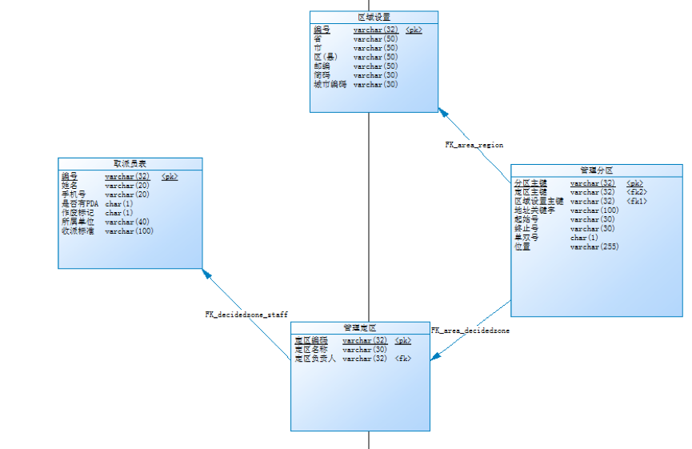

[TOC]

# BOS物流项目13———基础部分分析

整个BOS项目分为基础设置、取派、中转、路由、报表、财务等部分。

基础设置部分包括
> 1 基本档案设置
> 
> 2 收派标准
> 
> 3 班车设置
> 
> 4 取派设置/替班
> 
> 5 区域设置
> 
> 6 管理分区
> 
> 7 管理定区
>
> 8 收派时间管理

我们涉及到的是 **4、5、6、7**

## 一、基本档案设置

主要是针对本系统中的一些自定义项，需要参照录入，并作为统计分析和计算的维度，用户根据自己的需要动态设置的基础档案；对于自定义的档案支持多级定义；

本模块在其他的系统中也可以称为“数据字典”。

---

## 二、收派标准

将承接的货物，按照重量和体积两个标准，双纬度定义货物的标准。以便将不同标准的货物分给不同收取和派送能力的人员。由运营部门制定。

---

## 三、班车设置

将设置的线路和车辆建立对应关系。

---

## 四、取派设置/替班

小件员设置主要是设置小件员和快递员的资源信息，主要是为了自动下单和取派任务件使用；包括增加小件员的交

通工具和通讯设备，以及取派的重量和体积标准。

使用角色为各级组织机构的系统管理人员在添加。

取派设置中包括小件员的替班信息设置。

以及被替班人信息的查询功能。

---

## 五、区域设置

此功能区域为行政区域列表，为价格、商务网站、工作单始发站、目的站等来源的基础数据。
---

## 六、管理分区

区域是由国家划分的行政区域，区域往往很大，不规则，不便于进行物人员分配。对于区域要进行细分，产生分区。
	

对管理分区进行维护,为定区管理,自动下单等后续操作提供基础数据支持。
打算引入一个复制功能按钮，用来增加信息基本相同的数据。

---

## 七、管理定区

定区是物流分配的基本单位，可以将客户信息、取派员信息、分区信息进行关联，为自动分单提供基础数据。

区域 > 定区 > 分区

---

## 八、收派时间管理

上班时间的管理,根据取派人员的可上班时间,将区域取派任务在不同时限分配给不同的取派人员。建议时间管理由总公司部门管理,固化出各种上班时间点。下级厅点只有调用权限,没有修改权限。

---

## 九、表关系

----

## 十、源码下载

[https://github.com/wimingxxx/bos-parent](https://github.com/wimingxxx/bos-parent/)