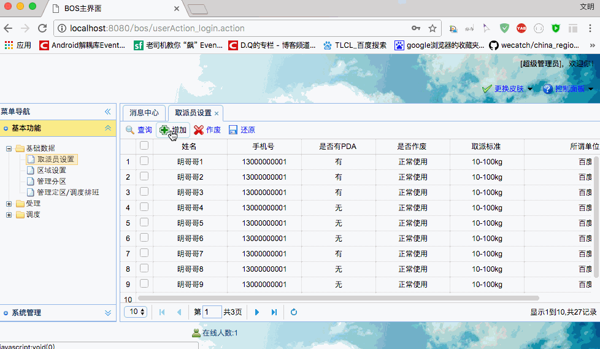

[TOC]


# BOS物流项目14———取派员1_添加取派员

## 一、添加取派员图示




----


## 二、导入相关文件

从 [https://github.com/wimingxxx/bos-parent/tree/master/bos-domain/src/main/java/com/qwm/bos/domain](https://github.com/wimingxxx/bos-parent/tree/master/bos-domain/src/main/java/com/qwm/bos/domain) 中导入一下文件

>Decidedzone.hbm.xml	
>	
>Decidedzone.java		
>
>Region.hbm.xml		
>
>Region.java		
>
>Staff.hbm.xml		
>
>Staff.java		
>
>Subarea.hbm.xml		
>
>Subarea.java	


----

## 三、界面修改

页面是 

[https://github.com/wimingxxx/bos-parent/blob/master/bos-web/src/main/webapp/WEB-INF/pages/base/staff.jsp](https://github.com/wimingxxx/bos-parent/blob/master/bos-web/src/main/webapp/WEB-INF/pages/base/staff.jsp)

主要就是添加 手机号的验证，和，修改地址

**手机号验证和使用**

```html
.........
var reg= /^1[3|4|5|7|8][\d]{9}$/;
		$.extend($.fn.validatebox.defaults.rules,{
			telephone:{
				validator:function(value,param){
					return reg.test(value);
				},
				message:'手机输入有误'
			}
		});
........

<td><input type="text" data-options="validType:'telephone'" name="telephone" class="easyui-validatebox" required="true"/></td>
........

```

**请求地址修改如下**

```html
<form id="addStaffFrom" action="staffAction_add.action" method="post">
.......
</from>
```

---

## 四、在 bos-dao 中创建 StaffDao

在 bos-dao 模块中，创建 IStaffDao、和 StaffDaoImpl 。使用 Spring 注解来管理对象。

**StaffDaoImpl**

```java
package com.qwm.bos.dao.impl;

import com.qwm.bos.dao.IStaffDao;
import com.qwm.bos.dao.base.impl.BaseDaoImpl;
import com.qwm.bos.domain.Staff;
import org.springframework.stereotype.Repository;

/**
 * @author: qiwenming(杞文明)
 * @date: 17/12/14 下午11:08
 * @className: StaffDaoImpl
 * @description:
 */
@Repository
public class StaffDaoImpl extends BaseDaoImpl<Staff> implements IStaffDao {
}
```

----

## 五、在 bos-service 中创建 StaffService

在 bos-service 模块中，创建 IStaffService、和 StaffServiceImpl 。使用 Spring 注解来管理对象。


### 5.1 IStaffService

```java
package com.qwm.bos.service;

import com.qwm.bos.domain.Staff;
import com.qwm.bos.utils.PageBean;

/**
 * @author: qiwenming(杞文明)
 * @date: 17/12/14 下午11:09
 * @className: IStaffService
 * @description:
 */
public interface IStaffService {
    void save(Staff staff);
}
```

### 5.2 StaffServiceImpl

```java
package com.qwm.bos.service.impl;

import com.qwm.bos.dao.IStaffDao;
import com.qwm.bos.domain.Staff;
import com.qwm.bos.service.IStaffService;
import com.qwm.bos.utils.PageBean;
import org.apache.commons.lang3.StringUtils;
import org.springframework.beans.factory.annotation.Autowired;
import org.springframework.stereotype.Service;
import org.springframework.transaction.annotation.Transactional;

/**
 * @author: qiwenming(杞文明)
 * @date: 17/12/14 下午11:20
 * @className: StaffServiceImpl
 * @description:
 */
@Service
@Transactional
public class StaffServiceImpl implements IStaffService {

    @Autowired
    private IStaffDao staffDao;

    @Override
    public void save(Staff staff) {
        staffDao.save(staff);
    }
}

```

----

## 六、在 bos-web 中创建 StaffAction

在 bos-web 模块中，创建 StaffAction。使用 Spring 注解来管理对象。

```java
package com.qwm.bos.web.action;

import com.qwm.bos.domain.Staff;
import com.qwm.bos.service.IStaffService;
import com.qwm.bos.utils.PageBean;
import com.qwm.bos.web.action.base.BaseAction;
import net.sf.json.JSONObject;
import net.sf.json.JsonConfig;
import org.apache.struts2.ServletActionContext;
import org.hibernate.criterion.DetachedCriteria;
import org.springframework.beans.factory.annotation.Autowired;
import org.springframework.context.annotation.Scope;
import org.springframework.stereotype.Controller;

import java.io.IOException;

/**
 * @author: qiwenming(杞文明)
 * @date: 17/12/14 下午11:22
 * @className: StaffAction
 * @description:
 */
@Controller
@Scope("prototype")
public class StaffAction extends BaseAction<Staff> {
    @Autowired
    private IStaffService staffService;

    /**
     * 添加取派员
     */
    public String add(){
        staffService.save(getModel());
        return LIST;
    }
   
}

```


struts.xml中加入如下配置

```xml
 <!--取派员-->
 <action name="staffAction_*" class="staffAction" method="{1}">
   <result name="list">/WEB-INF/pages/base/staff.jsp</result>
 </action>
```

----

## 七、源码下载

[https://github.com/wimingxxx/bos-parent](https://github.com/wimingxxx/bos-parent/)