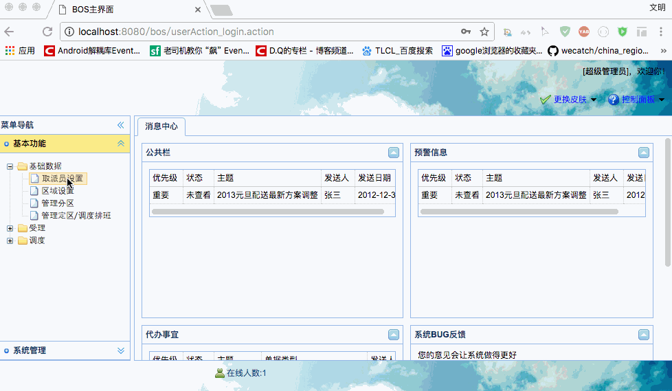
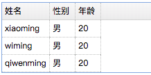
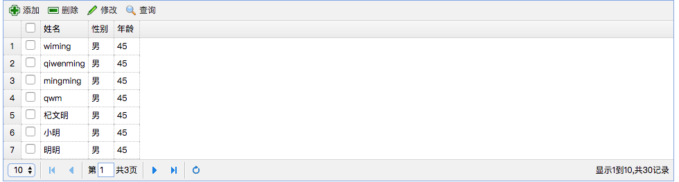

[TOC]


# BOS物流项目15———取派员2_取派员列表

## 一、添加取派员图示




----

## 二、easyui中datagrid基本使用

可以查看  [EasyUI Datagrid 数据网格](http://www.jeasyui.net/plugins/183.html)

主要使用的class 是 **easyui-datagrid**,作用于**table**，table中必须添加 **field**

否则无法显示数据。

**demo** 地址 [https://github.com/wimingxxx/bos-parent/blob/master/bos-web/src/main/webapp/easyui/07-datagrid.jsp](https://github.com/wimingxxx/bos-parent/blob/master/bos-web/src/main/webapp/easyui/07-datagrid.jsp)

### 2.1 将静态HTML渲染为datagrid样式

```html
<%--1	将静态HTML渲染为datagrid样式--%>
<table class="easyui-datagrid">
    <thead>
    <tr>
        <th data-options="field:'name'">姓名</th>
        <th data-options="field:'sex'">性别</th>
        <th data-options="field:'age'">年龄</th>
    </tr>
    </thead>
    <tbody>
    <tr>
        <td>xiaoming</td>
        <td>男</td>
        <td>20</td>
    </tr>
    <tr>
        <td>wiming</td>
        <td>男</td>
        <td>20</td>
    </tr>
    <tr>
        <td>qiwenming</td>
        <td>男</td>
        <td>20</td>
    </tr>
    </tbody>
</table>
```




### 2.2 发送ajax请求获取json数据创建datagrid

通过 **url** 可以来请求网络中的数据。

```html
<%--2发送ajax请求获取json数据创建datagrid--%>

<table class="easyui-datagrid" data-options="url:'${pageContext.request.contextPath}/json/datagridtest.json'">
    <thead>
    <tr>
        <th data-options="field:'name'">姓名</th>
        <th data-options="field:'sex'">性别</th>
        <th data-options="field:'age'">年龄</th>
    </tr>
    </thead>
    <tbody>
</table>
```

**datagridtest.json**

```json
[
  {"name":"wiming","sex":"男","age":45},
  {"name":"qiwenming","sex":"男","age":45},
  {"name":"mingming","sex":"男","age":45},
  {"name":"qwm","sex":"男","age":45},
  {"name":"杞文明","sex":"男","age":45},
  {"name":"小明","sex":"男","age":45},
  {"name":"明明","sex":"男","age":45}
]
```


---

### 2.3 使用easyUI提供的API创建datagrid

分页中需要注意的是：

请求的时候

page : 当前页

rows ： 代表的时候，每页的条数


响应的时候

total : 总记录数

rows ：当前页的记录数（json 数组）


```html
<%--使用easyUI提供的API创建datagrid--%>

<table id="mytable" class="easyui-datagrid"/>

<script type="text/javascript">
    $(function(){
        //页面加载完成后，创建数据表格datagrid
        $("#mytable").datagrid({
            //定义标题行所有的列
            columns:[[
                {title:'编号',field:'id',checkbox:true},
                {title:'姓名',field:'name'},
                {title:'性别',field:'sex'},
                {title:'年龄',field:'age'}
            ]],
            //指定数据表格发送ajax请求的地址
            url:'${pageContext.request.contextPath }/json/datagridtest2.json',
            rownumbers:true,
            singleSelect:true,
            //定义工具栏
            toolbar:[
                {text:'添加',iconCls:'icon-add',
                    //为按钮绑定单击事件
                    handler:function(){
                        alert('add...');
                    }
                },
                {text:'删除',iconCls:'icon-remove'},
                {text:'修改',iconCls:'icon-edit'},
                {text:'查询',iconCls:'icon-search'}
            ],
            pagination:true
        });
    });
</script>
```

**datagridtest2.json**

```json
{
  "total": 30,
  "rows": [
    {
      "name": "wiming",
      "sex": "男",
      "age": 45
    },
    {
      "name": "qiwenming",
      "sex": "男",
      "age": 45
    },
    {
      "name": "mingming",
      "sex": "男",
      "age": 45
    },
    {
      "name": "qwm",
      "sex": "男",
      "age": 45
    },
    {
      "name": "杞文明",
      "sex": "男",
      "age": 45
    },
    {
      "name": "小明",
      "sex": "男",
      "age": 45
    },
    {
      "name": "明明",
      "sex": "男",
      "age": 45
    }
  ]
}
```




----

## 三、bos-utils 中添加 PageBean

在 bos-utils 中添加 PageBean ，是分页对象


```java

package com.qwm.bos.utils;

import org.hibernate.criterion.DetachedCriteria;

import java.util.List;

/**
 * @author: qiwenming(杞文明)
 * @date: 17/12/16 下午5:19
 * @className: PageBean
 * @description:
 * 封装分页属性
 */
public class PageBean {
    private int currentPage;//当前页码
    private int pageSize;//每页显示的记录数
    private DetachedCriteria detachedCriteria;//查询条件
    private int total;//总记录数
    private List rows;//当前页需要展示的数据集合
    ........省略get/set方法........
 }   

```

## 四、BaseDao中添加 pageQuery

在 BaseDao中添加如下的分页查询方法

```java
/**
     * 分页查询
     */
    @Override
    public void pageQuery(PageBean pageBean) {
        int currentPage = pageBean.getCurrentPage();
        int pageSize = pageBean.getPageSize();
        DetachedCriteria detachedCriteria = pageBean.getDetachedCriteria();

        //查询total---总数据量
        detachedCriteria.setProjection(Projections.rowCount());
        List<Long> countList = (List<Long>) this.getHibernateTemplate().findByCriteria(detachedCriteria);
        Long count = countList.get(0);
        pageBean.setTotal(count.intValue());

        //查询rows---当前页需要展示的数据集合
        detachedCriteria.setProjection(null);
        detachedCriteria.setProjection(null);//指定hibernate框架发出sql的形式----》select * from bc_staff;
        int firstResult = (currentPage - 1) * pageSize;
        int maxResults = pageSize;
        List rows = this.getHibernateTemplate().findByCriteria(detachedCriteria, firstResult, maxResults);
        pageBean.setRows(rows);
    }
```


----

## 五、在StaffService中添加 pageQuery

```java
    @Override
    public void pageQuery(PageBean pageBean) {
        staffDao.pageQuery(pageBean);
    }
```

---

## 六、在StaffAction中添加 pageQuery

在StaffAction中添加如下代码

```java
//属性驱动，接收页面提交的分页参数
    private int page;
    private int rows;

    /**
     * 分页查询
     */
    public String pageQuery() throws IOException {
        //参数封装
        PageBean pageBean = new PageBean();
        pageBean.setCurrentPage(page);
        pageBean.setPageSize(rows);
        //创建离线提交查询对象
        DetachedCriteria detachedCriteria = DetachedCriteria.forClass(Staff.class);
        pageBean.setDetachedCriteria(detachedCriteria);
        staffService.pageQuery(pageBean);

        //使用json-lib将PageBean对象转为json，通过输出流写回页面中
        //JSONObject---将单一对象转为json
        //JSONArray----将数组或者集合对象转为json
        //指定哪些属性不需要转json
        JsonConfig jsonConfig = new JsonConfig();
        jsonConfig.setExcludes(new String[]{"currentPage","detachedCriteria","pageSize"});
        String json = JSONObject.fromObject(pageBean,jsonConfig).toString();
        ServletActionContext.getResponse().setContentType("text/json;charset=utf-8");
        ServletActionContext.getResponse().getWriter().print(json);
        return NONE;
    }
```


----

## 七、源码下载

[https://github.com/wimingxxx/bos-parent](https://github.com/wimingxxx/bos-parent/)