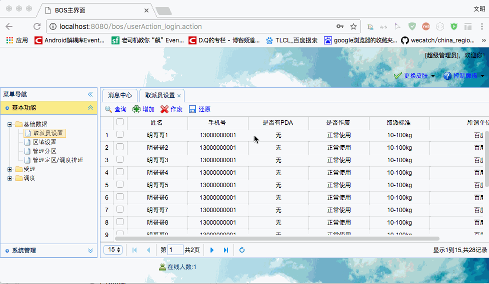

[TOC]


# BOS物流项目16———取派员3_修改取派员

## 一、修改取派员图示




----

## 二、修改说明

修改的操作是通过双击列表中的行，然后弹出修改窗口，修改完成，保存，这样就完成了修改。这里主要说明的是双击。

### 2.1 界面修改说明

**datagrid** 有一个属性 **onDblClickRow** 是用来绑定双击事件的，例如：

```html
		// 取派员信息表格
		$('#grid').datagrid( {
			iconCls : 'icon-forward',
			fit : true,
			border : false,
			rownumbers : true,
			striped : true,
			pageList: [10,15,20],
			pagination : true,
			toolbar : toolbar,
			url : "staffAction_pageQuery.action",
			idField : 'id',
			columns : columns,
			onDblClickRow : doDblClickRow
		});
```

当我们双击一行以后，打开一个窗口，通过**load**方法，可以数据自动显示到form中

```javascript
	function doDblClickRow(rowIndex, rowData){
		$("#editStaffWindow").window("open");
		//把数据自动显示到form表单中,通过name来识别
		$("#editStaffForm").form("load",rowData);
	}
```

### 2.2 修改的方法说明

为了避免更新了不必要的数据，在执行修改的时候，我们应该这样操作：

1 通过id查询出数据，保存的对象1中

2 把界面提交的数据，设置到对象1中

3 数据更新对象1


---

## 三、StaffService添加方法

通过上面的分析，我们可以发现，需要两个方法，一个是通过id查询对象,一个是更新方法

添加 **findById** 和 **update** 方法


```java
    @Override
    public Staff findById(String id) {
        return staffDao.findById(id);
    }

    @Override
    public void update(Staff staff) {
        staffDao.update(staff);
    }

```

---

## 四、StaffAction添加edit方法

```java
    /**
     * 修改取派员信息
     */
    public String edit(){
        //显查询数据库，根据id查询原始数据
        Staff staff = staffService.findById(model.getId());
        //使用页面提交的数据进行覆盖
        staff.setName(model.getName());
        staff.setTelephone(model.getTelephone());
        staff.setHaspda(model.getHaspda());
        staff.setStandard(model.getStandard());
        staff.setStation(model.getStation());
        staffService.update(staff);
        return LIST;
    }
```


----

## 五、源码下载

[https://github.com/wimingxxx/bos-parent](https://github.com/wimingxxx/bos-parent/)