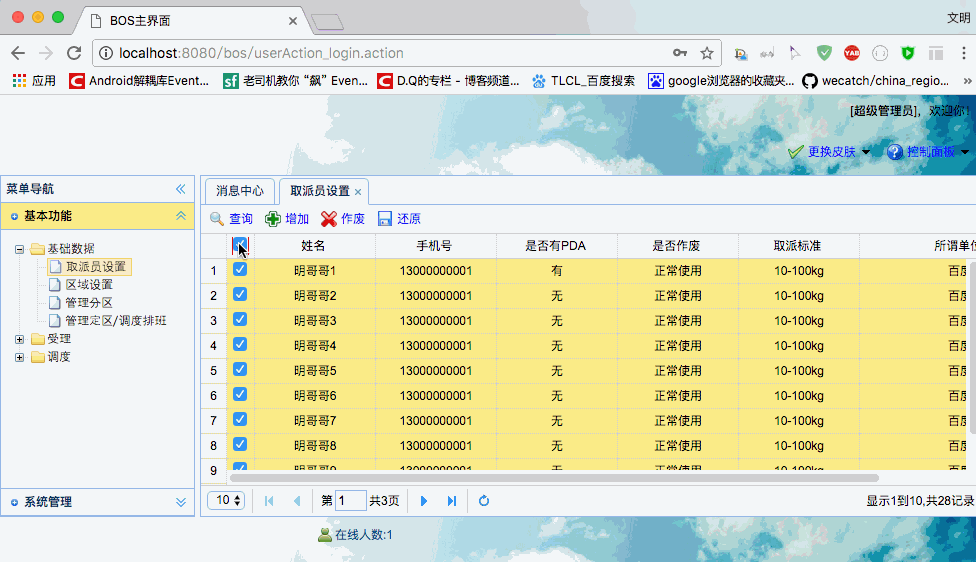

[TOC]


# BOS物流项目17———取派员4_批量删除与批量还原

## 一、取派员批量图示




----

## 二、界面获取选中行说明

选中的行，我们可以通过 datagrid 的 **getSelections** 方法来获取。

获取到以后，取出id 拼接成一个字符串，传递到后台，例如删除的方法

```html
function doDelete(){
		//获取数据表格中所有选中的行，返回数组对象
		var rows = $("#grid").datagrid("getSelections");
		if(rows.length == 0){
			//没有选中记录，弹出提示
			$.messager.alert("提示信息","请选择需要删除的取派员！","warning");
		}else{
			//选中了取派员,弹出确认框
			$.messager.confirm("删除确认","你确定要删除选中的取派员吗？",function(r){
				if(r){

					var array = new Array();
					//确定,发送请求
					//获取所有选中的取派员的id
					for(var i=0;i<rows.length;i++){
						var staff = rows[i];//json对象
						var id = staff.id;
						array.push(id);
					}
					var ids = array.join(",");//1,2,3,4,5
					location.href = "staffAction_deleteBatch.action?ids="+ids;
				}
			});
		}
	}
```

----

## 三、Staff.hbm.xml 中定义查询

在Staff.hbm.xml中定义 删除和还原的查询,使用的是 **逻辑删除**，不是**硬删除**

```xml
    <query name="staff.delete">
        update Staff set deltag='1' where id = ?
    </query>
    <query name="staff.reduction">
        update Staff set deltag='0' where id = ?
    </query>
```


---

## 四、StaffService添加方法


```java
     * 取派员批量删除
     * 逻辑删除，将deltag改为1
     */
    @Override
    public void deleteBatch(String ids) {
        if(StringUtils.isNotBlank(ids)){
            String[] staffIds = ids.split(",");
            for (String id : staffIds) {
                staffDao.executeUpdate("staff.delete", id);
            }
        }
    }

    /**
     * 取派员批量 还原
     * 逻辑删除，将deltag改为1
     */
    @Override
    public void reductionBatch(String ids) {
        if(StringUtils.isNotBlank(ids)){
            String[] staffIds = ids.split(",");
            for (String id : staffIds) {
                staffDao.executeUpdate("staff.reduction", id);
            }
        }
    }
```

---

## 五、StaffAction添加方法

```java
    //属性驱动，接收页面提交的ids参数
    private String ids;

    /**
     * 取派员批量删除
     */
    public String deleteBatch(){
        staffService.deleteBatch(ids);
        return LIST;
    }

    /**
     * 取派员批量还原
     */
    public String reductionBatch(){
        staffService.reductionBatch(ids);
        return LIST;
    }

```


----

## 六、源码下载

[https://github.com/wimingxxx/bos-parent](https://github.com/wimingxxx/bos-parent/)