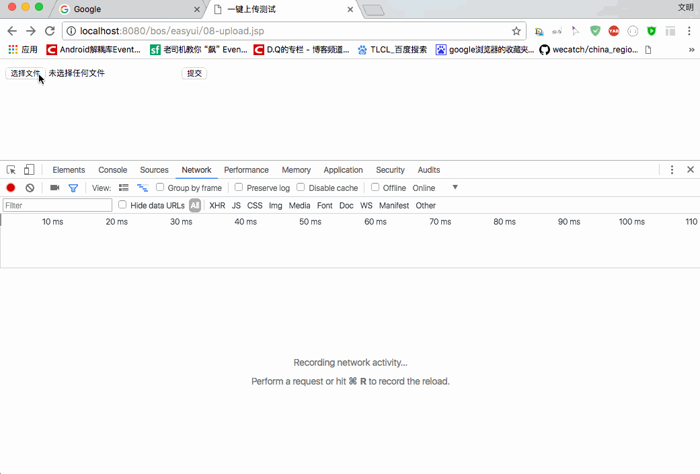
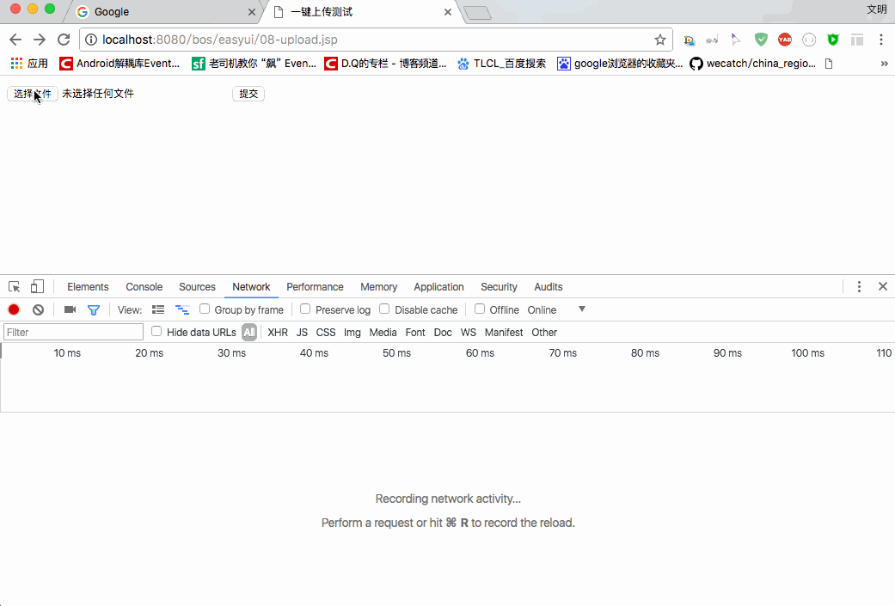
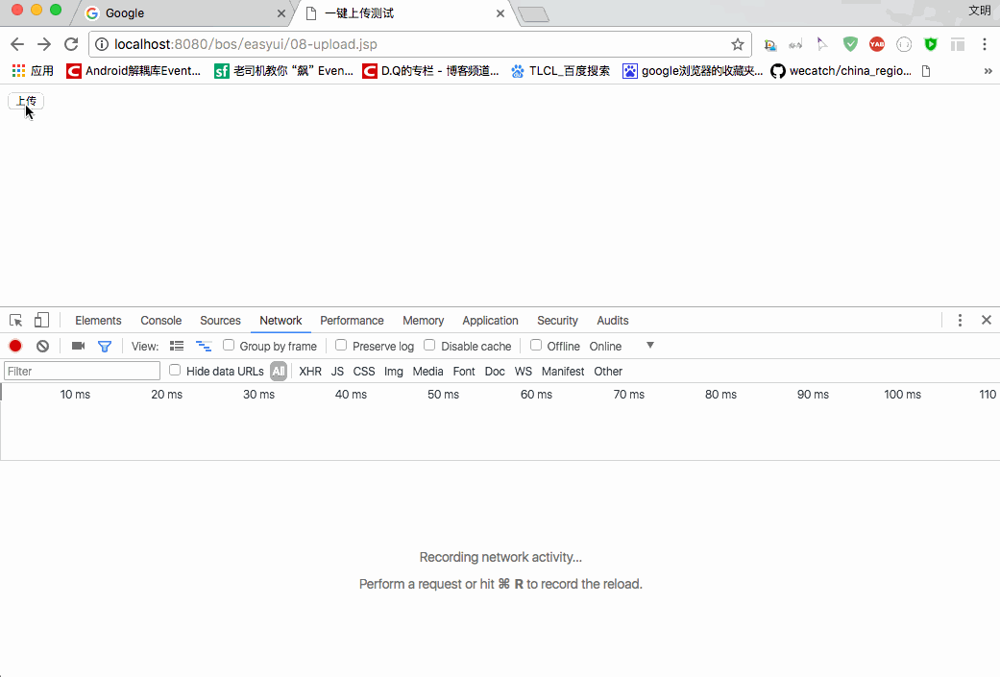
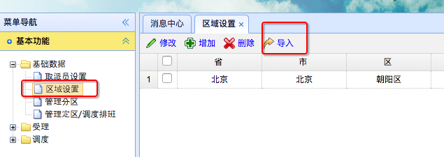

[TOC]


# BOS物流项目18———区域数据1\_导入功能_一键上传

## 一、原始的文件上传（刷新界面）

在执行文件上传的时候，我们使用的是 **input type="file"**,上传以后数据会刷新界面。例如下面的例子

html代码输入

```html
<%--
  Created by IntelliJ IDEA.
  User: qiwenming
  Date: 17/12/17
  Time: 上午2:30
  To change this template use File | Settings | File Templates.
--%>
<%@ page contentType="text/html;charset=UTF-8" language="java" %>
<html>
<head>
    <title>一键上传测试</title>
</head>
<body>

<form action="xxxx.action" method="post" enctype="multipart/form-data">
    <input type="file" name="myfile">
    <input type="submit">
</form>

</body>
</html>
```

上传以后会刷新界面。如图




**如果我们不希望去刷新界面，那么目前是没法满足的，请看下面**

---

## 二、上传文件（不刷新界面）

其实说不刷新界面，那么是不对的，只是刷新的界面有点奇特而已。我们的操作是这样的，我们书写一个 **iframe**,把

刷新的页面放到 iframe 中来。步骤如下：

1 书写一个iframe,添加上name属性，例如 : name=“iframe001”

2 书写上传文件的表单form，但是这里有一步很关键，把form的**target**属性指定为我们上面的iframe的name值，例如
：target="iframe001"

html代码如下

```html
<html>
<head>
    <title>一键上传测试</title>
</head>
<body>

<iframe name="iframe001"></iframe>

<form action="xxxx.action" method="post" target="iframe001" enctype="multipart/form-data">
    <input type="file" name="myfile">
    <input type="submit">
</form>

</body>
</html>
```

上传的图示如下


现在我们可以看到 页码只会在 iframe中刷新，不会整个页码都刷新，但是我们页码上仍然会出现刷洗的界面，我们怎么解决呢？

简单粗暴，直接不显示 iframe 不就行了吗？因此，我们给 iframe，添加一个样式，如下：

```html
<iframe name="iframe001" style="display: none"></iframe>
```



现在我们就实现了，上传文件，但是不刷新页码的需求了。

----

## 三、使用一键上传插件 jquery.ocupload

使用方式很简单，我们需要到 **jquery** 和 **jquery.ocupload**

使用的时候，我们需要在，页码中添加一个控件，然后给控件绑定点击事件，调用 upload 的方法就行了

```html
<html>
<head>
    <title>一键上传测试</title>
    <script type="text/javascript" src="${pageContext.request.contextPath }/js/jquery-1.8.3.js"></script>
    <script type="text/javascript" src="${pageContext.request.contextPath }/js/jquery.ocupload-1.1.2.js"></script>
    <script type="text/javascript">
        $(function(){
            //页面加载完成后，调用插件的upload方法，动态修改了HTML页面元素
            $("#myButton").upload({
                action:'xxx.action',
                name:'myFile'
            });
        });
    </script>
</head>
<body>

<input id="myButton" type="button" value="上传">

</body>
</html>
```

图示：




我们可以看到，点击以后，就自动上传了，其实它使用的也是我们上面使用不显示iframe的方式，我们可以去看看代码

```js
.........
/** A unique id so we can find our elements later */
		var id = new Date().getTime().toString().substr(8);
		
		/** Upload Iframe */
		var iframe = $(
			'<iframe '+
				'id="iframe'+id+'" '+
				'name="iframe'+id+'"'+
			'></iframe>'
		).css({
			display: 'none'
		});
		
		/** Form */
		var form = $(
			'<form '+
				'method="post" '+
				'enctype="'+options.enctype+'" '+
				'action="'+options.action+'" '+
				'target="iframe'+id+'"'+
			'></form>'
		).css({
			margin: 0,
			padding: 0
		});
.........
```

现在我们可以看到，它其实使用的也是我们上面使用的那种方式。

----

## 四、相关的文件下载

我们的测试的 jsp 源码位置 [https://github.com/wimingxxx/bos-parent/blob/master/bos-web/src/main/webapp/easyui/08-upload.jsp](https://github.com/wimingxxx/bos-parent/blob/master/bos-web/src/main/webapp/easyui/08-upload.jsp)

jquery.upload.js位置 [https://github.com/wimingxxx/bos-parent/blob/master/bos-web/src/main/webapp/js/jquery.ocupload-1.1.2.js](https://github.com/wimingxxx/bos-parent/blob/master/bos-web/src/main/webapp/js/jquery.ocupload-1.1.2.js)


----


## 五、区域设置一键上传前端
 区域设置中，有个通过导入 Excel 文件，到批量导入数据的功能。如图
 
 


现在我们需要添加前端的上传功能，依然使用上面我们的一键上传，其他部分已经写好了，下载我们只需要个导入的添加点击事件，

选择文件以后上传的功能。界面加载完成以后，添加下面的方法

```html
		//页面加载完成后，调用OCUpload插件的方法
		$("#button-import").upload({
			action:'regionAction_importXls.action',
			name:'regionFile'
		});
```

这样我们的 前端上传部分就已经完成了。


----

## 六、区域设置一键上传后端

前端上传文件以后，我们后端需要接收文件。可以查看

[SSH与SSM学习之SSH实现CRM练习11——文件上传](http://blog.csdn.net/qiwenmingshiwo/article/details/78713608)

[SSH与SSM学习之SSH实现CRM练习12——文件上传原理](http://blog.csdn.net/qiwenmingshiwo/article/details/78713629)

其实，没有想象的那么复杂，只需要在我们接收的action中定义一个 名称和提交的文件的name属性（如上面的**regionFile**）、类型为File的属性就行了。

我们创建一个 **RegionAction** 如下

```java
/**
 * @author: qiwenming(杞文明)
 * @date: 17/12/17 上午4:06
 * @className: RegionAction
 * @description: 区域
 */
@Controller
@Scope("prototype")
public class RegionAction extends BaseAction<Region> {


    //使用属性驱动接收伤处的文件
    private File regionFile;
    /**
     * 上传文件
     * @return
     */
    public String importXls(){
        System.out.println(regionFile);
        return NONE;
    }

    public void setRegionFile(File regionFile) {
        this.regionFile = regionFile;
    }
}

```


在 struts.xml 中添加配置

```xml
<!--区域管理-->
 <action name="regionAction_*" class="regionAction" method="{1}">
</action>
```

这样我们的文件上传就完成，剩下的就是处理 Excel 文件了。


----


## 七、源码下载

[https://github.com/wimingxxx/bos-parent](https://github.com/wimingxxx/bos-parent/)