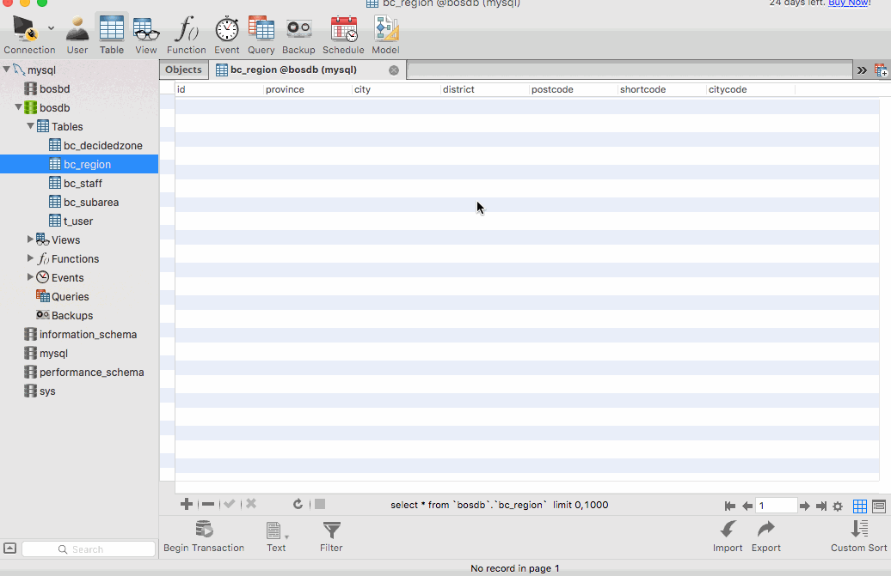
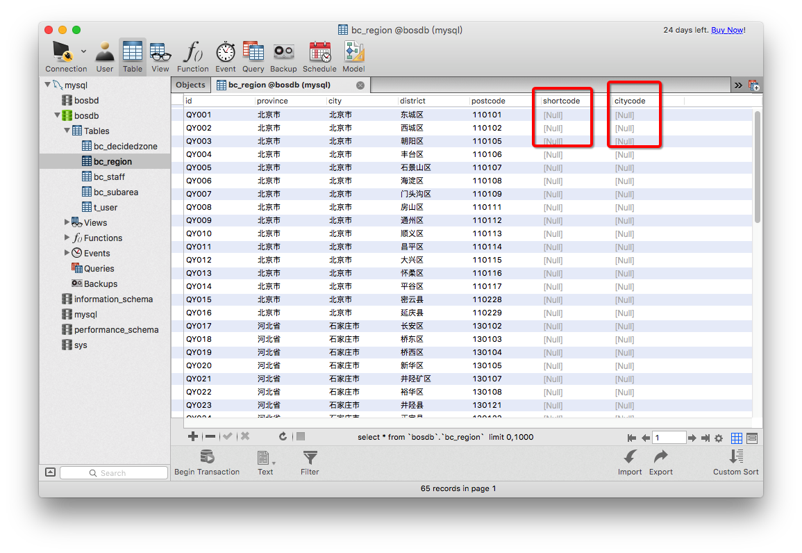

[TOC]


# BOS物流项目19———区域数据2\_导入功能_POI基本使用以及导入区域数据

## 一、POI说明

Apache POI是Apache软件基金会的开放源码函式库，POI提供API给Java程序对Microsoft Office格式档案读和写的功能。

**基本功能编辑***

结构：

>HSSF － 提供读写Microsoft Excel格式档案的功能。
>
>XSSF － 提供读写Microsoft Excel OOXML格式档案的功能。
>
>HWPF － 提供读写Microsoft Word格式档案的功能。
>
>HSLF － 提供读写Microsoft PowerPoint格式档案的功能。
>
>HDGF － 提供读写Microsoft Visio格式档案的功能。


下载地址

[https://poi.apache.org/download.html](https://poi.apache.org/download.html)


----


## 二、POI操作Excel基本使用

前面我们说到，我们上传的Excel文件，需要导入到数据库中，那么我们现在来看一下，具体怎么使用。首先我们看看，我们需导入的 Excel文件。如图


现在我们需要来操作这个Excel文件。

操作步骤如下：

1 创建一个工作簿(包装了一个Excel文件对象) (HSSFWorkbook)

2 读取文件中的第一个Sheet标签页  可以通过 Sheet名称或者索引获取到 (HSSFSheet)

3 遍历便签也中的每一行 (Row)

4 遍历每一行的单元格 (Cell)

5 获取cell的值


下面我们在 bos-web 中创建test的类，位置 src/test/com/qwm/bos/test/POITest.java

方法如下

```java

/**
     * 使用POI解析Excel文件
     * @throws IOException
     */
    @Test
    public void test1() throws IOException {
        //文件路径
        String filePath = "/Volumes/wiming/learn/maven/bos/bos-parent/files/区域导入测试数据.xls";
        //创建一个工作簿(包装了一个Excel文件对象)
        HSSFWorkbook workbook = new HSSFWorkbook(new FileInputStream(new File(filePath)));
        //读取文件中的第一个Sheet标签页  可以通过 Sheet名称或者索引获取到.
        HSSFSheet hssfSheet = workbook.getSheetAt(0);
        //遍历便签也中的每一行
        for (Row row: hssfSheet) {
            //第一行为标题,我们可以不遍历第一行
            if(row.getRowNum()==0)
                continue;
            //遍历每一行的单元格
            for (Cell cell: row) {
                //获取cell的值
                String value = cell.getStringCellValue();
                //加个制表符,显示更好看一点
                System.out.print(cell+"\t");
            }
            System.out.println();
        }
    }
```

遍历结果如下

```
QY001	北京市	北京市	东城区	110101	
QY002	北京市	北京市	西城区	110102	
QY003	北京市	北京市	朝阳区	110105	
QY004	北京市	北京市	丰台区	110106	
QY005	北京市	北京市	石景山区	110107	
QY006	北京市	北京市	海淀区	110108	
QY007	北京市	北京市	门头沟区	110109	
QY008	北京市	北京市	房山区	110111	
QY009	北京市	北京市	通州区	110112	
QY010	北京市	北京市	顺义区	110113	
QY011	北京市	北京市	昌平区	110114	
QY012	北京市	北京市	大兴区	110115	
QY013	北京市	北京市	怀柔区	110116	
QY014	北京市	北京市	平谷区	110117	
QY015	北京市	北京市	密云县	110228	
QY016	北京市	北京市	延庆县	110229	
QY017	河北省	石家庄市	长安区	130102	
QY018	河北省	石家庄市	桥东区	130103	
QY019	河北省	石家庄市	桥西区	130104	
QY020	河北省	石家庄市	新华区	130105	
QY021	河北省	石家庄市	井陉矿区	130107	

.................

```

----

## 三、导入区域数据

### 3.1 修改 RegionAciton的importXls方法

上面我们已经测试了 读取Excel的数据的操作方式，下面我们操作的是，上传Excel文件，然后读取数据，把数据存入到数据库中。

修改我们的 RegionAction 中的**importXls**方法

如下：

```java
    /**
     * 上传文件
     * @return
     */
    public String importXls() throws IOException {
        List<Region> regionList = new ArrayList<Region>();
        //创建一个工作簿(包装了一个Excel文件对象)
        HSSFWorkbook workbook = new HSSFWorkbook(new FileInputStream( regionFile ));
        //读取文件中的第一个Sheet标签页  可以通过 Sheet名称或者索引获取到.
        HSSFSheet hssfSheet = workbook.getSheetAt(0);
        //遍历便签也中的每一行
        for (Row row: hssfSheet) {
            //第一行为标题,我们可以不遍历第一行
            if(row.getRowNum()==0)
                continue;
            //上传的文件是按要求上传的,所以我们可以直接读取对应的单元格
            //区域编号	省份	城市	区域	邮编
            String id = row.getCell(0).getStringCellValue();
            String province = row.getCell(1).getStringCellValue();
            String city = row.getCell(2).getStringCellValue();
            String district = row.getCell(3).getStringCellValue();
            String postcode = row.getCell(4).getStringCellValue();

            //创建区域对象
            Region region = new Region(id,province,city,district,postcode,null,null,null);
            regionList.add(region);
        }
        //现在我们把读取的数据插入到数据库中
        regionService.saveBatch(regionList);
        return NONE;
    }

```


### 3.2 创建 RegionService

这里面有个点需要注意
>
>**我们使用的数据的区域编号,作为id,如果使用 save方法,那么我们**
>
>**第一次导入以后,后面再导入就会出现问题了,如果我们使用update方法**
>
>**那么我们需要自己去判断,所以我们这里使用 saveOrUpdate方法**

**IRegionService**

```java
package com.qwm.bos.service;

import com.qwm.bos.domain.Region;

import java.util.List;

/**
 * @author: qiwenming(杞文明)
 * @date: 17/12/17 下午12:57
 * @className: IRegionService
 * @description:
 */
public interface IRegionService {
    void saveBatch(List<Region> regionList);
}
```

**RegionServiceImpl**

```java
package com.qwm.bos.service.impl;

import com.qwm.bos.dao.IRegionDao;
import com.qwm.bos.domain.Region;
import com.qwm.bos.service.IRegionService;
import org.springframework.beans.factory.annotation.Autowired;
import org.springframework.stereotype.Controller;
import org.springframework.transaction.annotation.Transactional;

import java.util.List;

/**
 * @author: qiwenming(杞文明)
 * @date: 17/12/17 下午12:57
 * @className: IRegionService
 * @description:
 */
@Controller
@Transactional
public class RegionServiceImpl implements IRegionService {

    @Autowired
    private IRegionDao regionDao;

    /**
     * 批量保存数据
     * @param regionList
     */
    @Override
    public void saveBatch(List<Region> regionList) {
        //我们使用的数据的区域编号,作为id,如果使用 save方法,那么我们
        //第一次导入以后,后面再导入就会出现问题了,如果我们使用update方法
        //那么我们需要自己去判断,所以我们这里使用 saveOrUpdate方法
        for (Region region:regionList) {
            regionDao.saveOrUpdate(region);
        }
    }
}
```

## 三、创建DAO

我们把 **savaOrUpdate** 方法添加到 **BaseDao**中

```java
 	/**
     * 保存或者更新
     * @param entity
     */
    @Override
    public void saveOrUpdate(T entity) {
        getHibernateTemplate().saveOrUpdate(entity);
    }
```

然后创建空的 **RegionDao**

----

## 四、图示



----

## 五、遗留的问题

导入数据后，我们可以看到数据库中的数据如下



其中的 **shortcode**和**citycode**是空的，那么这两个数据是什么样的？它是这样的

**shortcode** 等于 **省+市+区** 去掉"省市区""，汉字的第一个字母大写相加的值，例如

河北省石家庄长安区 ---> 河北石家庄长安--> HBSJZCA

**citycode** 等于 **市** 去掉"市"的拼音，例如

石家庄--->shijiazhuang

这个问题下面的后面来解决

----

## 六、源码下载

[https://github.com/wimingxxx/bos-parent](https://github.com/wimingxxx/bos-parent/)