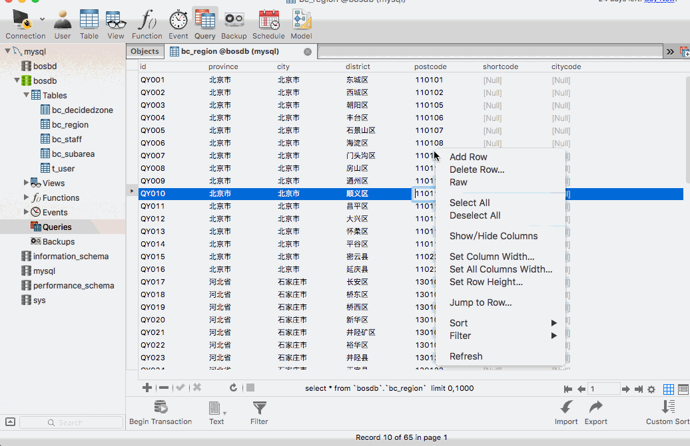

[TOC]


# BOS物流项目20———区域数据3\_导入功能_pinyin4j基本使用以及导入区域数据

## 一、pinyin4j说明以及导入相关文件

Pinyin4j是一个流行的Java库，支持中文字符和拼音之间的转换。拼音输出格式可以定制。

导入pinyin4j

```xml
		<!-- 引入pinyin4J的依赖 -->
		<dependency>
			<groupId>com.belerweb</groupId>
			<artifactId>pinyin4j</artifactId>
			<version>2.5.0</version>
		</dependency>
```

在 bos-utils中导入 **PinYin4jUtils.java** 工具类

位置 [https://github.com/wimingxxx/bos-parent/blob/master/bos-utils/src/main/java/com/qwm/bos/utils/PinYin4jUtils.java](https://github.com/wimingxxx/bos-parent/blob/master/bos-utils/src/main/java/com/qwm/bos/utils/PinYin4jUtils.java)

----

## 一、pinyin4j基本使用

在 bos-web 的测试包下，创建 Pinyin4jTest.java 类，用来测试Pinyin4j。解决之前遗留下来的问题

```java
package com.qwm.bos.test;

import com.qwm.bos.utils.PinYin4jUtils;
import org.apache.commons.lang3.StringUtils;
import org.junit.Test;

/**
 * @author: qiwenming(杞文明)
 * @date: 17/12/17 下午1:57
 * @className: Pinyin4jTest
 * @description:
 */
public class Pinyin4jTest {

    /**
     * Pinyin4j测试
     */
    @Test
    public void test(){
        //河北省	石家庄市	长安区
        String province = "河北省";
        String city = "石家庄市";
        String district = "长安区";

        //去掉省市区
        province = province.substring(0,province.length()-1);
        city = city.substring(0,city.length()-1);
        district = district.substring(0,district.length()-1);

        String info = province + city + district;

        //简码---> HBSJZCA
        String[] headByString = PinYin4jUtils.getHeadByString(info);
        //获取简码
        String shortcode = StringUtils.join(headByString);
        System.out.println(shortcode);

        //城市编码--->shijiazhuang
        String citycode = PinYin4jUtils.hanziToPinyin(city,"");
        System.out.println(citycode);
    }
}
```

结果

```
HBSJZZA
shijiazhuang
```
现在我们解决了 简码和城市的的问题，去修改我们的 importXls方法。

----

## 三、修改RegionAction的importXls方法

这里的修改，就是加上简码和城市编码，修改如下

```java
    /**
     * 上传文件
     * @return
     */
    public String importXls() throws IOException {
        List<Region> regionList = new ArrayList<Region>();
        //创建一个工作簿(包装了一个Excel文件对象)
        HSSFWorkbook workbook = new HSSFWorkbook(new FileInputStream( regionFile ));
        //读取文件中的第一个Sheet标签页  可以通过 Sheet名称或者索引获取到.
        HSSFSheet hssfSheet = workbook.getSheetAt(0);
        //遍历便签也中的每一行
        for (Row row: hssfSheet) {
            //第一行为标题,我们可以不遍历第一行
            if(row.getRowNum()==0)
                continue;
            //上传的文件是按要求上传的,所以我们可以直接读取对应的单元格
            //区域编号	省份	城市	区域	邮编
            String id = row.getCell(0).getStringCellValue();
            String province = row.getCell(1).getStringCellValue();
            String city = row.getCell(2).getStringCellValue();
            String district = row.getCell(3).getStringCellValue();
            String postcode = row.getCell(4).getStringCellValue();

            //创建区域对象
            Region region = new Region(id,province,city,district,postcode,null,null,null);

           //去掉省市区
            province = province.substring(0,province.length()-1);
            city = city.substring(0,city.length()-1);
            district = district.substring(0,district.length()-1);
            String info = province + city + district;
            //简码
            String[] headByString = PinYin4jUtils.getHeadByString(info);
            //获取简码
            String shortcode = StringUtils.join(headByString);
            //城市编码
            String citycode = PinYin4jUtils.hanziToPinyin(city,"");
            //设置简码和城市编码
            region.setShortcode(shortcode);
            region.setCitycode(citycode);
            regionList.add(region);
        }
        //现在我们把读取的数据插入到数据库中
        regionService.saveBatch(regionList);
        return NONE;
    }
```

图示



----

## 四、源码下载

[https://github.com/wimingxxx/bos-parent](https://github.com/wimingxxx/bos-parent/)