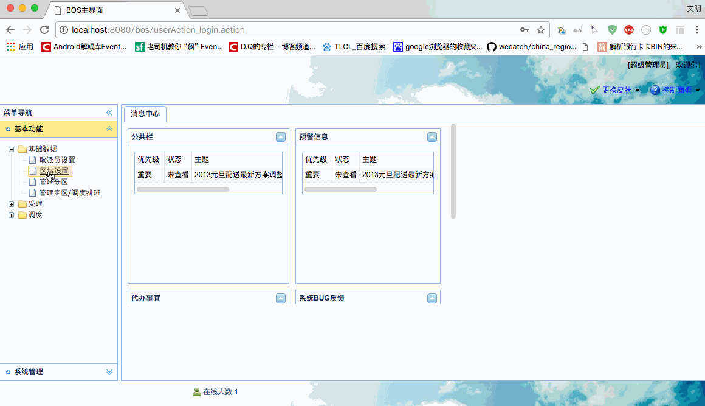

[TOC]


# BOS物流项目21———区域数据4\_分页查询以及重构分页代码

## 一、前端页码调整

这里面，我们主要修改 region.jsp 中的请求地址。如下

```html

            // 收派标准数据表格
            $('#grid').datagrid({
                iconCls: 'icon-forward',
                fit: true,
                border: false,
                rownumbers: true,
                striped: true,
                pageList: [30, 50, 100],
                pagination: true,
                toolbar: toolbar,
                url: "regionAction_pageQuery.action",
                idField: 'id',
                columns: columns,
                onDblClickRow: doDblClickRow
            });
```

----


## 二、重构分页代码


前面我们用到了分页，现在也用到了以后也需要用到，但是我们发现很多代码是重复的，所以我们我们需要把重复代码提取到 BaseAction中。

之前使用的分页代码是这样的

```java
    /**
     * 分页查询
     */
    public String pageQuery() throws IOException {
        //参数封装
        PageBean pageBean = new PageBean();
        pageBean.setCurrentPage(page);
        pageBean.setPageSize(rows);
        //创建离线提交查询对象
        DetachedCriteria detachedCriteria = DetachedCriteria.forClass(Staff.class);
        pageBean.setDetachedCriteria(detachedCriteria);
        staffService.pageQuery(pageBean);

        //使用json-lib将PageBean对象转为json，通过输出流写回页面中
        //JSONObject---将单一对象转为json
        //JSONArray----将数组或者集合对象转为json
        //指定哪些属性不需要转json
        JsonConfig jsonConfig = new JsonConfig();
        jsonConfig.setExcludes(new String[]{"currentPage","detachedCriteria","pageSize"});
        String json = JSONObject.fromObject(pageBean,jsonConfig).toString();
        ServletActionContext.getResponse().setContentType("text/json;charset=utf-8");
        ServletActionContext.getResponse().getWriter().print(json);
        return NONE;
    }

```


我们来分析一把

1 PageBean 的创建，和赋值吃重复的，提取到父类中去

2 离线查询对象是重复的，只是使用的类不同，但是这个我们通过父类中获取到，提取到父类中去

3 使用Service查询，每个Service是不同的，不能提取

4 转json和输出是重复的，提取到父类中去。

根据上面的分析，我们的父类中，需要添加如下代码

```java
    protected PageBean pageBean = new PageBean();
    //创建离线提交查询对象
    DetachedCriteria detachedCriteria = null;

    /**
     * 将指定Java对象转为json，并响应到客户端页面
     * @param o
     * @param exclueds
     */
    public void java2Json(Object o ,String[] exclueds){
        JsonConfig jsonConfig = new JsonConfig();
        //指定哪些属性不需要转json
        jsonConfig.setExcludes(exclueds);
        String json = JSONObject.fromObject(o,jsonConfig).toString();
        ServletActionContext.getResponse().setContentType("text/json;charset=utf-8");
        try {
            ServletActionContext.getResponse().getWriter().print(json);
        } catch (IOException e) {
            e.printStackTrace();
        }
    }

    public void setPage(int page) {
        pageBean.setCurrentPage(page);
    }

    public void setRows(int rows) {
        pageBean.setPageSize(rows);
    }
    
    //在构造方法中动态获取实体类型，通过反射创建model对象
    public BaseAction() {
        ParameterizedType genericSuperclass = (ParameterizedType) this.getClass().getGenericSuperclass();
        //获得BaseAction上声明的泛型数组
        Type[] actualTypeArguments = genericSuperclass.getActualTypeArguments();
        Class<T> entityClass = (Class<T>) actualTypeArguments[0];
        detachedCriteria = DetachedCriteria.forClass(entityClass);
        pageBean.setDetachedCriteria(detachedCriteria);
        //通过反射创建对象
        try {
            model = entityClass.newInstance();
        } catch (InstantiationException e) {
            e.printStackTrace();
        } catch (IllegalAccessException e) {
            e.printStackTrace();
        }
    }
```

上面我们的代码可以改为

```java
    /**
     * 分页查询
     */
    public String pageQuery() throws IOException {
        staffService.pageQuery(pageBean);
        java2Json(pageBean, new String[]{"currentPage","detachedCriteria","pageSize"});
        return NONE;
    }

```


---

## 三、在 RegionAction 中添加分页查询方法


```java
   /**
     * 分页查询
     * @return
     * @throws Exception
     */
    public String pageQuery() throws Exception{
        regionService.pageQuery(pageBean);
        java2Json(pageBean,new String[]{"currentPage","detachedCriteria","pageSize"});
        return NONE;
    }
```


----

## 四、在 RegionService 中添加分页查询方法

```java

    @Override
    public void pageQuery(PageBean pageBean) {
        regionDao.pageQuery(pageBean);
    }
```

---

## 五、图示




----

## 六、源码下载

[https://github.com/wimingxxx/bos-parent](https://github.com/wimingxxx/bos-parent/)