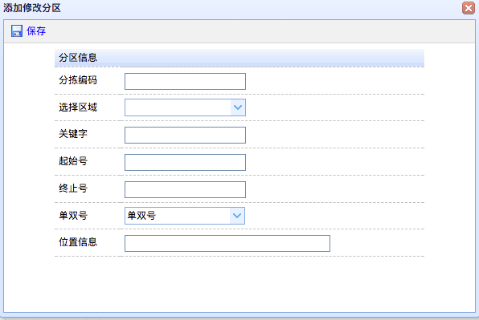
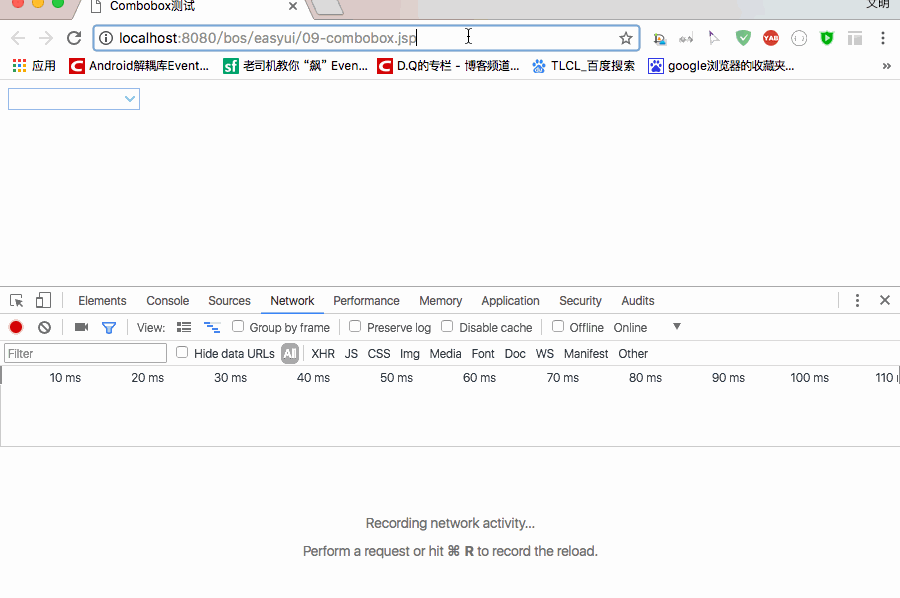
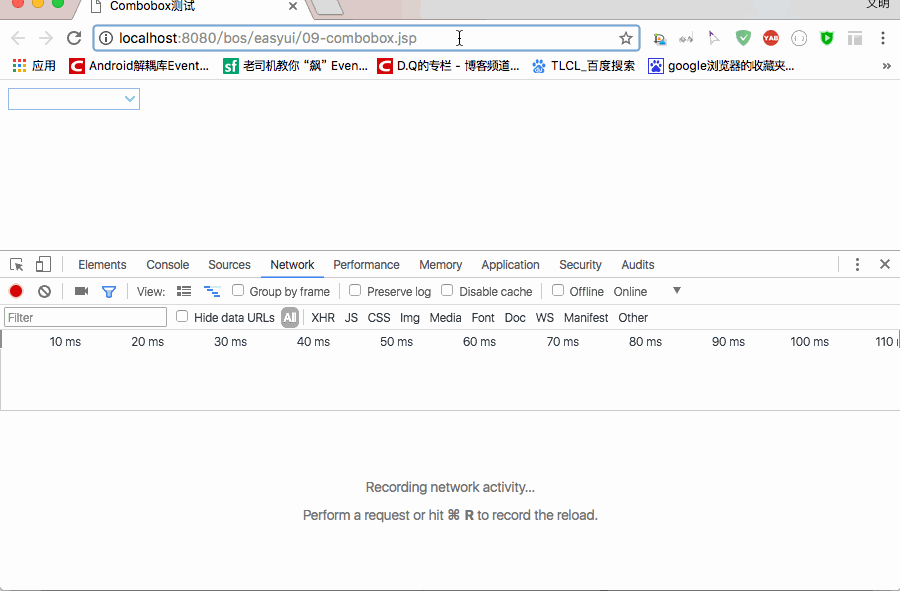
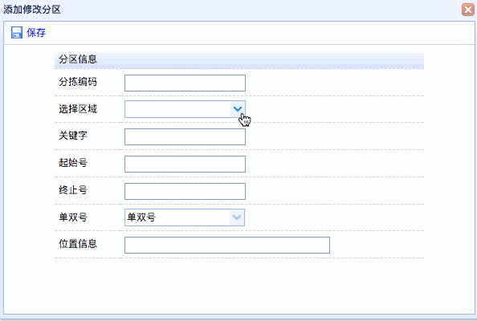

[TOC]


# BOS物流项目22———分区数据1\_添加分区选择区域

## 一、说明

区域较大，所以还要细分，就有了分区，分区的添加界面如下，这里我们选择区域的时候用到了 easyui的combobox。



---

## 二、easyui中combobox的简单使用

可以查看文档地址 [EasyUI Combobox 组合框](http://www.jeasyui.net/plugins/169.html)

combobox 依赖于 combo.

这里我使用 \<input>来说。

首先我们在 bos-web中创建一个测试的jsp文件 **09-combobox.jsp**

combobox中使用的class是**easyui-combobox**,主要使用到的属性如下

**url** ： 数据地址

**valueField** : 绑定到该组合框（ComboBox）的 value 上的基础数据的名称。(就是提交给服务器时候用的名称)

**textField** : 绑定到该组合框（ComboBox）的 text 上的基础数据的名称。（显示的文字）

**editable** : 输入框能入输入


根据上面，我们在 **09-combobox.jsp** 写一下代码

```jsp
<%--
  Created by IntelliJ IDEA.
  User: qiwenming
  Date: 17/12/17
  Time: 下午7:20
  To change this template use File | Settings | File Templates.
--%>
<%@ page contentType="text/html;charset=UTF-8" language="java" %>
<html>
<head>
    <title>Combobox测试</title>
    <link rel="stylesheet" type="text/css"
          href="${pageContext.request.contextPath }/js/easyui/themes/default/easyui.css">
    <link rel="stylesheet" type="text/css" href="${pageContext.request.contextPath }/js/easyui/themes/icon.css">
    <script type="text/javascript" src="${pageContext.request.contextPath }/js/jquery-1.8.3.js"></script>
    <script type="text/javascript" src="${pageContext.request.contextPath }/js/easyui/jquery.easyui.min.js"></script>
    <script type="text/javascript"
            src="${pageContext.request.contextPath }/js/easyui/locale/easyui-lang-zh_CN.js"></script>
</head>
<body>

 <input class="easyui-combobox" data-options="
               valueField:'id',
               textField:'name',
               url:'${pageContext.request.contextPath }/json/combobox.json'">

</body>
</html>
```

json数据如下

```json
[
  {"id":"001","name":"小明"},
  {"id":"002","name":"小红"},
  {"id":"003","name":"小黑"},
  {"id":"004","name":"大绿"},
  {"id":"005","name":"大黄"},
  {"id":"006","name":"大蓝"}
]
```

图示：



我们可以看到，它会把请求回来的数据加载到界面上来，而且还可以实现搜索过滤的功能，我们发现，它的搜索功能是对本地进行搜索，不会请求服务器。

如果我们需要请求服务器，那么我们应该怎么做呢？ 其实它还有一个属性 **mode**

**mode**:定义在文本改变时如何加载列表数据。如果组合框（combobox）从服务器加载就设置为 'remote'。当设置为 'remote' 模式时，用户输入的值将会被作为名为 'q' 的 http 请求参数发送到服务器，以获取新的数据。

现在我们修改 上面的 \<input>,添加一个 mode属性，值为 **remote**

```html
<input class="easyui-combobox" data-options="
               valueField:'id',
               textField:'name',
               mode:'remote',
               url:'${pageContext.request.contextPath }/json/combobox.json'">
```

结果如图示



它会把给服务器发送，名称为 **q**,值为我们的搜索内容的参数。这样我们就可以后台来做搜索功能了。

----

## 三、区域的下拉搜索功能界面修改

分区搜索，我们使用的就是上面的空间，我们需要可以通过分区的全称、简写、省、市、区等模糊搜索，这样我们就需要使用到，上面的 mode这个属性了。

选择区域部分修改如下：

```jsp

        ...............
         <div class="datagrid-toolbar">
				<a id="save" icon="icon-save" href="#" class="easyui-linkbutton" plain="true" >保存</a>
				<script type="text/javascript">
					$(function(){
						$("#save").click(function(){
							//表单校验
							var r = $("#addSubareaForm").form('validate');
							if(r){
								$("#addSubareaForm").submit();
							}
						});
					});
				</script>
			</div>
			 ...............
         <form id="addSubareaForm" method="post" action="subareaAction_add.action">
  
        ...............
					<tr>
						<td>选择区域</td>
						<td>
							<input class="easyui-combobox" name="region.id"  
    							data-options="valueField:'id',textField:'name',
    							mode:'remote',
    							url:'regionAction_listajax.action'" />
						</td>
					</tr>
		 ...............
  </form>		 

```


---

## 四、区域的下拉搜索功能后台实现

上面我们看到了，我们使用了 **RegionAction**的listajax方法，但是现在是没有，我们需要在添加这个方法。如下

```java
   //区域下拉搜索的参数,使用属性驱动
    private String q;

    /**
     * 区域下拉搜索
     * @return
     */
    public String listajax(){
        List<Region> list = null;
        //判断,如果搜索的参数不为空,我们使用搜索的方法
        //如果为空,我们使用查询全部的方法
        if(StringUtils.isNotBlank(q)){
            list = regionService.findByQ(q);
        }else{
            list = regionService.findAll();
        }
        java2Json(list,new String[]{"subareas"});
        return NONE;
    }

    public void setQ(String q) {
        this.q = q;
    }

```

上面当中，我们看到主要使用了 RegionService的 **findAll** 和  **findByQ** 方法，还有 BaseAction的 **java2Json** 方法，之前我们有一个**java2Json**的方法，那个方法是 java对象转json的，这个方法是集合转json的，因此我们需要重写一个方法。


----

## 五、RegionService中添加 findAll方法和findByQ方法

添加的方法如下

```java
    @Override
    public List<Region> findByQ(String q) {
        return regionDao.findByQ(q);
    }

    @Override
    public List<Region> findAll() {
        return regionDao.findAll();
    }
```

这里调用了，RegionDao的 **findAll** 和 **findByQ** 方法，其中 **findAll** 方法，在BaseDao中已经实现了，所有不需要写。现在，我们需要去 RegionDao中写 **findByQ** 方法。


----


## 六、RegionDao中添加 findByQ方法

添加的方法如下：

```java
    /**
     * 根据q参数进行模糊查询
     */
    @Override
    public List<Region> findByQ(String q) {
        String hql = "FROM Region r WHERE r.shortcode LIKE ? "
                + "	OR r.citycode LIKE ? OR r.province LIKE ? "
                + "OR r.city LIKE ? OR r.district LIKE ?";
        List<Region> list = (List<Region>)getHibernateTemplate().
                find(hql,"%"+q+"%","%"+q+"%","%"+q+"%","%"+q+"%","%"+q+"%");
        return list;
    }
```

这样，我们完成了基本步骤，回到前面说的，我们现在还没有去写 **java2Json** 的方法，下面我们去**BaseAction** 中添加这个方法。

----

## 七、RegionAction中添加 java2Json 集合转json的方法

添加的方法如下

```java

   /**
     * 将指定Java集合转为json，并响应到客户端页面
     * @param list
     * @param exclueds
     */
    public void java2Json(List list , String[] exclueds){
        JsonConfig jsonConfig = new JsonConfig();
        //指定哪些属性不需要转json
        jsonConfig.setExcludes(exclueds);
        String json = JSONArray.fromObject(list,jsonConfig).toString();
        ServletActionContext.getResponse().setContentType("text/json;charset=utf-8");
        try {
            ServletActionContext.getResponse().getWriter().print(json);
        } catch (IOException e) {
            e.printStackTrace();
        }
    }
```

现在已经完成了我们的方法，那么现在就可以显示到界面上了吗，虽然该数据已经过去了，但是是不能显示的，为什么呢？


----

## 八、Region中添加 getName方法

回答上面的问题，为什么数据已经拿到了，但是显示不了呢？现在我们再看看界面中的 **combobox**,如下

```html
<input class="easyui-combobox" name="region.id"  
    data-options="valueField:'id',textField:'name',
    mode:'remote',
    url:'regionAction_listajax.action'" />

```

我们看到显示的时候，使用的是**name**,可是我们放回的json中是没有name的，或者或 Region 中是没有name的，所以不能显示，那么怎么操作呢？

解决这个问题，我们需要在Region中添加 getName方法，让它返回 省市区 的值。添加方法如下

```java
public String getName(){
	return province + " " + city + " " + district;
}

```

现在我们去请求就能显示了。

----

## 九、显示图示





----

## 十、源码下载

[https://github.com/wimingxxx/bos-parent](https://github.com/wimingxxx/bos-parent/)