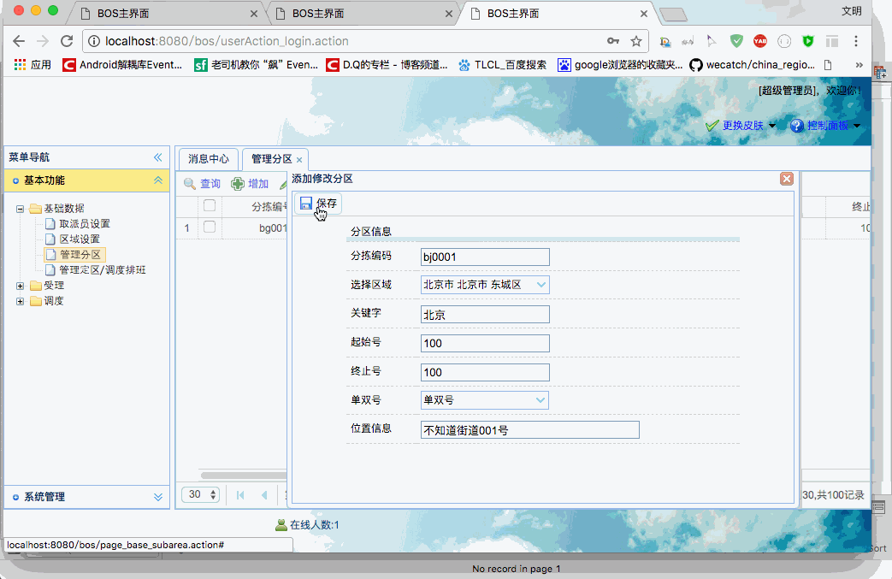

[TOC]


# BOS物流项目23———分区数据2\_添加分区

之前我们已经完成了，选择区域的功能，现在我们只要来书写保存的功能就行了。

## 一、创建 SubareaAtion

在 bos-web中创建 **SubareaAction**，添加添加方法。使用Spring注解来管理对象。

代码如下

```java
package com.qwm.bos.web.action;

import com.qwm.bos.domain.Subarea;
import com.qwm.bos.web.action.base.BaseAction;
import org.springframework.beans.factory.annotation.Autowired;
import org.springframework.context.annotation.Scope;
import org.springframework.stereotype.Controller;

/**
 * @author: qiwenming(杞文明)
 * @date: 17/12/17 下午8:55
 * @className: SubareaAction
 * @description:
 * 分区管理
 */
@Controller
@Scope("prototype")
public class SubareaAction extends BaseAction<Subarea> {

    @Autowired
    private ISubareaService subareaService;

    /**
     * 添加分区
     * @return
     */
    public String add(){
        subareaService.save(model);
        return LIST;
    }
}

```

在struts.xml中添加如下配置

```xml
		<!-- 分区管理 -->
		<action name="subareaAction_*" class="subareaAction" method="{1}">
			<result name="list">/WEB-INF/pages/base/subarea.jsp</result>
		</action>
```


这里面使用了 **SubareaService** 的 **save**方法，现在我们去写 **SubareanService**

---

## 二、创建 SubareaService

**ISubareaService**

```java
package com.qwm.bos.service;

import com.qwm.bos.domain.Subarea;

/**
 * @author: qiwenming(杞文明)
 * @date: 17/12/17 下午9:02
 * @className: ISubareaService
 * @description:
 */
public interface ISubareaService {
    void save(Subarea model);
}

```


**SubareaServiceImpl**
```java

package com.qwm.bos.service.impl;

import com.qwm.bos.dao.ISubareaDao;
import com.qwm.bos.domain.Subarea;
import com.qwm.bos.service.ISubareaService;
import org.springframework.beans.factory.annotation.Autowired;
import org.springframework.stereotype.Service;
import org.springframework.transaction.annotation.Transactional;

/**
 * @author: qiwenming(杞文明)
 * @date: 17/12/17 下午9:03
 * @className: SubareaServiceImpl
 * @description:
 */
@Service
@Transactional
public class SubareaServiceImpl implements ISubareaService{

    @Autowired
    private ISubareaDao subareaDao;
    @Override
    public void save(Subarea model) {
        subareaDao.save(model);
    }
}
```

使用了 SubareanDao 的save方法，所以我们需要创建 SubareaDao,但是save方法在 BaseDao中已经实现，所以我们只需要创建空的 SubareaDao就行了

----

## 三、创建 SubareaDao

**ISubareaDao**

```java
package com.qwm.bos.dao;

import com.qwm.bos.dao.base.IBaseDao;
import com.qwm.bos.domain.Subarea;

/**
 * @author: qiwenming(杞文明)
 * @date: 17/12/17 下午9:05
 * @className: ISubareaDao
 * @description:
 */
public interface ISubareaDao extends IBaseDao<Subarea> {
}


```

**SubareanImpl**

```java
package com.qwm.bos.dao.impl;

import com.qwm.bos.dao.ISubareaDao;
import com.qwm.bos.dao.base.impl.BaseDaoImpl;
import com.qwm.bos.domain.Subarea;
import org.springframework.stereotype.Repository;

/**
 * @author: qiwenming(杞文明)
 * @date: 17/12/17 下午9:06
 * @className: SubareaDaoImpl
 * @description:
 */
@Repository
public class SubareaDaoImpl extends BaseDaoImpl<Subarea> implements ISubareaDao {
}
```

---

## 四、添加图示




----

## 五、源码下载

[https://github.com/wimingxxx/bos-parent](https://github.com/wimingxxx/bos-parent/)