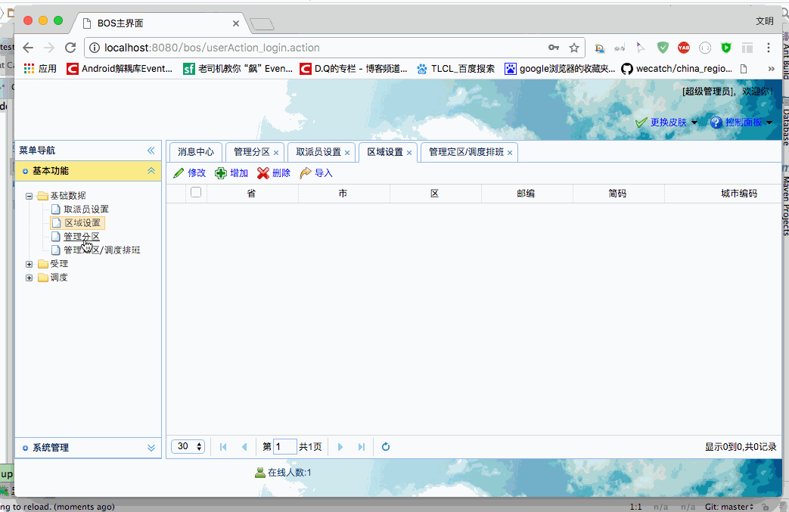
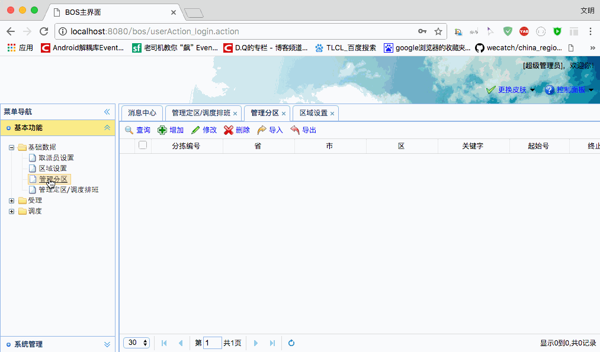

[TOC]


# BOS物流项目24———分区数据3\_解决区域分页死循环问题

## 一、区域分页查询出问题了？

前面我们添加了一条分区的数据，现在我们去查询区域的数据看一看。




主要的异常，我们可以看到下面

```java
21:31:30,072 ERROR DefaultDispatcherErrorHandler:42 - Exception occurred during processing request: There is a cycle in the hierarchy!
net.sf.json.JSONException: There is a cycle in the hierarchy!

```


----

## 二、分析异常的原因

上面我们看到 ```net.sf.json.JSONException: There is a cycle in the hierarchy!```

转json的时候异常了，这是什么原因呢？其实这主要就是 hibernate 的懒加载出的问题。 具体怎么回事？。

这一个查询返回的是 **Region** 的集合数据。那么我们看看 Region 类

**Region**

```java
public class Region implements java.io.Serializable {
	private String id;
	private String province;
	private String city;
	private String district;
	private String postcode;
	private String shortcode;
	private String citycode;
	private Set subareas = new HashSet(0);
	.......
}	

```

Region中包含了 Subarean的集合。我们再去看看 **Subarea**

**Subarea**

```java

public class Subarea implements java.io.Serializable {
	private String id;
	private Decidedzone decidedzone;
	private Region region;
	private String addresskey;
	private String startnum;
	private String endnum;
	private String single;
	private String position;
}	
```

Subarea中又包含了 **Region**。

就是说二者直接都包含了对方。由于是 hibernate 默认是延迟加载的，具体什么时候去发送Sql请求呢？

这里发送sql请求的时机就是，我们把上面的 **Region** 集合转为json对象的时候，因为这个时候我们需要

使用到数据了，所以会去请求。

1 把 Region集合转为json，这个时候发现，Region中有 Subarea

2 去查询 Subarea ,查询到 Subarea 中又有 Region

3 接着去查询 Region,查询到 Region 以后发现有 Subarea ,又会去执行第2步骤操作。

这样就造成了死循环。

**问题** ： 为什么之前每天添加**分区**数据的时候，区域数据没出这个问题呢？

之前没有添加**分区** 数据的时候，查询到的 区域数据中**分区**数据为为空的，所以不会出现上面的问题。

----


## 三、死循环解决方案

通过上面的分析，我们有两种解决方案。

### 3.1 排除不需要的数据

第一种方案 : 既然这个问题是出在json转换的时候的，那么我们不转这个这个数据了，当然这个的前提是不需要使用到出问题的数据。

分析我们区域列表界面，发现不需要分区的的数据，因此我们在转json的时候，排除掉**分区数据的转换**。这样就解决了问题。

因此我们的 区域的分页方法中，转json的时候，可以在**RegionAction**的pageQuery做以下更改。

**修改前**

```java
    /**
     * 分页查询
     * @return
     * @throws Exception
     */
    public String pageQuery() throws Exception{
        regionService.pageQuery(pageBean);
        java2Json(pageBean,new String[]{"currentPage","detachedCriteria","pageSize"});
        return NONE;
    }
```

**修改后**

```java
    /**
     * 分页查询
     * @return
     * @throws Exception
     */
    public String pageQuery() throws Exception{
        regionService.pageQuery(pageBean);
        java2Json(pageBean,new String[]{"currentPage","detachedCriteria","pageSize","subareas"});
        return NONE;
    }
```


这样区域的数据就能出来了。




### 3.2 关闭延迟加载

第二种解决方案 ：既然是由于懒加载引发的问题，我们可以关闭懒加载。这样json装换的时候也可以转换这个数据。

这种方式解决，比较麻烦。后面会在**分区的列表**中继续说这种解决方案


----

## 四、源码下载

[https://github.com/wimingxxx/bos-parent](https://github.com/wimingxxx/bos-parent/)