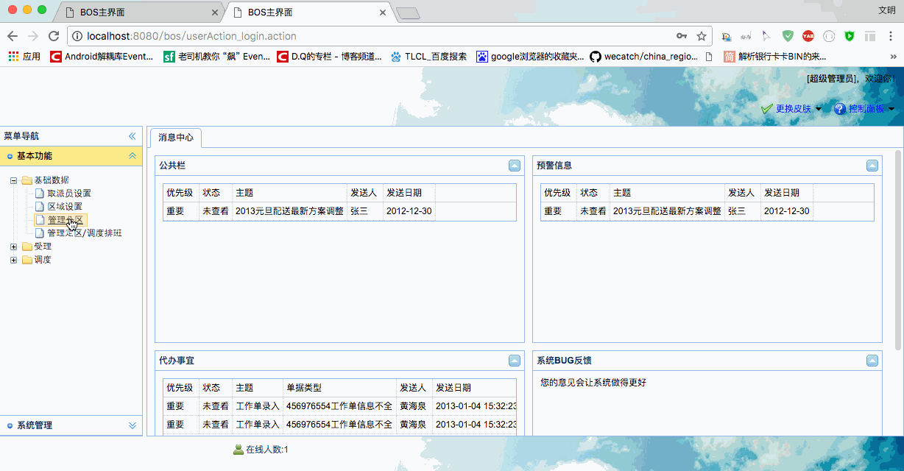

[TOC]


# BOS物流项目25———分区数据4\_分页查询没有查询条件

有了之前的分页基础，现在分页查询特别简单。

## 一、界面修改

主要修改 subarea.jsp中datagrid的请求地址，修改如下

```html

		$('#grid').datagrid( {
			iconCls : 'icon-forward',
			fit : true,
			border : true,
			rownumbers : true,
			striped : true,
			pageList: [30,50,100],
			pagination : true,
			toolbar : toolbar,
			url : "subareaAction_pageQuery.action",
			idField : 'id',
			columns : columns,
			onDblClickRow : doDblClickRow
		});
```

---

## 二、SubareaAction 中添加 pageQuery方法

添加方法如下

```java

    /**
     * 分页查询
     * @return
     */
    public String pageQuery(){
        subareaService.pageQuery(pageBean);
        java2Json(pageBean,new String[]{"currentPage","detachedCriteria","pageSize","subareas"});
        return NONE;
    }
```

使用到了 **SubareaService的pageQuery方法**

-----

## 三、SubareaService 中添加 pageQuery方法

添加如下：

```java
    @Override
    public void pageQuery(PageBean pageBean) {
        subareaDao.pageQuery(pageBean);
    }

```

现在，我们的界面和方法已经可以，我们去运行，发现又出现 死循环的问题。可是我们已经删除了 **subareas** 的转换为什么还会这样呢？

---


## 四、死循环问题解决

上面我们说到了，会出现死循环的问题。其实出现这个问题的原因就是，延迟加载造成的。延迟加载生成是代理对象，不是我们创建的对象，json转换的时候

还是会出现转换死循环的问题。之前我们说过，有两种解决方案

第一种方案：删除出问题的数据的转换。由于我们需要用到区域的信息，所以这种方案这里不可行。

第二种方案：把延时加载改为立即加载,并且将关联对象中的属性排除。这种方案，可以不删除数据，这里这种方案适合我们。所以这里我们使用这种方案。

因此，我们需要去修改 **Subarea.hbm.xml** 文件，把 Region的加载设置为立即加载


- 修改前


```xml
        <many-to-one name="region" class="com.qwm.bos.domain.Region" fetch="select">
            <column name="region_id" length="32" />
        </many-to-one>

```

- 修改后

```xml
        <many-to-one lazy="false" name="region" class="com.qwm.bos.domain.Region" fetch="select">
            <column name="region_id" length="32" />
        </many-to-one>

```

这样，我们就解决了死循环的问题。

----

## 五、图示




----

## 六、源码下载

[https://github.com/wimingxxx/bos-parent](https://github.com/wimingxxx/bos-parent/)