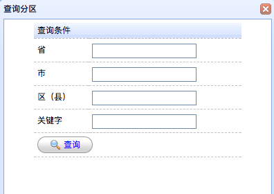
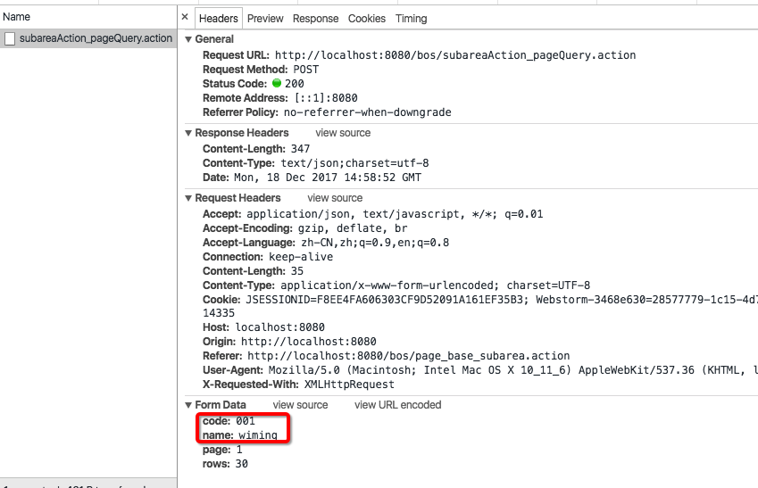
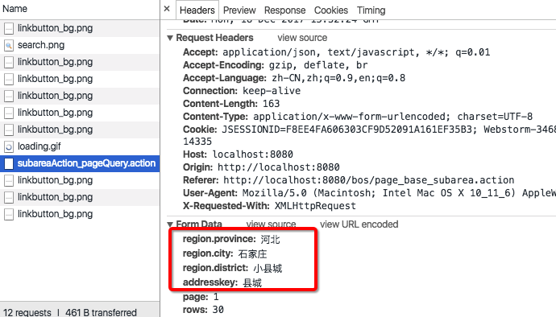

[TOC]


# BOS物流项目26———分区数据5\_分页查询带查询条件前端

## 一、查询界面分析

首先我我们来看看，我们的查询界面，如图：



我们可以根据 **省、市、区、关键字** 来查询。使用这个查询，点击查询以后，查询数据，

获取到数据以后，显示到 **datagrid** 上。我们可以来看看 easyui中datagird提供的 load的方法。


---

## 二、datagrid的load的方法

load : 加载和显示第一页的所有行。如果指定了'param'，它将取代'queryParams'属性。通常可以通过传递一些参数执行一次查询，通过调用这个方法从服务器加载新数据。

例如

```html
$('#dg').datagrid('load',{
	code: '01',
	name: 'name01'
});

```

上面说了那么多，其实就一句话：用于重新发送ajax请求，并且可以提交参数

下面我们来测试一下：

查到界面 **subarea.jsp** 界面中的 查询方法。我们在这个方法中，使用 load 的方法。来发送一个请求看看。如下

```html
		$("#btn").click(function(){
			$("#grid").datagrid("load",{
				code:"001",
				name:"wiming"
			});
			$("#searchWindow").window("close");
		});
```

现在我们去查询看看，有没有携带参数过去了。结果如下图



我们可以看到上面我们的数据就已经带上了。我们看到 load 中使用的json，现在我们去把我们的参数拼接json。


---

## 三、自己在load方法中拼接参数

我们可以从界面获取我们的请求参数，然后拼接成 json,传递到后台。这个时候，我们上面的方法修改为

```html
		$("#btn").click(function(){
			$("#grid").datagrid("load",{
				"region.province":$("input[name='region.province']").val(),
				"region.city":$("input[name='region.city']").val(),
				"region.district":$("input[name='region.district']").val(),
				"addresskey":$("#searchForm input[name='addresskey']").val()
			});
			$("#searchWindow").window("close");
		});
```

注意的是界面中有两个 name为 “addresskey” 的input ，所有我们添加了一个 **form** 的选择条件

现在我们查看，请求参数时候已经过去了。如图




上面我们的实现了使用load方法，请求并且把参数组装，发送到了后台的操作，其实我们没有必要这么弄，我们可以使用工具方法。


----

## 四、使用工具方法从from表单中获取json参数

这里面我们需要添加一个工具方法，添加到查询方法的上面

```html
       //定义一个工具方法，用于将指定的form表单中所有的输入项转为json数据{key:value,key:value}
		$.fn.serializeJson=function(){  
            var serializeObj={};  
            var array=this.serializeArray();
            $(array).each(function(){  
                if(serializeObj[this.name]){  
                    if($.isArray(serializeObj[this.name])){  
                        serializeObj[this.name].push(this.value);  
                    }else{  
                        serializeObj[this.name]=[serializeObj[this.name],this.value];  
                    }  
                }else{  
                    serializeObj[this.name]=this.value;   
                }  
            });  
            return serializeObj;  
        }; 
```

这样，我们的 查询方法，可以更改为

```html
		$("#btn").click(function(){
			//将指定的form表单中所有的输入项转为json数据{key:value,key:value}
			var p = $("#searchForm").serializeJson();
			//调用数据表格的load方法，重新发送一次ajax请求，并且提交参数
			$("#grid").datagrid("load",p);
			$("#searchWindow").window("close");
		});
```


两个方法合起来就是

```html
		//定义一个工具方法，用于将指定的form表单中所有的输入项转为json数据{key:value,key:value}
		$.fn.serializeJson=function(){
			var serializeObj={};
			var array=this.serializeArray();
			$(array).each(function(){
				if(serializeObj[this.name]){
					if($.isArray(serializeObj[this.name])){
						serializeObj[this.name].push(this.value);
					}else{
						serializeObj[this.name]=[serializeObj[this.name],this.value];
					}
				}else{
					serializeObj[this.name]=this.value;
				}
			});
			return serializeObj;
		};

		$("#btn").click(function(){
			//将指定的form表单中所有的输入项转为json数据{key:value,key:value}
			var p = $("#searchForm").serializeJson();
			//调用数据表格的load方法，重新发送一次ajax请求，并且提交参数
			$("#grid").datagrid("load",p);
			$("#searchWindow").window("close");
		});
```

现在，数据的请求，就完成了，重点是在后台了。


----

## 五、源码下载

[https://github.com/wimingxxx/bos-parent](https://github.com/wimingxxx/bos-parent/)