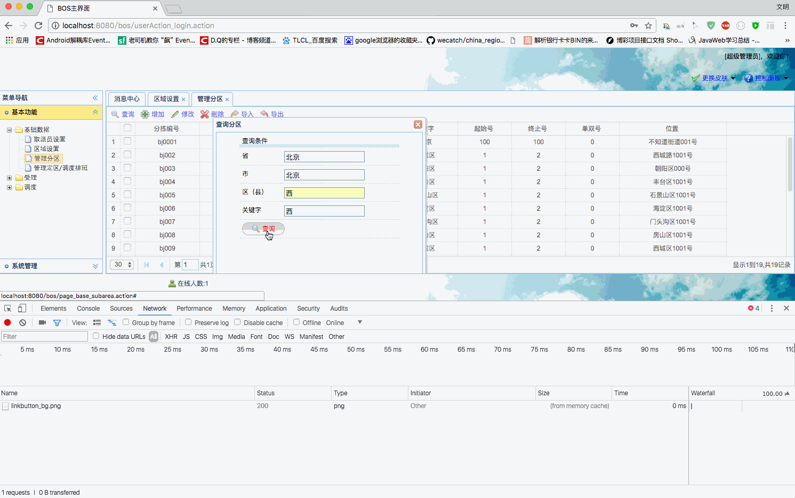
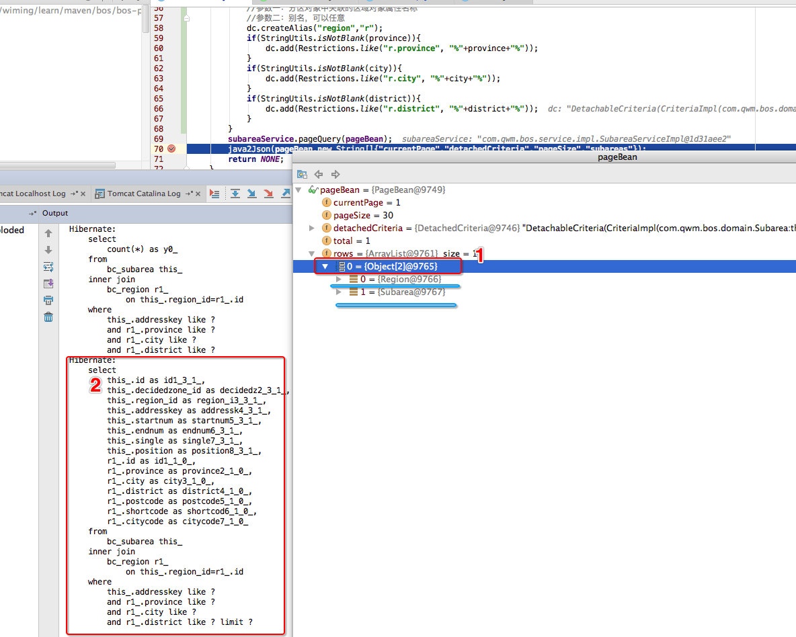
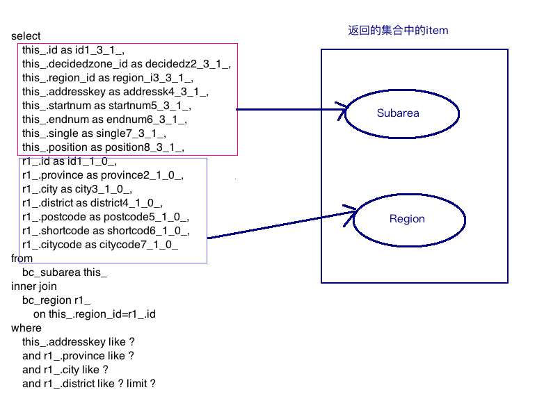
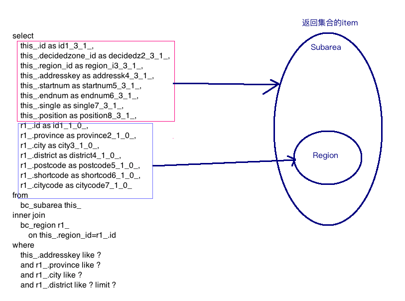
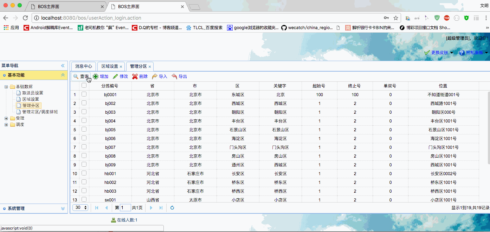
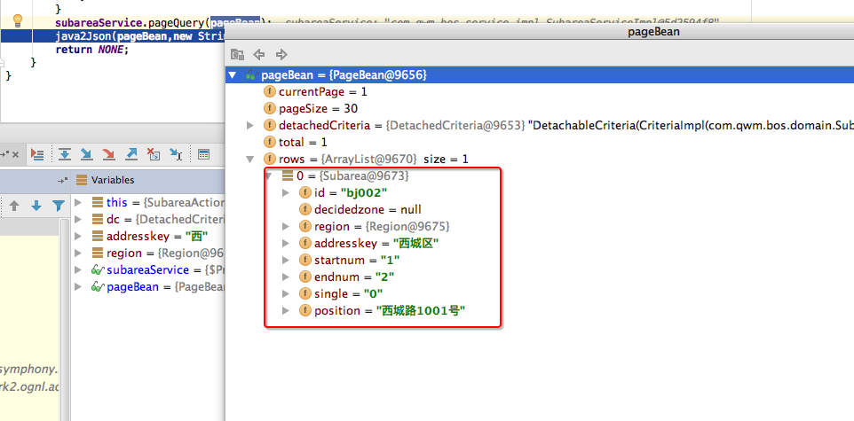

[TOC]


# BOS物流项目27———分区数据6\_分页查询带查询条件后端

## 一、修改我们的SubareaAction中的pageQuery方法

页面的处理，前面我们已经完成了，现在就要去处理后端了，分页查询，之前我们写了最简单的，不带条件的查询，现在我们需要去修改这个方法，

把前面的 **省、市、区、关键字** 带上，做模糊查询，在组装查询条件之前，我们判断参数是否为空。现在我们去书写一下。可是问题来了，

我们的 **省、市、区** 需要查询的是 **区域表** 而不是 **分区表**，也就是说，这里涉及到多表查询，应该如何进行查询呢？

**hibernate** 多表查询，使用的是别名的方式，例如：我们添加 **省** 这个字段的查询，如下

```java
dc.createAlias("region", "r");
dc.add(Restrictions.like("r.province", "%"+province+"%"));
```

这样，就可以多表查询了。

综合上述，我们的查询方法，就可以如下了：

```java

    /**
     * 分页查询
     * @return
     */
    public String pageQuery(){
        DetachedCriteria dc = pageBean.getDetachedCriteria();
        String addresskey = model.getAddresskey();
        //动态添加过滤条件
        if(StringUtils.isNotBlank(addresskey)){
            //添加过滤条件，根据地址关键字模糊查询
            dc.add(Restrictions.like("addresskey","%"+addresskey+"%"));
        }
        Region region = model.getRegion();
        if(region!=null) {
            String province = region.getProvince();
            String city = region.getCity();
            String district = region.getDistrict();
            //添加过滤条件，根据省份模糊查询-----多表关联查询，使用别名方式实现
            //参数一：分区对象中关联的区域对象属性名称
            //参数二：别名，可以任意
            dc.createAlias("region","r");
            if(StringUtils.isNotBlank(province)){
                dc.add(Restrictions.like("r.province", "%"+province+"%"));
            }
            if(StringUtils.isNotBlank(city)){
                dc.add(Restrictions.like("r.city", "%"+city+"%"));
            }
            if(StringUtils.isNotBlank(district)){
                dc.add(Restrictions.like("r.district", "%"+district+"%"));
            }
        }
        subareaService.pageQuery(pageBean);
        java2Json(pageBean,new String[]{"currentPage","detachedCriteria","pageSize","subareas"});
        return NONE;
    }
```

---

## 二、添加一些数据

我们之前添加的数据太少了，现在我们添加一些数据

使用一下sql

```sql
insert into bc_subarea(id,region_id,addresskey,startnum,endnum,single,position) values("bj002","QY002","西城区","1","2","0","西城路1001号");
insert into bc_subarea(id,region_id,addresskey,startnum,endnum,single,position) values("bj003","QY003","朝阳区","1","2","0","朝阳区000号");
insert into bc_subarea(id,region_id,addresskey,startnum,endnum,single,position) values("bj004","QY004","丰台区","1","2","0","丰台区1001号");
insert into bc_subarea(id,region_id,addresskey,startnum,endnum,single,position) values("bj005","QY005","石景山区","1","2","0","石景山区1001号");
insert into bc_subarea(id,region_id,addresskey,startnum,endnum,single,position) values("bj006","QY006","海淀区","1","2","0","海淀区1001号");
insert into bc_subarea(id,region_id,addresskey,startnum,endnum,single,position) values("bj007","QY007","门头沟区","1","2","0","门头沟区1001号");
insert into bc_subarea(id,region_id,addresskey,startnum,endnum,single,position) values("bj008","QY008","房山区","1","2","0","房山区1001号");
insert into bc_subarea(id,region_id,addresskey,startnum,endnum,single,position) values("bj009","QY009","西城区","1","2","0","西城区1001号");

insert into bc_subarea(id,region_id,addresskey,startnum,endnum,single,position) values("hb001","QY017","长安区","1","2","0","长安区0002号");
insert into bc_subarea(id,region_id,addresskey,startnum,endnum,single,position) values("hb002","QY018","桥东区","1","2","0","桥东区1001号");
insert into bc_subarea(id,region_id,addresskey,startnum,endnum,single,position) values("hb003","QY019","桥西区","1","2","0","桥西区1001号");

insert into bc_subarea(id,region_id,addresskey,startnum,endnum,single,position) values("tj001","QY041","河东区","1","2","0","河东区1001号");
insert into bc_subarea(id,region_id,addresskey,startnum,endnum,single,position) values("tj002","QY042","河西区","1","2","0","河西区1001号");
insert into bc_subarea(id,region_id,addresskey,startnum,endnum,single,position) values("tj003","QY043","南开区","1","2","0","南开区1001号");

insert into bc_subarea(id,region_id,addresskey,startnum,endnum,single,position) values("sx001","QY056","小店区","1","2","0","小店区1001号");
insert into bc_subarea(id,region_id,addresskey,startnum,endnum,single,position) values("sx002","QY057","迎泽区","1","2","0","迎泽区1001号");
insert into bc_subarea(id,region_id,addresskey,startnum,endnum,single,position) values("sx003","QY058","杏花岭区","1","2","0","杏花岭区1001号");
insert into bc_subarea(id,region_id,addresskey,startnum,endnum,single,position) values("sx004","QY059","尖草坪区","1","2","0","尖草坪区1001号");

```

----

## 三、为何数据不正确

我们添加了数据，以后来进行查询，如图：



我们发现，界面上仍然没有改变，我们获取到返回的json数据如下


```json
{
    "rows": [
        [
            {
                "city": "北京市",
                "citycode": "beijing",
                "district": "西城区",
                "id": "QY002",
                "name": "北京市 北京市 西城区",
                "postcode": "110102",
                "province": "北京市",
                "shortcode": "BJBJXC"
            },
            {
                "addresskey": "西城区",
                "decidedzone": null,
                "endnum": "2",
                "id": "bj002",
                "position": "西城路1001号",
                "region": {
                    "city": "北京市",
                    "citycode": "beijing",
                    "district": "西城区",
                    "id": "QY002",
                    "name": "北京市 北京市 西城区",
                    "postcode": "110102",
                    "province": "北京市",
                    "shortcode": "BJBJXC"
                },
                "single": "0",
                "startnum": "1"
            }
        ]
    ],
    "total": 1
}
```

应该放回的一条数据，可是这个返回了两条数据，返回的应该是是**分区的数据**，可是我们上面看到返回的一条**分区数据**和一条**区域数据**。

这个是为什么呢？我们调试看一下，如下图示



我们可以看到，原本**1** 这个地方，返回的应该是 **Subarea** 的对象，可是现在返回的是一个数组，这个数据中有两个元素，

一个是 **Subarea** 和一个 **Region**。那么这个问题是什么原因引起的？

其实主要就是 **2** 这个关联查询引起的，那么怎么解决？？


----

## 四、数据不正确原因以及解决


上面说了，是由于 **2** 那个查询引起的，那么我们现在看看怎么回事。多表查询，默认数据的处理方式是如下图



我们可以看到，它没有把 **Region** 封装进入 **Subarea** 中。我们希望的数据是 **Region** 封装进入 **Subarea** 中，如下图



那么怎么解决呢？解决方式就是在，我们的分页查询中**指定hibernate框架封装对象的方式**，其实就是在**BaseDao** 的分页查询中，加入下面一句话

```java
		//指定hibernate框架封装对象的方式
		detachedCriteria.setResultTransformer(DetachedCriteria.ROOT_ENTITY);

```

修改以后的BaseDao中的 **pageQuery** 方法应该如下

```java

    /**
     * 分页查询
     */
    @Override
    public void pageQuery(PageBean pageBean) {
        int currentPage = pageBean.getCurrentPage();
        int pageSize = pageBean.getPageSize();
        DetachedCriteria detachedCriteria = pageBean.getDetachedCriteria();

        //查询total---总数据量
        detachedCriteria.setProjection(Projections.rowCount());
        List<Long> countList = (List<Long>) this.getHibernateTemplate().findByCriteria(detachedCriteria);
        Long count = countList.get(0);
        pageBean.setTotal(count.intValue());

        //查询rows---当前页需要展示的数据集合
        detachedCriteria.setProjection(null);//指定hibernate框架发出sql的形式----》select * from bc_staff;
       //指定hibernate框架封装对象的方式
        detachedCriteria.setResultTransformer(DetachedCriteria.ROOT_ENTITY);
        int firstResult = (currentPage - 1) * pageSize;
        int maxResults = pageSize;
        List rows = this.getHibernateTemplate().findByCriteria(detachedCriteria, firstResult, maxResults);
        pageBean.setRows(rows);
    }

```

这样，我们返回的数据就是对的了，如图：





----

## 五、源码下载

[https://github.com/wimingxxx/bos-parent](https://github.com/wimingxxx/bos-parent/)