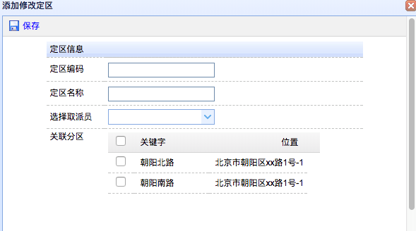
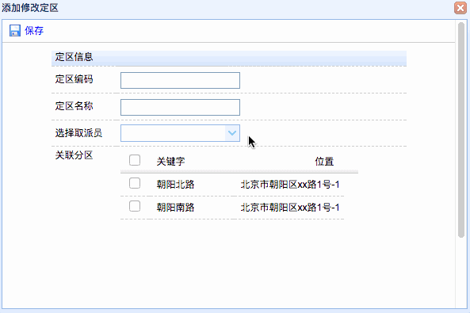
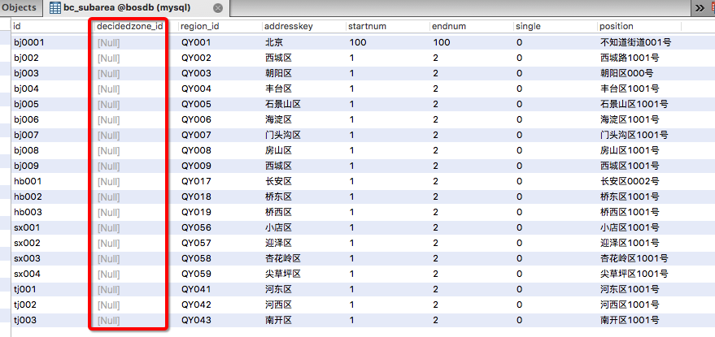
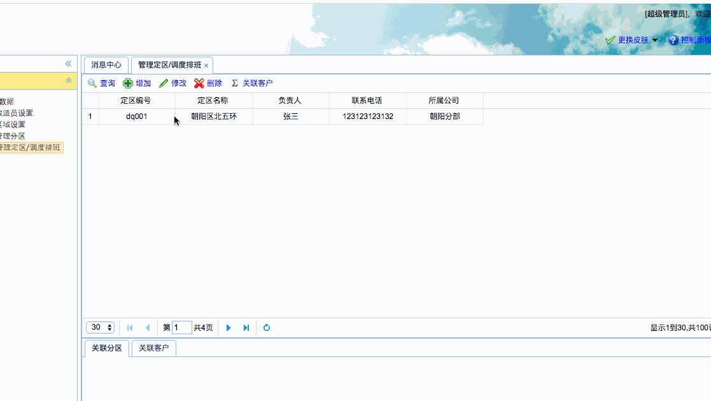
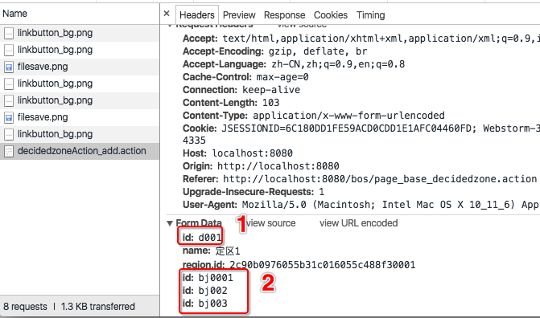
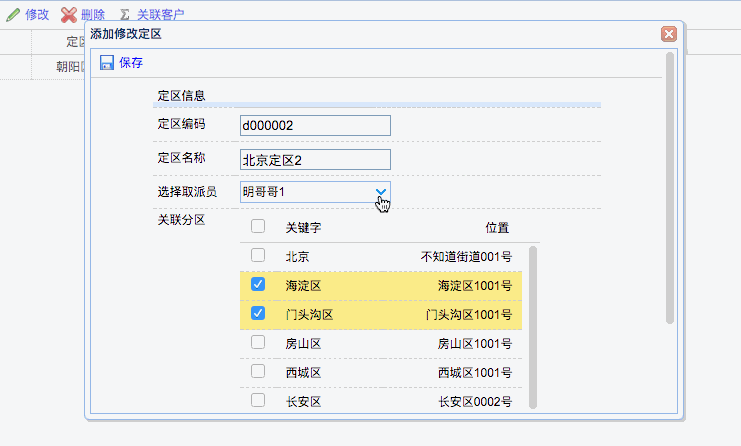
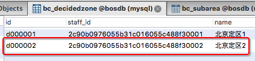
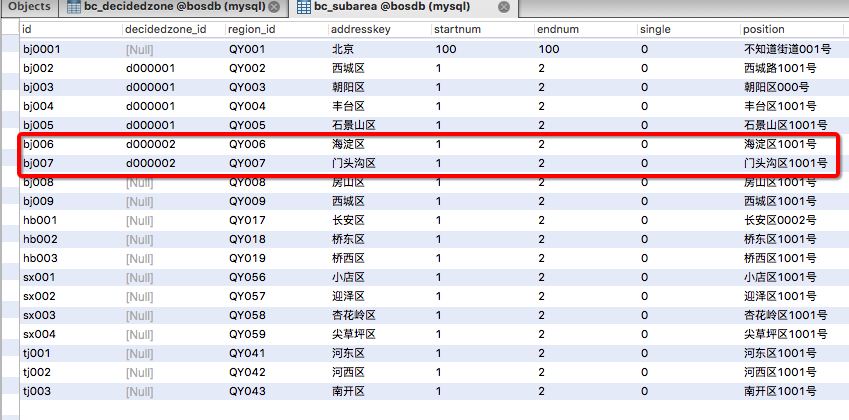

[TOC]


# BOS物流项目29———定区数据1\_添加定区

定区是进行物流分配的基本单位，可以将取派员、分区、客户信息进行关联，为自动分单提供数据。


页面：WEB-INF/pages/base/decidedzone.jsp


## 一、前端页面分析

添加的页面如下图




分析上面的界面，这里主要是就是选择取派员和关联分区的选择。

选择取派员的时候，我们选择的是没有被废除的取派员，就是计时 deltag=0的取派员

关联分区的选择的时候，处理的是没有被分配的分区。

现在我们来看一下取派员的选择。


----

## 二、选择取派员页面调整

取派员的选择，前端页面，主要就是设置请求的路径，修改如下：

```html
		<td>选择取派员</td>
		<td>
			<input class="easyui-combobox" name="region.id"  
    				data-options="valueField:'id',textField:'name',
    				url:'staffAction_listajax.action'" />
		</td>
```

---

## 三、在StaffAction中创建listajax方法

我们需要查询的是，没有被删除的取派员，然后返回json

```java
    /**
     * 获取所有未删除的取派员
     * @return
     */
    public String listajax(){
        List<Staff> list = staffService.findListNotDelete();
        java2Json(list,new String[]{"decidedzones"});
        return NONE;
    }
```

这里面使用到了，StaffService的 **findListNotDelete** 方法，现在去创建


---

## 四、在StaffService中创建 findListNotDelete 方法

创建方法如下

```java

    @Override
    public List<Staff> findListNotDelete() {
        DetachedCriteria detachedCriteria = DetachedCriteria.forClass(Staff.class);
        //添加过滤条件 deltag=0
        detachedCriteria.add(Restrictions.eq("deltag","0"));
        return staffDao.findByCriteria(detachedCriteria);
    }
```


这里又使用到了 DAO 的 **findByCriteria** 方法，这个方法，根据查询条件，获取数据，以后我们也会有

这样的需求，所以我们在BaseDao中来实现这个方法。


---

## 五、BaseDao中创建 findByCriteria 方法

创建方法如下

```java
    @Override
    public List<T> findByCriteria(DetachedCriteria detachedCriteria) {
        return (List<T>) getHibernateTemplate().findByCriteria(detachedCriteria);
    }

```

现在我们已经完成了，后端的代码。去看看**选择取派员**是否已经可以了。




完成了，选择取派员，现在就要去处理 **关联分区** 了。


----

## 六、关联分区页面调整

关联分区使用的是 **datagrid** 控件，我们主要是去修改 请求地址，修改如下

```html
<table id="subareaGrid"  class="easyui-datagrid" border="false" style="width:300px;height:300px"
	   data-options="url:'subareaAction_listajax.action',fitColumns:true,singleSelect:false">
	<thead>  
        <tr>  
            <th data-options="field:'id',width:30,checkbox:true">编号</th>  
            <th data-options="field:'addresskey',width:150">关键字</th>  
            <th data-options="field:'position',width:200,align:'right'">位置</th>  
        </tr>  
    </thead> 
</table>
```

---

## 七、在SubareaAction中创建listajax方法

在SubareaAction中创建listajax方法，查询所有未关联到定区的分区。分区表如下：



如上图，未关联的分区，它的 **decidedzone_id** 为 null。因此，其实我们查询的就是

 **decidedzone_id** 为 null的数据。
 
 
 ```
     /**
     * 查询所有未关联的定区的分区,返回json
     * @return
     */
    public String listajax(){
        List<Subarea> list = subareaService.findListNotAssociation();
        java2Json(list,new String[]{"decidezone","region"});
        return NONE;
    }
 ```
 
---
 
## 八、在SubareaService中创建findListNotAssociation方法
 
 上面我们说过，我们查询的就是分区表中，定区为null的数据，如下。
 
 ```java
     @Override
    public List<Subarea> findListNotAssociation() {
        DetachedCriteria detachedCriteria = DetachedCriteria.forClass(Subarea.class);
        detachedCriteria.add(Restrictions.isNull("decidedzone"));
        return subareaDao.findByCriteria(detachedCriteria);
    }
 ```
 
 现在完成了后端的代码，我们去看看前端的显示
 
 

现在就只差保存的功能了。

---

## 九、为保存按钮添加事件提交表单

界面修改如下：

```html

<a id="save" icon="icon-save" href="#" class="easyui-linkbutton" plain="true" >保存</a>
<script type="text/javascript">
	$(function(){
		$("#save").click(function(){
			var v = $("#addDecidedzoneForm").form("validate");
			if(v){
				$("#addDecidedzoneForm").submit();
			}
		});
	});
</script>
........
<form id="addDecidedzoneForm" method="post"
      action="decidedzoneAction_add.action">
      ..........
</form>
```

---


## 十、保存提交参数分析

现在我们看看，保存的时候，我们提交的参数是什么样子的？如下图

 

上图中，可以看到有多个**id**, **1** id 是定区的id , **2** 是我们选择的 分区的 id,可是后台怎么

样去分辨这个些**id**，显然是没办法，所以这里我们需要处理，怎么处理呢？

---

## 十一、为分区类 Subarea中添加 getSubareaid方法,并修改页面


出现了多个id，并且代表的含义不一样，那么我们就需要重新来定义属性。为分区类 Subarea中添加 getSubarenid方法，然后在页面中修改管理分区的中 datagrid 的相关字段

添加的到 Subarea中添加 getSubarenid方法如下

```java
	public String getSubareaid() {
		return id;
	}
```

修改datagrid中的**id** 为**subareaid**

**修改前**

```html

<table id="subareaGrid"  class="easyui-datagrid" border="false" style="width:300px;height:300px"
	   data-options="url:'subareaAction_listajax.action',fitColumns:true,singleSelect:false">
	<thead>  
        <tr>  
            <th data-options="field:'id',width:30,checkbox:true">编号</th>  
            <th data-options="field:'addresskey',width:150">关键字</th>  
            <th data-options="field:'position',width:200,align:'right'">位置</th>  
        </tr>  
    </thead> 
</table>
```

**修改后**

```html
<table id="subareaGrid"  class="easyui-datagrid" border="false" style="width:300px;height:300px"
	   data-options="url:'subareaAction_listajax.action',fitColumns:true,singleSelect:false">
	<thead>  
        <tr>  
            <th data-options="field:'subareaid',width:30,checkbox:true">编号</th>  
            <th data-options="field:'addresskey',width:150">关键字</th>  
            <th data-options="field:'position',width:200,align:'right'">位置</th>  
        </tr>  
    </thead> 
</table>
```

现在提交的数据就ok了，轮到写后端的代码了。

----

## 十二、创建DecidedzoneAction添加add方法


```java

package com.qwm.bos.web.action;

import com.qwm.bos.domain.Decidedzone;
import com.qwm.bos.web.action.base.BaseAction;
import org.springframework.context.annotation.Scope;
import org.springframework.stereotype.Controller;

/**
 * @author: qiwenming(杞文明)
 * @date: 17/12/19 下午11:46
 * @className: DecidedzoneAction
 * @description:
 * 定区
 */
@Controller
@Scope("prototype")
public class DecidedzoneAction extends BaseAction<Decidedzone>{
    
    @Autowired
    private IDecidedzoneService decidedzoneService;

    //属性驱动,使用数组来接收多个分区id
    private String[] subareaid;

    public void setSubareaid(String[] subareaid) {
        this.subareaid = subareaid;
    }

    public String add(){
        decidedzoneService.save(model,subareaid);
        return LIST;
    }
}

```


在 **struts.xml** 中添加配置

```java
        <!-- 定区管理 -->
        <action name="decidedzoneAction_*" class="decidedzoneAction" method="{1}">
            <result name="list">/WEB-INF/pages/base/decidedzone.jsp</result>
        </action>
```

---

## 十三、创建DecidedzoneService

**IDecidedzoneService**

```java
package com.qwm.bos.service;

import com.qwm.bos.domain.Decidedzone;

/**
 * @author: qiwenming(杞文明)
 * @date: 17/12/19 下午11:53
 * @className: IDecidedzoneService
 * @description:
 */
public interface IDecidedzoneService {
    void save(Decidedzone model, String[] subareaid);
}

```


保存的时候，主要就是 关系应该由谁来维护？一般都是一方放弃维护，多方进行维护。

这里：一个定区对应多个分区，多个分区对应一个定区。所以这里 定区属于一方，分区数据多方

应该是：定区放弃维护关系，分区来维护关系。


```java

package com.qwm.bos.service.impl;

import com.qwm.bos.dao.ISubareaDao;
import com.qwm.bos.domain.Decidedzone;
import com.qwm.bos.domain.Subarea;
import com.qwm.bos.service.IDecidedzoneService;
import org.springframework.beans.factory.annotation.Autowired;
import org.springframework.stereotype.Service;
import org.springframework.transaction.annotation.Transactional;

/**
 * @author: qiwenming(杞文明)
 * @date: 17/12/19 下午11:53
 * @className: DecidedzoneServiceImpl
 * @description:
 * 定区管理
 */
@Service
@Transactional
public class DecidedzoneServiceImpl implements IDecidedzoneService{
    @Autowired
    private IDecidedzoneDao decidedzoneDao;
    @Autowired
    private ISubareaDao subareaDao;

    /**
     * 添加定区
     * @param model
     * @param subareaid
     */
    @Override
    public void save(Decidedzone model, String[] subareaid) {
        decidedzoneDao.save(model);
        for (String subid: subareaid) {
            Subarea subarea = subareaDao.findById(subid);
            //一方（定区）已经放弃维护外键权利，只能由多方（分区）负责维护
            subarea.setDecidedzone(model);
        }
    }
}
```

然后创建空的 DecidedzoneDao 就行了。

----

## 十四、添加图示





查看我们的定区表如图



查看我们的分区表如图




----

## 十五、源码下载

[https://github.com/wimingxxx/bos-parent](https://github.com/wimingxxx/bos-parent/)