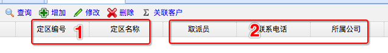
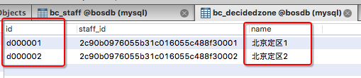
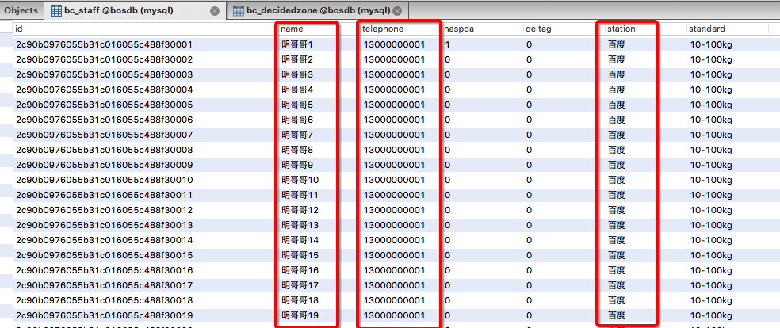
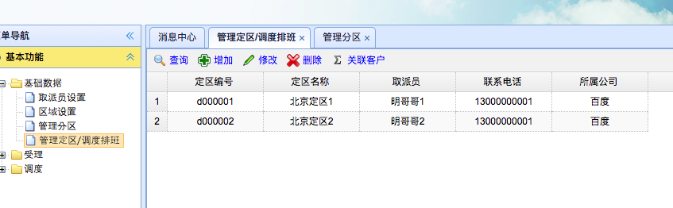

[TOC]


# BOS物流项目30———定区数据2\_定区分页查询以及死循环解决

前面我们已经完成了，添加定区的功能，现在我们来完成定区的分页查询


## 一、前端页面修改

页面的修改，主要就是修改请求的地址，修改如下

```html
		// 定区数据表格
		$('#grid').datagrid( {
			iconCls : 'icon-forward',
			fit : true,
			border : true,
			rownumbers : true,
			striped : true,
			pageList: [30,50,100],
			pagination : true,
			toolbar : toolbar,
			url : "decidedzoneAction_pageQuery.action",
			idField : 'id',
			columns : columns,
			onDblClickRow : doDblClickRow
		});
```

---


## 二、分页查询数据分析

这里面我们需要查询去定区的信息，首先我们来看一下界面



然后我们看一看 **定区表** 和 **取派员表**

**定区表**



**取派员表**




通过上面的图，我们可以看到 **1** 中的数据来自 **定区表**， **2** 中的数据来自**取派员表**

我们主要看看 定区实体类和取派员实体类

**定区实体类**

```java
public class Decidedzone implements java.io.Serializable {
	private String id;
	private Staff staff;
	private String name;
	private Set subareas = new HashSet(0);
	.......
}	

```


**取派员实体类**

```java
public class Staff implements java.io.Serializable {
	private String id;
	private String name;
	private String telephone;
	private String haspda = "0";//是否有PDA，1：有 0：无
	private String deltag;
	private String station;
	private String standard;
	private Set decidedzones = new HashSet(0);
	.......
}	

```

我们看到 **定区实体** 中有 **取派员实体**，**取派员实体** 中 **分区实体**，那么这里在转json的

时候就会出现 死循环。出现这种死循环，我们之前说过，有两种解决方案：

**第一种方案：** 删除出问题的数据的转换。由于我们需要用到取派员的信息，所以这种方案这里不可行。

**第二种方案：** 把延时加载改为立即加载,并且将关联对象中的属性排除。这种方案，可以不删除数据，这里这种方案适合我们。所以这里我们使用这种方案。

那么怎么删除属性呢？

这里面，我们拿到的是 **定区的数据**，定区中包含取派员。这些数据是需要的。那么取派员中的**定区数据**

我们是不需要的，所以这里要删除 取派员中定区数据的转换，也就是 **decidedzones**。除此之外，分区数

据也是不需要的，同时也删除 **subareas**。


----

## 三、DecidedzoneAction中添加pageQuery方法

根据上面的分析，这里面我们要删除 **decidedzones** 和 **subareas** 转json，同时要修改 **定区**中取派员的数据为立即加载。

添加的方法如下

```java
    public String pageQuery(){
        decidedzoneService.pageQuery(pageBean);
        java2Json(pageBean,new String[]{
                "currentPage","detachedCriteria",
                "pageSize","subareas","decidedzones"
        });
        return NONE;
    }

```


---

## 四、修改 Decidedzone.hbm.xml

修改 **定区**中取派员的数据为立即加载。

修改如下

```xml
        <many-to-one lazy="false" name="staff" class="com.qwm.bos.domain.Staff" fetch="select">
            <column name="staff_id" length="32" />
        </many-to-one>
```

---

## 五、DecidedzoneService中添加pageQuery方法

添加如下

```java
    @Override
    public void pageQuery(PageBean pageBean) {
        decidedzoneDao.pageQuery(pageBean);
    }
```


---

## 六、分页图示





----

## 七、源码下载

[https://github.com/wimingxxx/bos-parent](https://github.com/wimingxxx/bos-parent/)