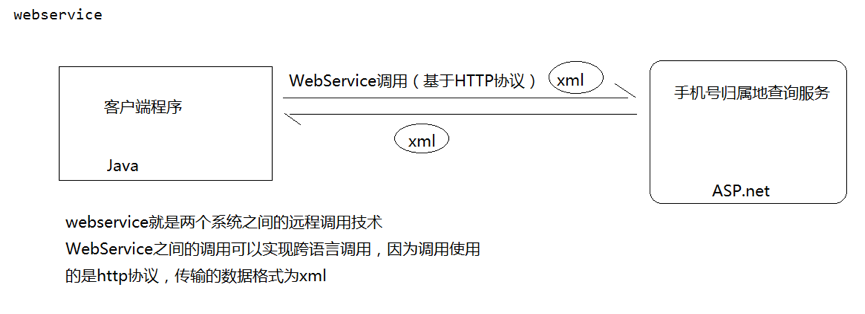
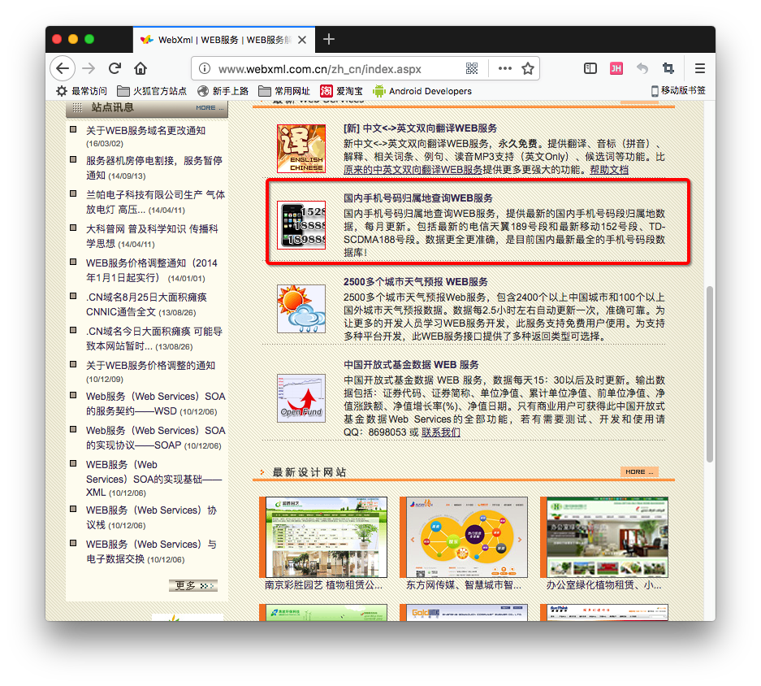
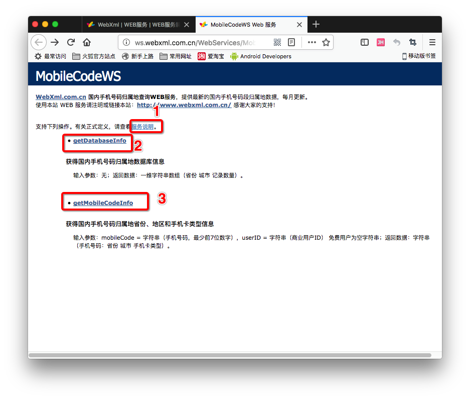
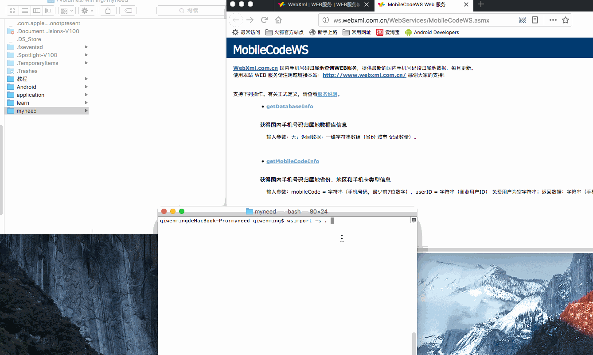
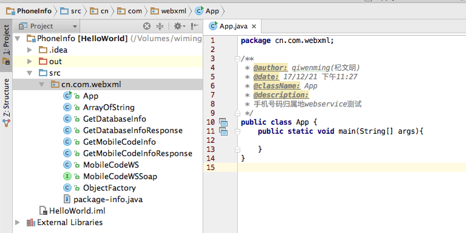
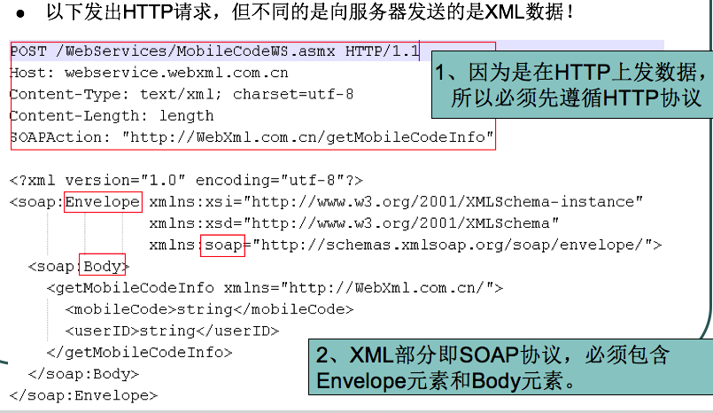
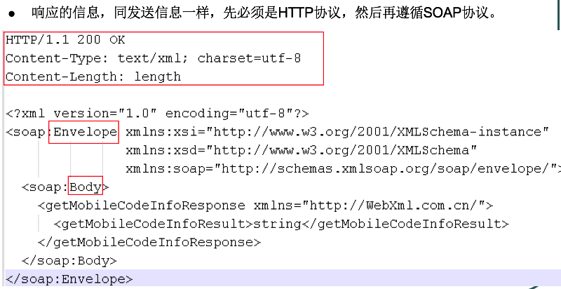
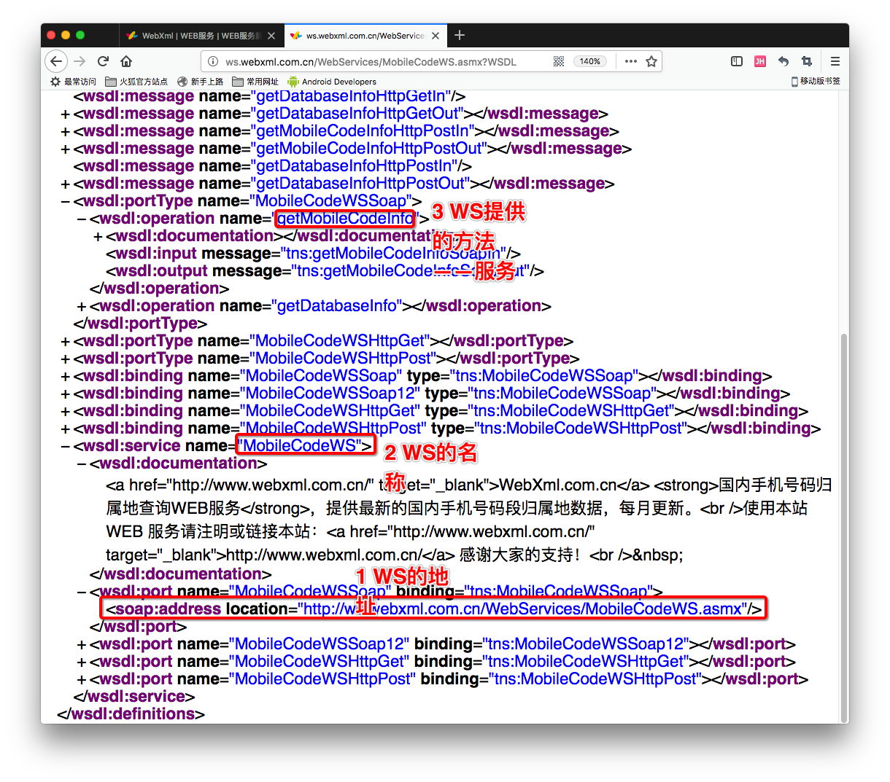

[TOC]


# BOS物流项目31———WebService01_WebService入门


## 一、什么是WebService

Web service是一个平台独立的，低耦合的，自包含的、基于可编程的web的应用程序，可使用开放的XML（标准通用标记语言下的一个子集）标准来描述、发布、发现、协调和配置这些应用程序，用于开发分布式的互操作的应用程序。

Web Service技术， 能使得运行在不同机器上的不同应用无须借助附加的、专门的第三方软件或硬件， 就可相互交换数据或集成。依据Web Service规范实施的应用之间， 无论它们所使用的语言、 平台或内部协议是什么， 都可以相互交换数据。Web Service是自描述、 自包含的可用网络模块， 可以执行具体的业务功能。Web Service也很容易部署， 因为它们基于一些常规的产业标准以及已有的一些技术，诸如标准通用标记语言下的子集XML、HTTP。Web Service减少了应用接口的花费。Web Service为整个企业甚至多个组织之间的业务流程的集成提供了一个通用机制。

例如手机号归属地查询




**WebService的特点**

-	WebService通过HTTP POST方式接受客户的请求


-	WebService与客户端之间一般使用SOAP协议传输XML数据


-	它本身就是为了跨平台或跨语言而设计的

---

## 二、几个名词解释


名词1：XML. Extensible Markup Language －扩展性标记语言


XML，用于传输格式化的数据，是Web服务的基础。


> namespace-命名空间。

>> xmlns=“http://wiming.cn” 使用默认命名空间。


>> xmlns:wiming=“http://wiming.cn”使用指定名称的命名空间。


名词2：WSDL – WebService Description Language – Web服务描述语言。

> 通过XML形式说明服务在什么地方－地址。

> 通过XML形式说明服务提供什么样的方法 – 如何调用。


名词3：SOAP-Simple Object Access Protocol(简单对象访问协议)

> SOAP作为一个基于XML语言的协议用于在网上传输数据。

> SOAP = 在HTTP的基础上+XML数据。

> SOAP是基于HTTP的。

> SOAP的组成如下：

>> Envelope – 必须的部分。以XML的根元素出现。

>> Headers – 可选的.

>> Body – 必须的。在body部分，包含要执行的服务器的方法。和发送到服务器的数据。

----

## 三、手机归属地查询示例

### 3.1 找到归属地查询的Webservice

可以去这个地址查找 
[http://www.webxml.com.cn](http://www.webxml.com.cn)

如下图



我们点击进去



这个就是我们需要使用到的WebService了

----

### 3.2 下载需要的代码

下载打开我们的终端，定位到需要把代码下载到的地方

终端中输入 

```
wsimport -s . http://ws.webxml.com.cn/WebServices/MobileCodeWS.asmx?WSDL
```

其中的 http 这个地址来自于，上面的服务说明的地址，执行上面的命令以后，就把需要的.java和.class 文件下载下来了。

如图：




### 3.3 创建java工程，测试代码

现在我们创建一个 **PhoneInfo**的项目

把上一步中，我们下载到的代码，删除 .class 文件以后，导入到项目中。

并且我们创建一个叫做 App.java的文件来测试代码。如图




现在我们来创建代码，那么怎么创建呢？ 我们查看 **http://ws.webxml.com.cn/WebServices/MobileCodeWS.asmx?WSDL**

如下图


我们可以看到，我们使用的服务类的名字叫做 **MobileCodeWS**

通过它的对象获取 **MobileCodeWSSoap**，然后通过**MobileCodeWSSoap**

的**getMobileCodeInfo**的归属地了。代码如下、

```java

package cn.com.webxml;

/**
 * @author: qiwenming(杞文明)
 * @date: 17/12/21 下午11:27
 * @className: App
 * @description:
 * 手机号码归属地webservice测试
 */
public class App {
    public static void main(String[] args){
        MobileCodeWS ss = new MobileCodeWS();
        MobileCodeWSSoap soap =  ss.getMobileCodeWSSoap();
        String str1 = soap.getMobileCodeInfo("13000000000",null);
        String str2 = soap.getMobileCodeInfo("12345678901",null);
        System.out.println(str1);
        System.out.println(str2);
    }
}
```

运行结果

```
13000000000：北京 北京 北京联通GSM卡
没有此号码记录
```

就需要这么点代码，我们就完成了手机号码归属地的查询。


-----

## 四、SOAP请求响应示例

上面手机号号码的请求示例如下

**SOAP协议的范本：－请求示例：**




**SOAP协议：－响应示例**




---

## 五、WSDL

WSDL－说明服务在哪里，如何调用，其实就是一个使用说明书：




----
## 六、源码下载

[https://github.com/wimingxxx/bos-parent](https://github.com/wimingxxx/bos-parent/)