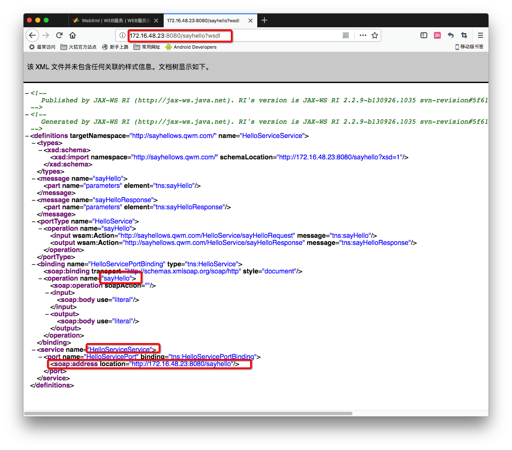
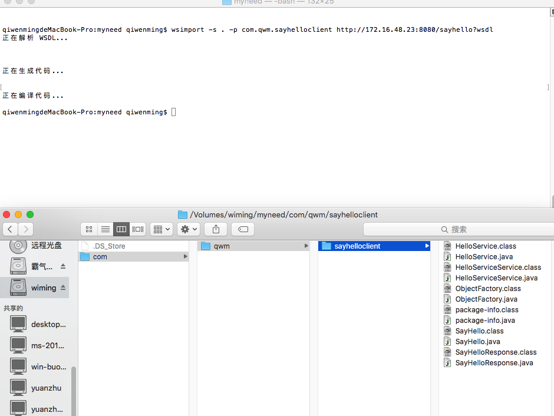
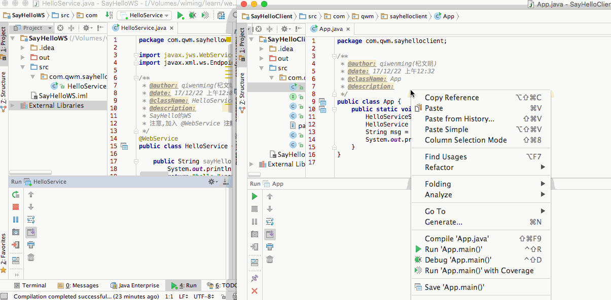

[TOC]


# BOS物流项目32———WebService02_发布一个WS服务


## 一、服务端发布的说明

在JDK1.6中JAX-WS规范定义了如何发布一个webService服务。

JAX-WS是指Java Api for XML – WebService.

与Web服务相关的类，都位于javax.jws.*包中。

主要类有：
> @WebService － 它是一个注解，用在类上指定将此类发布成一个ws.

> Endpoint – 此类为端点服务类，它的方法publish用于将一个已经添加了@WebService注解对象绑定到一个地址的端口上。


---

## 二、如何发布一个web服务

1 在类上添加@WebService注解。
> 这是jdk1.6提供的一个注解。它位于：javax.jws.*包中。

２ 通过EndPoint(端点服务)发布一个webService。
> Endpoint也是jdk提供的一个专门用于发布服务的类，它的publish方法接收两个参数，一个是本地的服务地址，二是提供服务的类。它位于javax.xml.ws.*包中。

> static Endpoint.publish(String address, Object implementor) 
          在给定地址处针对指定的实现者对象创建并发布端点。

>stop方法用于停止服务。

>EndPoint发布完成服务以后，将会独立的线程运行。所以，publish之后的代码，可以正常执行。


**其他注意事项：**

> 给类添加上@WebService注解后，类中所有的非静态方法都将会对外公布。

> 不支持静态方法，final方法。－

> 如果希望某个方法(非static,非final)不对外公开，可以在方法上添加@WebMethod(exclude=true)，阻止对外公开。

>如果一个类上，被添加了@WebService注解，则必须此类至少有一个可以公开的方法，否则将会启动失败。


---


## 三、服务端发布的步骤

第一步：创建一个Java项目

第二步：创建一个类，加入Webservice注解

第三步：提供一个方法sayHello

第四步：在main方法中调用jdk提供的发布服务的方法

第五步：访问服务的wsdl文档（服务的发布地址+?wsdl）

----

## 四、创建服务端，并且发布WS

创建名称叫做 **SayHelloWS**的工程

创建一个 **HelloService**的类，如下

```java
package com.qwm.sayhellows;

import javax.jws.WebService;
import javax.xml.ws.Endpoint;

/**
 * @author: qiwenming(杞文明)
 * @date: 17/12/22 上午12:03
 * @className: HelloService
 * @description:
 * SayHello的WS
 * 注意,加入 @WebService 注解
 */
@WebService
public class HelloService {

    public String sayHello(String name,int age){
        System.out.println("SayHello服务端被调用了.......");
        return "hello,"+name+" ,your age is : "+age;
    }

    public static void main(String[] args) {
        String address = "http://172.16.48.23:8080/sayhello";
        HelloService implementor = new HelloService();
        //第一个参数称为Binding即绑定地址，
        //第二个参数是实现者，即谁提供服务
        Endpoint.publish(address,implementor);
    }
}
```

运行，然后在浏览器上访问 **http://172.16.48.23:8080/sayhello?WSDL**

如下图



能够方位成功，那么就说明，我们的服务已经ok了。


----

## 五、wsimport主要说明

wsimport是jdk自带的,可以根据wsdl文档生成客户端调用代码的工具.当然,无论服务器端的WebService是用什么语言写的,

都将在客户端生成Java代码.服务器端用什么写的并不重要.

wsimport.exe位于JAVA_HOME\bin目录下.

常用参数为:
> -d<目录>  - 将生成.class文件。默认参数。

> -s<目录> - 将生成.java文件。

> -p<生成的新包名> -将生成的类，放于指定的包下。

> (wsdlurl) - http://server:port/service?wsdl，必须的参数。

**示例：**

C:/> wsimport –s . http://192.168.0.100/one?wsdl

注意：-s不能分开，-s后面有个小点，用于指定源代码生成的目录。点即当前目录。

如果使用了-s参数则会在目录下生成两份代码，一份为.class代码。一份为.java代码。
.class代码，可以经过打包以后使用。.java代码可以直接Copy到我们的项目中运行。


----

## 六、客户端测试

### 6.1 下载代码

现在我们再创建一个项目区调用我们的服务。项目名字叫做 **SayHelloClient**

导入我们的服务代码，一样的使用命令来获取代码

使用如下指令

```
wsimport -s . -p com.qwm.sayhelloclient http://172.16.48.23:8080/sayhello?wsdl
```

如图



### 6.2 导入代码

删除.class 文件后，导入到我们的项目中

### 6.3 测试

创建一个App 类来测试方法，如下

方法的调用可以查看 **http://172.16.48.23:8080/sayhello?wsdl**

```java
package com.qwm.sayhelloclient;

/**
 * @author: qiwenming(杞文明)
 * @date: 17/12/22 上午12:32
 * @className: App
 * @description:
 */
public class App {
    public static void main(String[] args){
        HelloServiceService ss = new HelloServiceService();
        HelloService soap = ss.getHelloServicePort();
        String msg = soap.sayHello("wiming",26);
        System.out.println(msg);
    }
}

```

### 6.4 图示




---
## 七、源码下载

[https://github.com/wimingxxx/bos-parent](https://github.com/wimingxxx/bos-parent/)