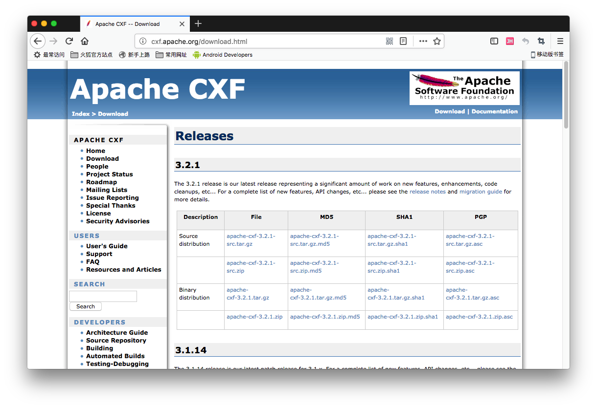
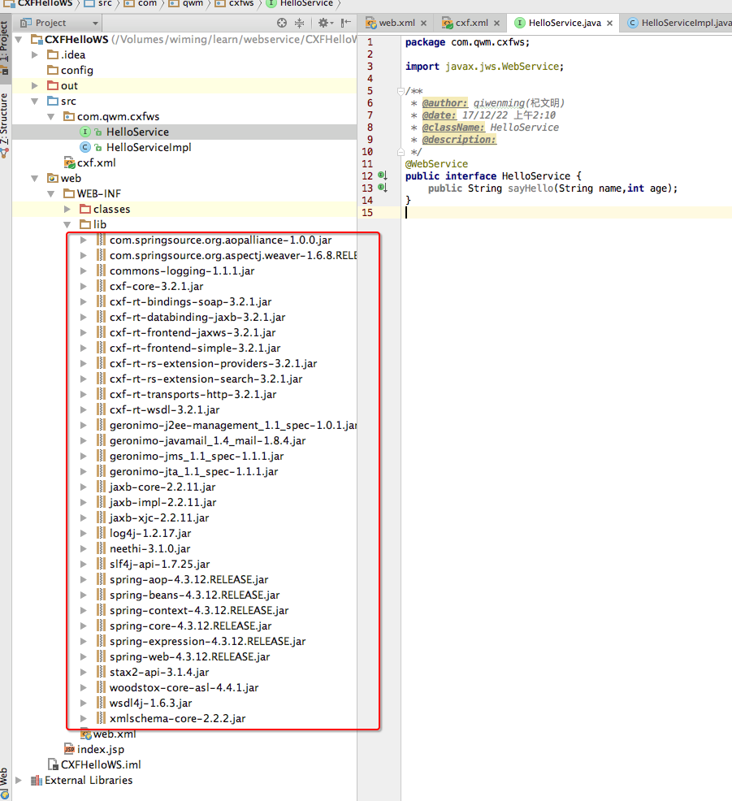
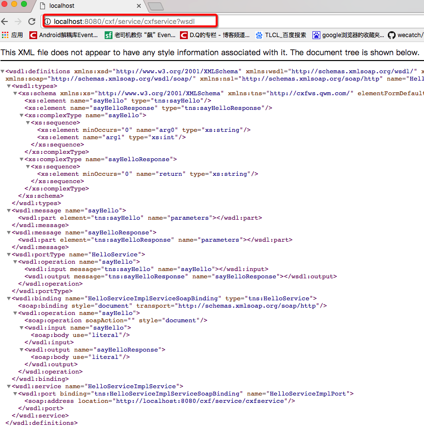
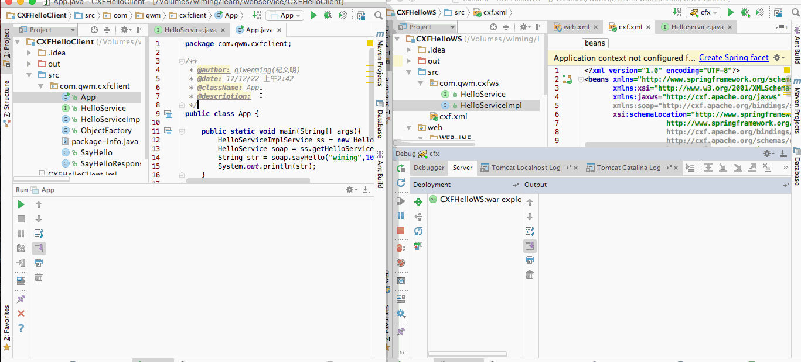

[TOC]


# BOS物流项目33———WebService03_CXF


## 一、CXF简介


Apache CXF = Celtix + XFire，开始叫 Apache CeltiXfire，后来更名为 Apache CXF 了，以下简称为 CXF。CXF 继承了 Celtix 和 XFire 两大开源项目的精华，提供了对 JAX-WS 全面的支持，并且提供了多种 Binding 、DataBinding、Transport 以及各种 Format 的支持，并且可以根据实际项目的需要，采用代码优先（Code First）或者 WSDL 优先（WSDL First）来轻松地实现 Web Services 的发布和使用。Apache CXF已经是一个正式的Apache顶级项目。

Apache CXF 是一个开源的 Services 框架，CXF 帮助您利用 Frontend 编程 API 来构建和开发 Services ，像 JAX-WS 。这些 Services 可以支持多种协议，比如：SOAP、XML/HTTP、RESTful HTTP 或者 CORBA ，并且可以在多种传输协议上运行，比如：HTTP、JMS 或者 JBI，CXF 大大简化了 Services 的创建，同时它继承了 XFire 传统，一样可以天然地和 Spring 进行无缝集成。


---

## 二、CXF下载

官网 [http://cxf.apache.org/](http://cxf.apache.org/)

下载地址 [http://cxf.apache.org/download.html](http://cxf.apache.org/download.html)



---

## 三、CXF服务端开发

### 3.1创建动态web项目

创建一个名为 **CXFHelloWS** 的动态web项目

### 3.2 导入CXF相关jar包

导入CXF必须包

如图




### 3.3 在web.xml中配置CXF框架提供的一个Servlet

```java
<?xml version="1.0" encoding="UTF-8"?>
<web-app xmlns="http://xmlns.jcp.org/xml/ns/javaee"
         xmlns:xsi="http://www.w3.org/2001/XMLSchema-instance"
         xsi:schemaLocation="http://xmlns.jcp.org/xml/ns/javaee http://xmlns.jcp.org/xml/ns/javaee/web-app_3_1.xsd"
         version="3.1">

    <!-- 配置CXF框架提供的Servlet -->
    <servlet>
        <servlet-name>cxf</servlet-name>
        <servlet-class>org.apache.cxf.transport.servlet.CXFServlet</servlet-class>
        <!-- 通过初始化参数指定CXF框架的配置文件位置 -->
        <init-param>
            <param-name>config-location</param-name>
            <param-value>classpath:cxf.xml</param-value>
        </init-param>
    </servlet>
    <servlet-mapping>
        <servlet-name>cxf</servlet-name>
        <url-pattern>/service/*</url-pattern>
    </servlet-mapping>


</web-app>
```


### 3.4 在类路径下提供cxf.xml

在src目录下创建 **cxf.xml**

```xml
<?xml version="1.0" encoding="UTF-8"?>
<beans xmlns="http://www.springframework.org/schema/beans"
       xmlns:xsi="http://www.w3.org/2001/XMLSchema-instance"
       xmlns:jaxws="http://cxf.apache.org/jaxws"
       xmlns:soap="http://cxf.apache.org/bindings/soap"
       xsi:schemaLocation="http://www.springframework.org/schema/beans
					http://www.springframework.org/schema/beans/spring-beans.xsd
					http://cxf.apache.org/bindings/soap
					http://cxf.apache.org/schemas/configuration/soap.xsd
					http://cxf.apache.org/jaxws
					http://cxf.apache.org/schemas/jaxws.xsd">

    <import resource="classpath:META-INF/cxf/cxf.xml" />

</beans>

```


### 3.5 开发一个接口和实现类

**HelloService**

```java

package com.qwm.cxfws;

import javax.jws.WebService;

/**
 * @author: qiwenming(杞文明)
 * @date: 17/12/22 上午2:10
 * @className: HelloService
 * @description:
 */
@WebService
public interface HelloService {
    public String sayHello(String name,int age);
}

```

**HelloServiceImpl**

```java
package com.qwm.cxfws;

/**
 * @author: qiwenming(杞文明)
 * @date: 17/12/22 上午2:11
 * @className: HelloServiceImpl
 * @description:
 */
public class HelloServiceImpl implements HelloService{
    @Override
    public String sayHello(String name, int age) {
        System.out.println("基于CXF服务器方法调用-----");
        return "hello,"+name+" your age is : "+age;
    }
}
```

### 3.6 在cxf.xml中注册服务

```java
<?xml version="1.0" encoding="UTF-8"?>
<beans xmlns="http://www.springframework.org/schema/beans"
       xmlns:xsi="http://www.w3.org/2001/XMLSchema-instance"
       xmlns:jaxws="http://cxf.apache.org/jaxws"
       xmlns:soap="http://cxf.apache.org/bindings/soap"
       xsi:schemaLocation="http://www.springframework.org/schema/beans
					http://www.springframework.org/schema/beans/spring-beans.xsd
					http://cxf.apache.org/bindings/soap
					http://cxf.apache.org/schemas/configuration/soap.xsd
					http://cxf.apache.org/jaxws
					http://cxf.apache.org/schemas/jaxws.xsd">

    <import resource="classpath:META-INF/cxf/cxf.xml" />
    
    <bean id="helloService" class="com.qwm.cxfws.HelloServiceImpl"/>
    <!--address 就是我们调用服务的地址的后部分,当然前面还有路径-->
    <jaxws:server id="myService" address="/cxfservice">
        <jaxws:serviceBean>
            <ref bean="helloService"/>
        </jaxws:serviceBean>
    </jaxws:server>


</beans>
```

服务地址说明

http://localhost:8080/cxf/service/cxfservice?wsdl

我们可以通过上面的地址访问到说明，上面地址中 **service** 是必须有的，不能修改，其他地方可以修改，**/cxfservice** 就是上面我们在配置文件

中配置的。

下面我说明文档




---

## 四、CXF客户端开发

客户端和原来我们使用**SayHello**项目的操作是一模一样的。

### 4.1 下载代码

只是现在我们下载类的方式有两种。

第一种，使用jdk自带的 wsimport

第二种，使用CXF的 wsdl2java


在cxf中，也提供了一个用于生成客户端调用代码的工具。它的功能就如同wsimport一样。

先让我们了解一下cxf的wsdl2java工具，可以生成一堆客户端调用的代码。

此工具位于cxf_home/bin目录下。参数与wsimport有所不同。

它包含以下参数：
>－d 参数，指定代码生成的目录。

> －p参数，指定生成的新的包结构。

在命令行执行：

	wsdl2java –d . http://localhost:8080/cxf/service/cxfservice?wsdl

删除.class文件


### 4.2 测试

创建项目，导入上面的文件，创建一个 App的类如下


```java

package com.qwm.cxfclient;

/**
 * @author: qiwenming(杞文明)
 * @date: 17/12/22 上午2:42
 * @className: App
 * @description:
 */
public class App {

    public static void main(String[] args){
        HelloServiceImplService ss = new HelloServiceImplService();
        HelloService soap = ss.getHelloServiceImplPort();
        String str = soap.sayHello("wiming",10);
        System.out.println(str);
    }

}
```

结果图示




---
## 五、源码下载

[https://github.com/wimingxxx/bos-parent](https://github.com/wimingxxx/bos-parent/)