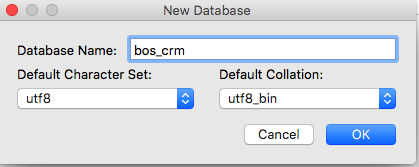
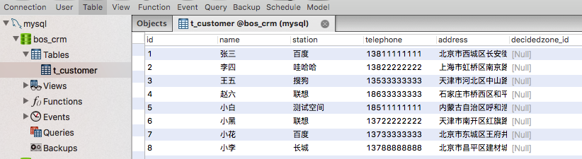
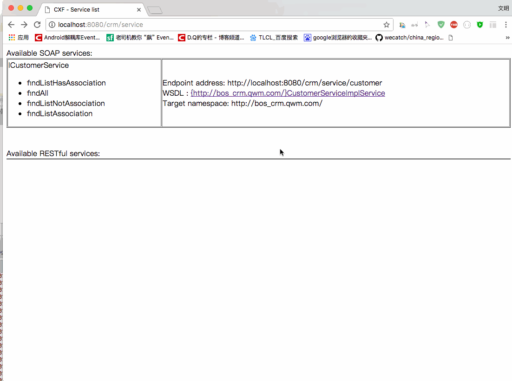
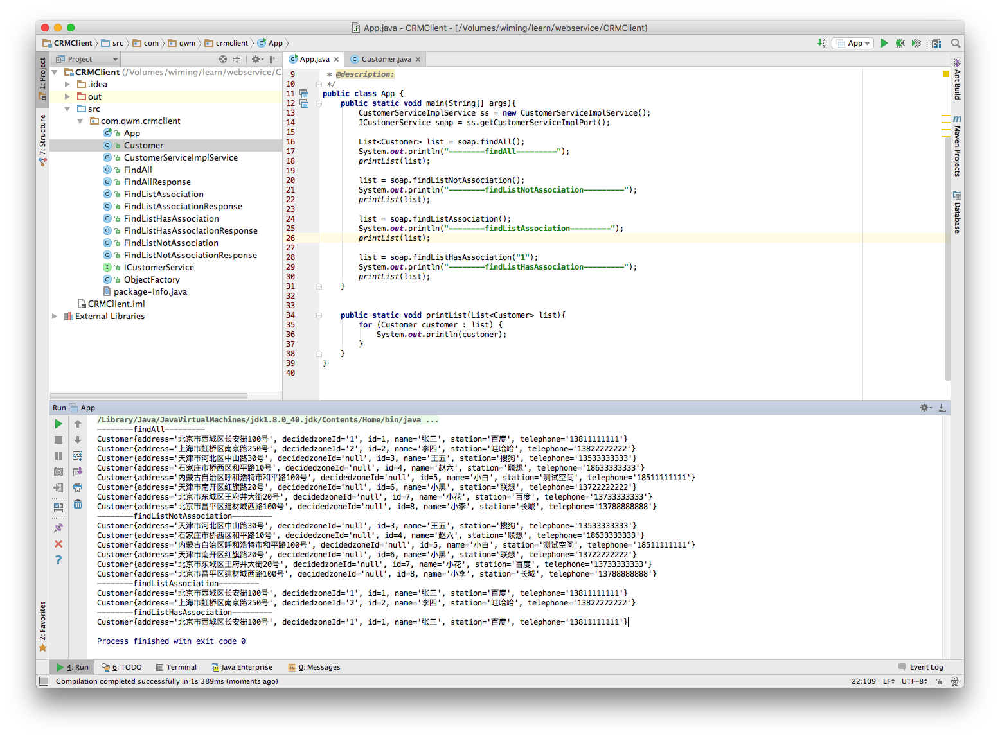

[TOC]


# BOS物流项目34———WebService04_基于CXF的crm服务


## 一、数据库的环境搭建

创建数据库，如图




使用下面的sql创建表和添加输入

```sql
SET FOREIGN_KEY_CHECKS=0;

-- ----------------------------
-- Table structure for `t_customer`
-- ----------------------------
DROP TABLE IF EXISTS `t_customer`;
CREATE TABLE `t_customer` (
  `id` int(11) NOT NULL auto_increment,
  `name` varchar(255) default NULL,
  `station` varchar(255) default NULL,
  `telephone` varchar(255) default NULL,
  `address` varchar(255) default NULL,
  `decidedzone_id` varchar(255) default NULL,
  PRIMARY KEY  (`id`)
) ENGINE=InnoDB DEFAULT CHARSET=utf8;

-- ----------------------------
-- Records of t_customer
-- ----------------------------
INSERT INTO `t_customer` VALUES ('1', '张三', '百度', '13811111111', '北京市西城区长安街100号', null);
INSERT INTO `t_customer` VALUES ('2', '李四', '哇哈哈', '13822222222', '上海市虹桥区南京路250号', null);
INSERT INTO `t_customer` VALUES ('3', '王五', '搜狗', '13533333333', '天津市河北区中山路30号', null);
INSERT INTO `t_customer` VALUES ('4', '赵六', '联想', '18633333333', '石家庄市桥西区和平路10号', null);
INSERT INTO `t_customer` VALUES ('5', '小白', '测试空间', '18511111111', '内蒙古自治区呼和浩特市和平路100号', null);
INSERT INTO `t_customer` VALUES ('6', '小黑', '联想', '13722222222', '天津市南开区红旗路20号', null);
INSERT INTO `t_customer` VALUES ('7', '小花', '百度', '13733333333', '北京市东城区王府井大街20号', null);
INSERT INTO `t_customer` VALUES ('8', '小李', '长城', '13788888888', '北京市昌平区建材城西路100号', null);
```




---

## 二、web项目环境搭建

1 创建动态web项目

2 导入CXF相关包

3 配置web.xml。所添加的如下

```xml
 <context-param>
  	<param-name>contextConfigLocation</param-name>
  	<param-value>classpath:cxf.xml</param-value>
  </context-param>
  
  <listener>
  	<listener-class>org.springframework.web.context.ContextLoaderListener</listener-class>
  </listener>
  
  <!-- 配置CXF框架提供的Servlet -->
  <servlet>
  	<servlet-name>cxf</servlet-name>
  	<servlet-class>org.apache.cxf.transport.servlet.CXFServlet</servlet-class>
  </servlet>
  <servlet-mapping>
  	<servlet-name>cxf</servlet-name>
  	<url-pattern>/service/*</url-pattern>
  </servlet-mapping>
```

4 在类路径下提供cxf.xml


```xml

<?xml version="1.0" encoding="UTF-8"?>
<beans xmlns="http://www.springframework.org/schema/beans"
       xmlns:xsi="http://www.w3.org/2001/XMLSchema-instance"
       xmlns:jaxws="http://cxf.apache.org/jaxws"
       xmlns:soap="http://cxf.apache.org/bindings/soap"
       xsi:schemaLocation="http://www.springframework.org/schema/beans
					http://www.springframework.org/schema/beans/spring-beans.xsd
					http://cxf.apache.org/bindings/soap
					http://cxf.apache.org/schemas/configuration/soap.xsd
					http://cxf.apache.org/jaxws
					http://cxf.apache.org/schemas/jaxws.xsd">
    <!-- 引入CXF Bean定义如下,早期的版本中使用 -->
    <import resource="classpath:META-INF/cxf/cxf.xml" />
</beans>
```


5 针对t_customer表创建一个Customer客户实体类
```java
package com.qwm.bos_crm;

/**
 * @author: qiwenming(杞文明)
 * @date: 17/12/22 下午11:11
 * @className: Customer
 * @description:
 * 客户实体类
 */
public class Customer {
   private int id ;
   private String name ;
   private String station;
   private String telephone;
   private String address;
   private String decidedzone_id;
   ........省略get/set方法.........
}   
```

6 开发一个接口和实现类

这里我们主要实现四个方法，

一个是查询全部 

一个是查询未关联定区的

一个是查询关联定区的 

一个是查询关联了定区的客户,通过id查询

**ICustomerService**

```java

/**
 * @author: qiwenming(杞文明)
 * @date: 17/12/22 下午11:15
 * @className: ICustomerService
 * @description:
 */
@WebService
public interface ICustomerService {
    /**
     * 查询全部
     * @return
     */
    public List<Customer> findAll();

    /**
     * 查询未关联定区的客户
     * @return
     */
    public List<Customer> findListNotAssociation();

    /**
     * 查询关联了定区的客户
     * @return
     */
    public List<Customer> findListAssociation();

    /**
     * 查询关联了定区的客户,通过id查询
     * @return
     */
    public List<Customer> findListHasAssociation(String decidedzoneId);
}
```

**CustomerServiceImpl**

```java
/**
 * @author: qiwenming(杞文明)
 * @date: 17/12/22 下午11:15
 * @className: CustomerServiceImpl
 * @description:
 */
@Transactional
public class CustomerServiceImpl implements ICustomerService {

    private JdbcTemplate jdbcTemplate;

    public void setJdbcTemplate(JdbcTemplate jdbcTemplate) {
        this.jdbcTemplate = jdbcTemplate;
    }


    /**
     * 查询全部
     *
     * @return
     */
    @Override
    public List<Customer> findAll() {
        //原生sql查询
        String sql = "select * from t_customer";
        List<Customer> list = jdbcTemplate.query(sql, new RowMapper<Customer>() {
            @Override
            public Customer mapRow(ResultSet resultSet, int i) throws SQLException {
                return resultSet2Customer(resultSet);
            }
        });
        return list;
    }

    /**
     * 查询未关联定区的客户
     *
     * @return
     */
    @Override
    public List<Customer> findListNotAssociation() {
        String sql = "select * from t_customer where decidedzone_id is null";
        List<Customer> list = jdbcTemplate.query(sql, new RowMapper<Customer>() {
            @Override
            public Customer mapRow(ResultSet resultSet, int i) throws SQLException {
                return resultSet2Customer(resultSet);
            }
        });
        return list;
    }

    /**
     * 查询关联了定区的客户
     *
     * @return
     */
    @Override
    public List<Customer> findListAssociation() {
        String sql = "select * from t_customer where decidedzone_id is not null";
        List<Customer> list = jdbcTemplate.query(sql, new RowMapper<Customer>() {
            @Override
            public Customer mapRow(ResultSet resultSet, int i) throws SQLException {
                return resultSet2Customer(resultSet);
            }
        });
        return list;
    }

    /**
     * 查询关联了定区的客户,通过id查询
     *
     * @param decidedzoneId
     * @return
     */
    @Override
    public List<Customer> findListHasAssociation(String decidedzoneId) {
        String sql = "select * from t_customer where decidedzone_id = ?";
        List<Customer> list = jdbcTemplate.query(sql, new RowMapper<Customer>() {
            @Override
            public Customer mapRow(ResultSet resultSet, int i) throws SQLException {
                return resultSet2Customer(resultSet);
            }
        },decidedzoneId);
        return list;
    }


    private Customer resultSet2Customer(ResultSet resultSet) throws SQLException {
        int id = resultSet.getInt("id");
        String name = resultSet.getString("name");
        String station = resultSet.getString("station");
        String telephone = resultSet.getString("telephone");
        String address = resultSet.getString("address");
        String decidedzone_id = resultSet.getString("decidedzone_id");
        return new Customer(id,name,station,telephone,address,decidedzone_id);
    }
}
```

7 配置 cxf.xml

```xml
<?xml version="1.0" encoding="UTF-8"?>
<beans xmlns="http://www.springframework.org/schema/beans"
       xmlns:xsi="http://www.w3.org/2001/XMLSchema-instance"
       xmlns:jaxws="http://cxf.apache.org/jaxws"
       xmlns:soap="http://cxf.apache.org/bindings/soap" xmlns:tx="http://www.springframework.org/schema/tx"
       xsi:schemaLocation="http://www.springframework.org/schema/beans
					http://www.springframework.org/schema/beans/spring-beans.xsd
					http://cxf.apache.org/bindings/soap
					http://cxf.apache.org/schemas/configuration/soap.xsd
					http://cxf.apache.org/jaxws
					http://cxf.apache.org/schemas/jaxws.xsd http://www.springframework.org/schema/tx http://www.springframework.org/schema/tx/spring-tx.xsd">
    <!-- 引入CXF Bean定义如下,早期的版本中使用 -->
    <import resource="classpath:META-INF/cxf/cxf.xml" />

    <!--配置数据源-->
    <bean id="dataSource" class="org.springframework.jdbc.datasource.DriverManagerDataSource">
        <property name="driverClassName" value="com.mysql.jdbc.Driver"/>
        <property name="url" value="jdbc:mysql:///bos_crm"/>
        <property name="username" value="root"/>
        <property name="password" value="123456"/>
    </bean>

    <!--事务管理器-->
    <bean id="transactionManager" class="org.springframework.jdbc.datasource.DataSourceTransactionManager">
        <property name="dataSource" ref="dataSource"/>
    </bean>

    <!--支持事务注解-->
    <tx:annotation-driven transaction-manager="transactionManager"/>


    <bean id="jdbcTemplate" class="org.springframework.jdbc.core.JdbcTemplate">
        <property name="dataSource" ref="dataSource"/>
    </bean>

    <!--注入Jdbc模板-->
    <bean id="customerService" class="com.qwm.bos_crm.CustomerServiceImpl">
        <property name="jdbcTemplate" ref="jdbcTemplate"/>
    </bean>

    <!--注册Webservice服务-->
    <jaxws:server id="myService" address="/customer">
        <jaxws:serviceBean>
            <ref bean="customerService"/>
        </jaxws:serviceBean>
    </jaxws:server>
</beans>

```

8 运行，发布，如下图




---


## 三、创建java项目测试一把

修改几个数据的定区di不为空，测试

同样的，和之前一样，下载代码，把代码导入到创建的工程中中调用方法测试





---
## 五、源码下载

[https://github.com/wimingxxx/bos-parent](https://github.com/wimingxxx/bos-parent/)