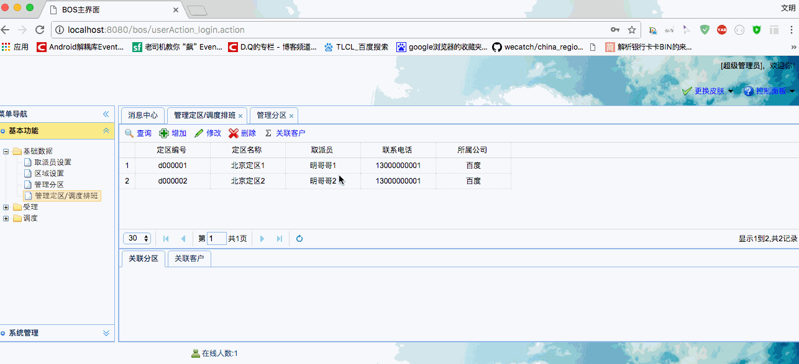
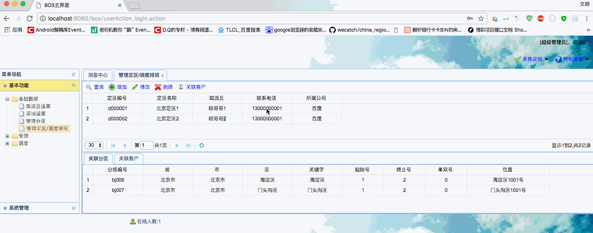

[TOC]


# BOS物流项目36———定区数据4\_查看定区中包含的分区和客户信息


页面：WEB-INF/pages/base/decidedzone.jsp

## 一、说明

当我们双击定区中的数据的时候，能够展示定区中包含的分区和客户信息，示例如下




## 二、分区部分的页面调整


### 2.1 为datagrid绑定数据事件

主要的修改，就是修改请求地址

```html
$('#grid').datagrid( {
			iconCls : 'icon-forward',
			fit : true,
			border : true,
			rownumbers : true,
			striped : true,
			pageList: [30,50,100],
			pagination : true,
			toolbar : toolbar,
			url : "decidedzoneAction_pageQuery.action",
			idField : 'id',
			columns : columns,
			//为数据表格绑定双击事件
			onDblClickRow : doDblClickRow
		});
```

### 2.2 定义doDblClickRow函数
双击的时候，定义了 doDblClickRow 函数，这个函数可以接收两个方法，一个是 双击行的序号,一个是双击的那行的数据

```html
function doDblClickRow(index,data){
		$('#association_subarea').datagrid( {
			fit : true,
			border : true,
			rownumbers : true,
			striped : true,
			url : "subareaAction_findListByDecidedzoneId.action?decidedzoneId="+data.id,
			.............
}			
```

## 三、分区部分的后台

其实就是主要就是通过 定区id 查询出 分区，

DecidedzoneAction中的方法

```java
    /**
     * 根据定区id获取分区
     * @return
     */
    public String findListByDecidedzoneId(){
        List<Subarea> list = subareaService.findListByDecidedzoneId(decidedzoneId);
        java2Json(list,new String[]{"decidedzone","subareas"});
        return NONE;
    }
```

SubareaService 中的方法

```java
    /**
     * 根据定区id查询分区
     * @param decidedzoneId
     * @return
     */
    public List<Subarea> findListByDecidedzoneId(String decidedzoneId) {
        DetachedCriteria detachedCriteria = DetachedCriteria.forClass(Subarea.class);
        detachedCriteria.add(Restrictions.eq("decidedzone.id",decidedzoneId));
        return subareaDao.findByCriteria(detachedCriteria);
    }
```


---


## 四、客户信息部分的修改

客户信息部分，前面已经把后台写好了，这里只需要修改前端的请求地址就行了

```html
$('#association_customer').datagrid( {
			fit : true,
			border : true,
			rownumbers : true,
			striped : true,
			url : "decidedzoneAction_findListHasAssociation.action?id="+data.id,
			columns : [[{
				field : 'id',
				title : '客户编号',
				width : 120,
				align : 'center'
			},{
				field : 'name',
				title : '客户名称',
				width : 120,
				align : 'center'
			}, {
				field : 'station',
				title : '所属单位',
				width : 120,
				align : 'center'
			}]]
		});
```


---


## 五、图示



----

## 六、源码下载

[https://github.com/wimingxxx/bos-parent](https://github.com/wimingxxx/bos-parent/)