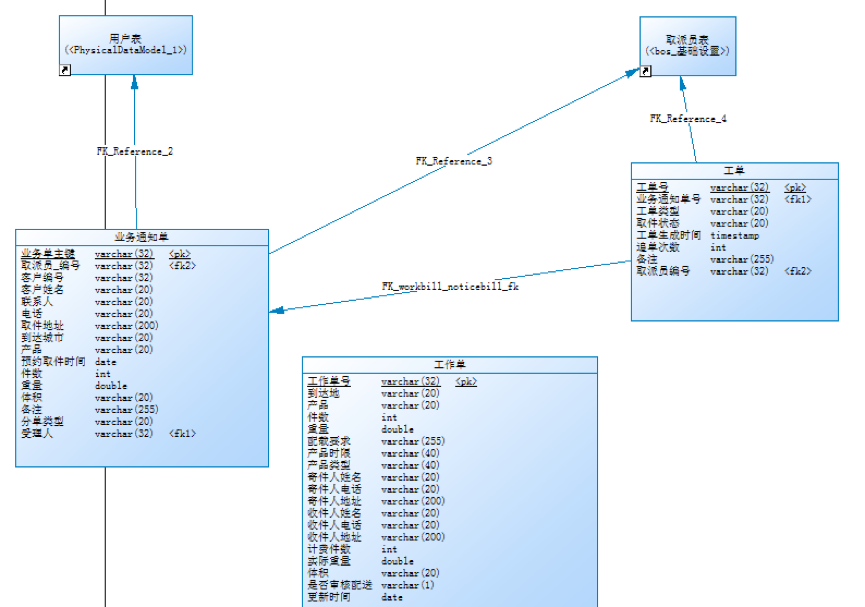
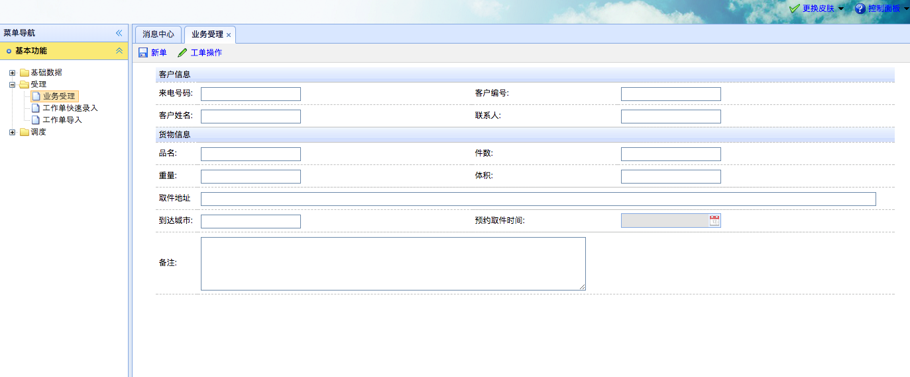
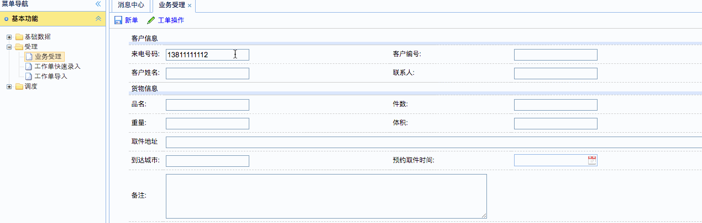
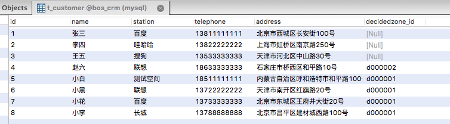
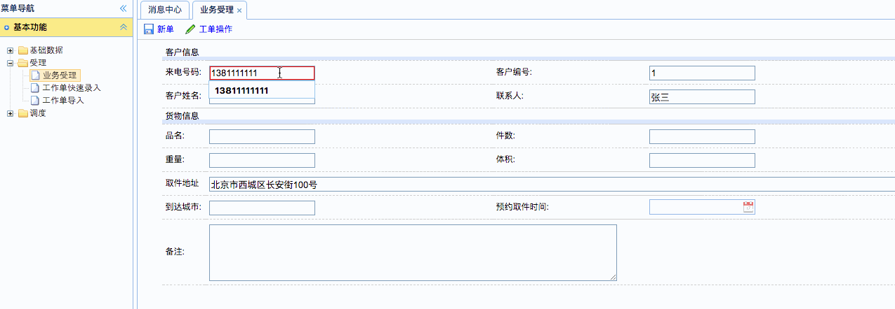
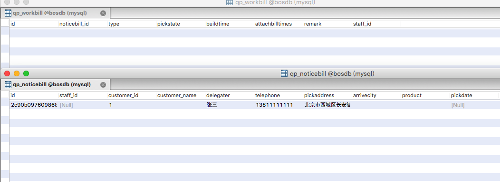
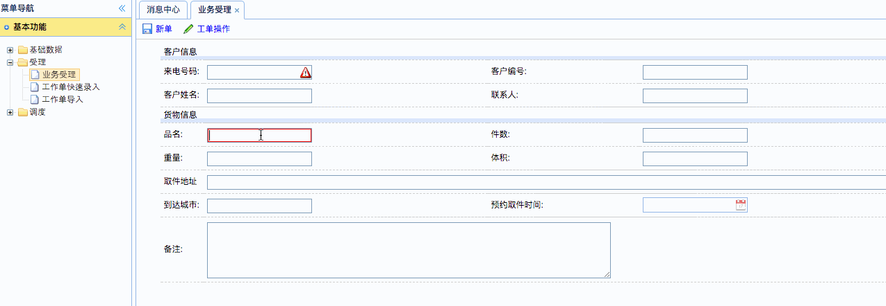
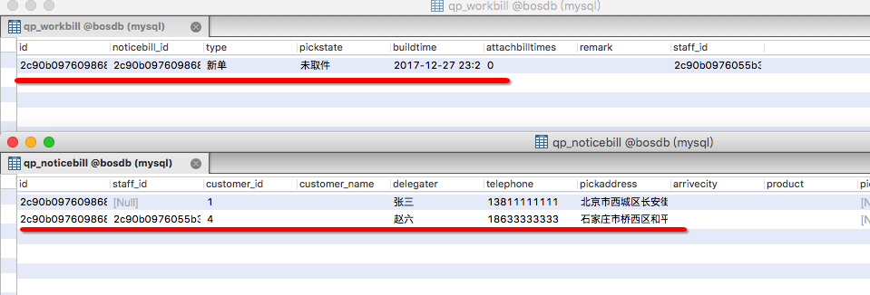

[TOC]


# BOS物流项目37———业务受理1\_


## 一、业务受理需求分析

整个BOS项目分为基础设置、取派、中转、路由、报表等几大部分。
受理环节，是物流公司业务的开始，作为服务前端，客户通过电话、网络等多种方式进行委托，业务受理员通过与客户交流，获取客户的服务需求和具体委托信息，将服务指令输入我司服务系统。

客户通过打电话方式进行物流委托，物流公司的客服人员需要将委托信息录入到BOS系统中，这个录入的信息称**为业务通知单**。

	
当客服人员将业务通知单信息录入到系统后，系统会根据客户的住址自动匹配到一个取派员，并为这个取派员产生一个任务，这个任务就称为**工单**。


取派员收到取货任务后，会到客户住址取货，取派员会让客户填写纸质的单子（寄件人信息、收件人信息等），取派员将货物取回物流公司网点后，需要将纸质单子上的信息录入到BOS系统中，录入的信息称为**工作单**。


----

## 二、创建业务受理环节的数据表

### 2.1 数据表的关系



### 2.2 建表sql

```sql
/*==============================================================*/
/* DBMS name:      MySQL 5.0                                    */
/* Created on:     2017/12/24 ÐÇÆÚÈÕ 22:54:18                      */
/*==============================================================*/


drop table if exists qp_noticebill;

drop table if exists qp_workbill;

drop table if exists qp_workordermanage;

/*==============================================================*/
/* Table: qp_noticebill                                         */
/*==============================================================*/
create table qp_noticebill
(
   id                   varchar(32) not null,
   staff_id             varchar(32),
   customer_id          varchar(32),
   customer_name        varchar(20),
   delegater            varchar(20),
   telephone            varchar(20),
   pickaddress          varchar(200),
   arrivecity           varchar(20),
   product              varchar(20),
   pickdate             date,
   num                  int,
   weight               double,
   volume               varchar(20),
   remark               varchar(255),
   ordertype            varchar(20),
   user_id              varchar(32),
   primary key (id)
);

/*==============================================================*/
/* Table: qp_workbill                                           */
/*==============================================================*/
create table qp_workbill
(
   id                   varchar(32) not null,
   noticebill_id        varchar(32),
   type                 varchar(20),
   pickstate            varchar(20),
   buildtime            timestamp,
   attachbilltimes      int,
   remark               varchar(255),
   staff_id             varchar(32),
   primary key (id)
);

/*==============================================================*/
/* Table: qp_workordermanage                                    */
/*==============================================================*/
create table qp_workordermanage
(
   id                   varchar(32) not null,
   arrivecity           varchar(20),
   product              varchar(20),
   num                  int,
   weight               double,
   floadreqr            varchar(255),
   prodtimelimit        varchar(40),
   prodtype             varchar(40),
   sendername           varchar(20),
   senderphone          varchar(20),
   senderaddr           varchar(200),
   receivername         varchar(20),
   receiverphone        varchar(20),
   receiveraddr         varchar(200),
   feeitemnum           int,
   actlweit             double,
   vol                  varchar(20),
   managerCheck         varchar(1),
   updatetime           date,
   primary key (id)
);

alter table qp_noticebill add constraint FK_Reference_2 foreign key (user_id)
      references t_user(id) on delete restrict on update restrict;

alter table qp_noticebill add constraint FK_Reference_3 foreign key (staff_id)
      references bc_staff(id) on delete restrict on update restrict;

alter table qp_workbill add constraint FK_Reference_4 foreign key (staff_id)
      references bc_staff(id) on delete restrict on update restrict;

alter table qp_workbill add constraint FK_workbill_noticebill_fk foreign key (noticebill_id)
      references qp_noticebill (id) on delete restrict on update restrict;


```

## 三、导入需要的类和文件

导入以下的文件


Noticebill.hbm.xml

Noticebill.java

Workbill.hbm.xml

Workbill.java

Workordermanage.hbm.xml

Workordermanage.java



---



## 四、业务受理自动分单界面说明

页面地址是：WEB-INF/pages/qupai/noticebill_add.jsp





页面中，只有手机号和取件地址是必需填写的，其他地址是非必填的，

为了更好的客户体验，可以通过手机号码查询出，相关信息（如果存在），通过取件地址查询出对应的取派员（如果存在）。

因此，crm应该提供两个方法，一个是通过手机号查询客户信息，一个是通过取件地址，查询到取派员

----

## 五、在crm服务中扩展方法

扩展的方法是：

根据客户的手机号查询客户信息

根据客户的取件地址查询定区id


```java

    /**
     * 根据手机号查询客户信息
     *
     * @param telephone
     * @return
     */
    @Override
    public Customer findCustomerByTelephone(String telephone) {
        String sql = "select * from t_customer where telephone = ?";
        List<Customer> list = jdbcTemplate.query(sql, new RowMapper<Customer>() {
            @Override
            public Customer mapRow(ResultSet resultSet, int i) throws SQLException {
                return resultSet2Customer(resultSet);
            }
        },telephone);
        if(list!=null&&list.size()>0){
            return list.get(0);
        }
        return null;
    }

    /**
     * 根据客户的地址查询到定区id
     *
     * @param address
     * @return
     */
    @Override
    public String findDecidedzoneIdByAddress(String address) {
        String sql = "select decidedzone_id from t_customer where address = ?";
        String decidedzoneId = jdbcTemplate.queryForObject(sql,String.class,address);
        return decidedzoneId;
    }

```

---

## 六、页面调整

### 6.1 为手机号输入框绑定离焦事件

页面的调整，输入手机号的时候，失去焦点的时候，去查询手机号对应的客户信息

修改如下

```html
                   <td>来电号码:</td>
					<td><input type="text" class="easyui-validatebox" name="telephone"
						required="true" /></td>
					<script type="text/javascript">
						$(function(){
							//页面加载完成,为手机号输入框绑定离焦事件
							$("input[name=telephone]").blur(function(){
								//获取页面输入的手机号
								var telephone = this.value;
								//发送ajax请求，请求Action，在Action中远程掉调用crm服务，获取客户信息，用于页面回显
								$.post("noticebillAction_findCustomerByTelephone.action",{"telephone":telephone},function(data){
									if(data!=null){
										//查询到了客户信息，可以进行页面回显
										var customerId = data.id;
										var customerName = data.name;
										var address = data.address;
										$("input[name=customerId]").val(customerId);
										$("input[name=delegater]").val(customerName);
										$("input[name=pickadress]").val(address);

									}else{
										//没有查询到客户信息，不能进行页面回显
										$("input[name=customerId]").val("");
										$("input[name=delegater]").val("");
										$("input[name=pickaddress]").val("");

									}
								});
							});
						});
					</script>
```


### 6.2 创建NoticebillAction

```java
/**
 * @author: qiwenming(杞文明)
 * @date: 17/12/27 下午9:24
 * @className: NoticebillAction
 * @description:
 * 业务受理分单
 */
@Controller
@Scope("prototype")
public class NoticebillAction extends BaseAction<Noticebill> {

    @Autowired
    private ICustomerService customerService;

    /**
     * 远程调用CRM服务,根据手机号查询客户信息
     * @return
     */
    public String findCustomerByTelephone(){
        String telephone = model.getTelephone();
        Customer customer = customerService.findCustomerByTelephone(telephone);
        java2Json(customer,new String[]{});
        return NONE;
    }

}
```

### 6.3 在struts.xml中配置NoticebillAction
```xml
        <!--新单管理 -->
        <action name="noticebillAction_*" class="noticebillAction" method="{1}">
            <result name="list">/WEB-INF/pages/base/decidedzone.jsp</result>
        </action>
```

### 6.4 查询的效果




---

## 七、在NoticebillAction中提供方法实现业务受理自动分单

添加方法如下

```java
    /**
     * 保存一个业务通知单,并尝试自动分单
     * @return
     */
    public String add(){
        noticebillService.save(model);
        return "noticebill_add";
    }
```

struts.xml中添加配置

```xml
        <!-- 业务通知单管理 -->
        <action name="noticebillAction_*" class="noticebillAction" method="{1}">
            <result name="noticebill_add">/WEB-INF/pages/qupai/noticebill_add.jsp</result>
        </action>
```


---

## 八、创建 NoticebillService

如下

```java
/**
 * @author: qiwenming(杞文明)
 * @date: 17/12/27 下午10:01
 * @className: NoticebillServiceImpl
 * @description:
 */
@Service
@Transactional
public class NoticebillServiceImpl implements INoticebillService {

    @Autowired
    private INoticebillDao noticebillDao;

    @Autowired
    private ICustomerService customerService;

    @Autowired
    private IDecidedzoneDao decidedzoneDao;

    @Autowired
    private IWorkbillDao workbillDao;

    /**
     * 保存业务通知,还有尝试自动分单
     * 根据取件地址,来获取定区id,通过定区id来自动分单
     * @param noticebill
     */
    @Override
    public void save(Noticebill noticebill) {
        User user = BOSUtils.getLoginUser();
        noticebill.setUser(user);//设置当前登录用户
        noticebillDao.save(noticebill);
        //获取当前用户的取件地址
        String pickAddress = noticebill.getPickaddress();
        //远程调用CRM服务,查询出取件地址对应的定区id
        String decidedzoneId = customerService.findDecidedzoneIdByAddress(pickAddress);
        //判断定区id是否为空,不为空自动分单,为空手动分单
        if(decidedzoneId!=null){
            //获取定区
            Decidedzone decidedzone = decidedzoneDao.findById(decidedzoneId);
            //获取取派员
            Staff staff = decidedzone.getStaff();
            //业务通知单关联取派员对象
            noticebill.setStaff(staff);
            //设置分单类型为自动分单
            noticebill.setOrdertype(Noticebill.ORDERTYPE_AUTO);
            //为取派员创建一个工单
            Workbill workbill = new Workbill();
            workbill.setAttachbilltimes(0);//追单次数
            workbill.setBuildtime(new Timestamp(System.currentTimeMillis()));
            workbill.setNoticebill(noticebill);//工单关联通知单
            workbill.setPickstate(Workbill.PICKSTATE_NO);//取件状态
            workbill.setRemark(noticebill.getRemark());//备注信息
            workbill.setStaff(staff);//工单管理取派员
            workbill.setType(Workbill.TYPE_1);//工单类型
            workbillDao.save(workbill);//保存工单

            //TODO 调用短信平台,发送短信

        }else{
            //没有查询到定区id，不能完成自动分单
            noticebill.setOrdertype(Noticebill.ORDERTYPE_MAN);
        }
    }
}

```

---


##九、测试

首先我们看CRM中的客户表



其中有些用户是没有绑定定区的


使用没有绑定定区的用户，那么我们需要**手动分单**，也就是说

只会在**qp_noticebill**中添加一条数据，不会在**qp_workbill**中添加数据


使用绑定定区的用户，那么是**自动动分单**，也就是说

会在**qp_noticebill**中添加一条数据，也会在**qp_workbill**中添加数据


### 9.1 添加手动分单的数据

现在使用 **13811111111** 这个用户来测试，他是没有绑定定区的



数据的结果




### 9.2 添加自动分单的数据

现在使用 **18633333333** 这个用户来测试，他是绑定了定区



数据的结果




## 十、源码下载

[https://github.com/wimingxxx/bos-parent](https://github.com/wimingxxx/bos-parent/)