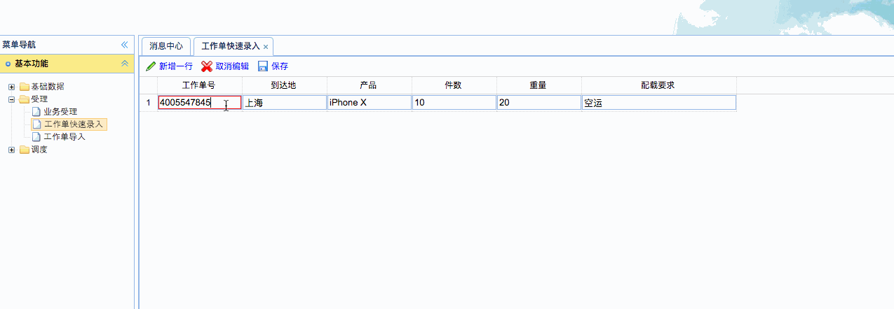
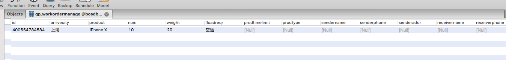

[TOC]


# BOS物流项目38———业务受理2\_工作单快速录入


## 一、前端页面修改

修改的页面是：WEB-INF/qupai/quickworkorder.jsp

主要修改如下：

```jsp
$(function(){
		// 先将body隐藏，再显示，不会出现页面刷新效果
		$("body").css({visibility:"visible"});
		
		// 收派标准数据表格
		$('#grid').datagrid( {
			iconCls : 'icon-forward',
			fit : true,
			border : true,
			rownumbers : true,
			striped : true,
			pageList: [30,50,100],
			pagination : true,
			toolbar : toolbar,
			url :  "",
			idField : 'id',
			columns : columns,
			onDblClickRow : doDblClickRow,
			onAfterEdit : function(rowIndex, rowData, changes){
				console.info(rowData);
				editIndex = undefined;
				$.post('workordermanageAction_add.action',rowData,function(data){
					if(data == '0'){
						$.messager.alert("提示信息","工作单信息录入失败！","error");
					}
				});
			}
		});
	});
```

---

## 二、后端

### 2.1 WorkordermanageAction

```java
/**
 * @author: qiwenming(杞文明)
 * @date: 17/12/28 上午12:34
 * @className: workordermanageAction
 * @description:
 * 工作单 管理
 */
@Controller
@Scope("prototype")
public class WorkordermanageAction extends BaseAction<Workordermanage> {

    @Autowired
    private IWorkordermanageService workordermanageService;

    public String add() throws IOException {
        String f="1";
        try{
            workordermanageService.save(model);
        }catch (Exception e){
            e.printStackTrace();
            f = "0";
        }
        ServletActionContext.getResponse().setContentType("text/html;charset=utf-8");
        ServletActionContext.getResponse().getWriter().print(f);
        return NONE;
    }

}
```

在 struts.xml中添加配置

```xml
        <!-- 工作单 管理 -->
        <action name="workordermanageAction_*" class="workordermanageAction" method="{1}">
        </action>
```

### 2.2 WorkordermanageService

**IWorkordermanageService**

```java
/**
 * @author: qiwenming(杞文明)
 * @date: 17/12/28 上午12:39
 * @className: IWorkordermanageService
 * @description:
 */
public interface IWorkordermanageService {
    void save(Workordermanage workordermanage);
}
```

**WorkordermanageServiceImpl**

```java
/**
 * @author: qiwenming(杞文明)
 * @date: 17/12/28 上午12:41
 * @className: WorkordermanageServiceImpl
 * @description:
 */
@Service
@Transactional
public class WorkordermanageServiceImpl implements IWorkordermanageService {

    @Autowired
    private IWorkordermanageDao workordermanageDao;

    @Override
    public void save(Workordermanage workordermanage) {
        workordermanageDao.save(workordermanage);
    }
}
```

### 2.3 WorkordermanageDao

**IWorkordermanageDao**

```java
/**
 * @author: qiwenming(杞文明)
 * @date: 17/12/28 上午12:41
 * @className: IWorkordermanageDao
 * @description:
 */
public interface IWorkordermanageDao extends IBaseDao<Workordermanage>{
}
```

**WorkordermanageDaoImpl**

```java
/**
 * @author: qiwenming(杞文明)
 * @date: 17/12/28 上午12:42
 * @className: WorkordermanageDaoImpl
 * @description:
 */
@Repository
public class WorkordermanageDaoImpl extends BaseDaoImpl<Workordermanage> implements IWorkordermanageDao {
}
```

----

## 三、测试

前端测试




数据库表中数据





----

## 四、源码下载

[https://github.com/wimingxxx/bos-parent](https://github.com/wimingxxx/bos-parent/)