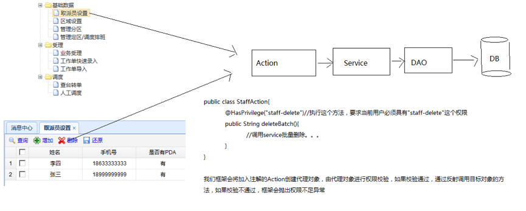
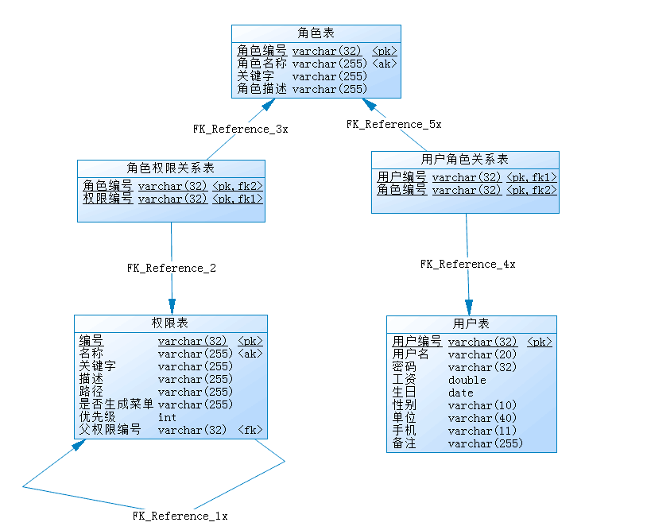
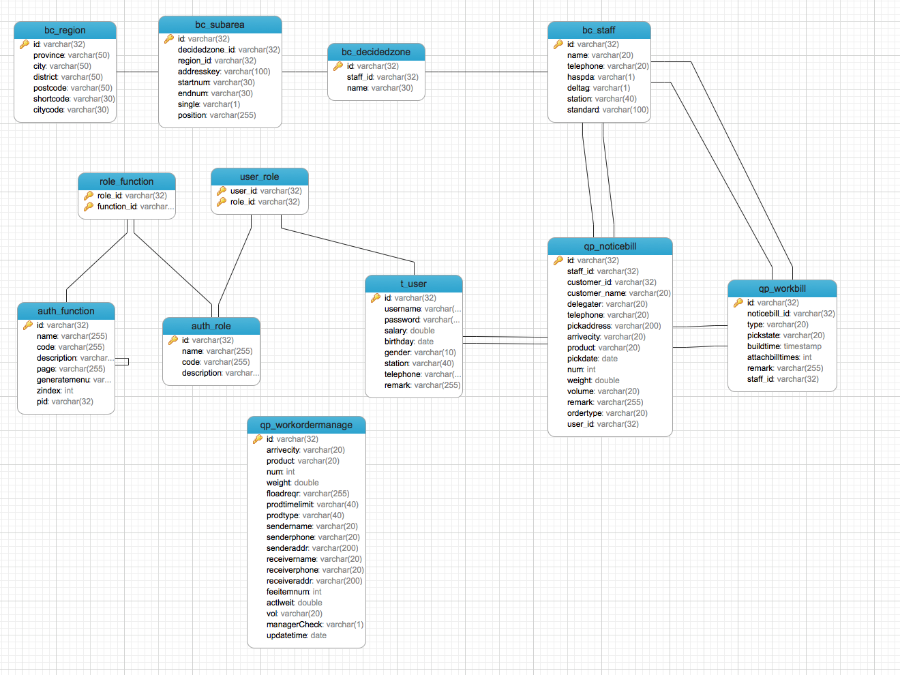

[TOC]


# BOS物流项目39———权限控制1\_简单概述


## 一、权限概述

**认证：**系统提供的用于识别用户身份的功能，通常登录功能就是认证功能-----让系统知道你是谁？？

**授权：**系统授予用户可以访问哪些功能的许可（证书）----让系统知道你能做什么？？


---

## 二、常见的权限控制方式

### 2.1 URL拦截权限控制

底层基于拦截器或者过滤器实现


图示




### 2.2 方法注解权限控制

底层基于代理技术实现，为Action创建代理对象，由代理对象进行权限校验

图示



---

## 三、创建权限数据模型

- 权限表

- 角色表

- 用户表

- 角色权限关系表

- 用户角色表

角色就是权限的集合，引入角色表，是为了方便授权

表结构如下


数据库中添加使用下面的sql创建表


```sql
/*==============================================================*/
/* DBMS name:      MySQL 5.0                                    */
/* Created on:     2017/12/29 星期五 0:15:25                       */
/*==============================================================*/


drop table if exists auth_function;

drop table if exists auth_role;

drop table if exists role_function;

drop table if exists t_user;

drop table if exists user_role;

/*==============================================================*/
/* Table: auth_function                                         */
/*==============================================================*/
create table auth_function
(
   id                   varchar(32) not null,
   name                 varchar(255),
   code                 varchar(255),
   description          varchar(255),
   page                 varchar(255),
   generatemenu         varchar(255),
   zindex               int,
   pid                  varchar(32),
   primary key (id),
   key AK_Key_2 (name)
);

/*==============================================================*/
/* Table: auth_role                                             */
/*==============================================================*/
create table auth_role
(
   id                   varchar(32) not null,
   name                 varchar(255),
   code                 varchar(255),
   description          varchar(255),
   primary key (id),
   key AK_Key_2 (name)
);

/*==============================================================*/
/* Table: role_function                                         */
/*==============================================================*/
create table role_function
(
   role_id              varchar(32) not null,
   function_id          varchar(32) not null,
   primary key (role_id, function_id)
);

/*==============================================================*/
/* Table: t_user                                                */
/*==============================================================*/
create table t_user
(
   id                   varchar(32) not null,
   username             varchar(20),
   password             varchar(32),
   salary               double,
   birthday             date,
   gender               varchar(10),
   station              varchar(40),
   telephone            varchar(11),
   remark               varchar(255),
   primary key (id)
);

/*==============================================================*/
/* Table: user_role                                             */
/*==============================================================*/
create table user_role
(
   user_id              varchar(32) not null,
   role_id              varchar(32) not null,
   primary key (user_id, role_id)
);

alter table auth_function add constraint FK_Reference_1x foreign key (pid)
      references auth_function (id) on delete restrict on update restrict;

alter table role_function add constraint FK_Reference_2 foreign key (function_id)
      references auth_function (id) on delete restrict on update restrict;

alter table role_function add constraint FK_Reference_3x foreign key (role_id)
      references auth_role (id) on delete restrict on update restrict;

alter table user_role add constraint FK_Reference_4x foreign key (user_id)
      references t_user (id) on delete restrict on update restrict;

alter table user_role add constraint FK_Reference_5x foreign key (role_id)
      references auth_role (id) on delete restrict on update restrict;
```


最终的表结构是




----

## 四、源码下载

[https://github.com/wimingxxx/bos-parent](https://github.com/wimingxxx/bos-parent/)