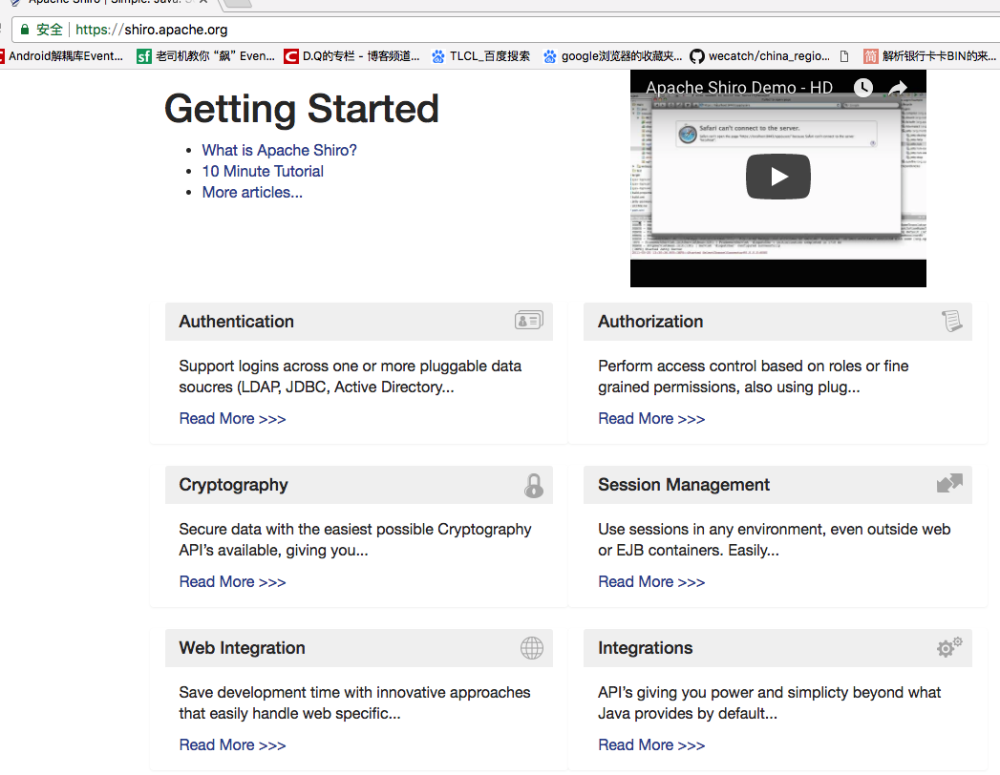
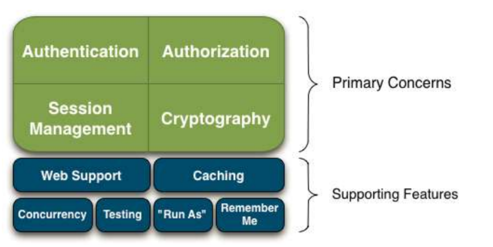
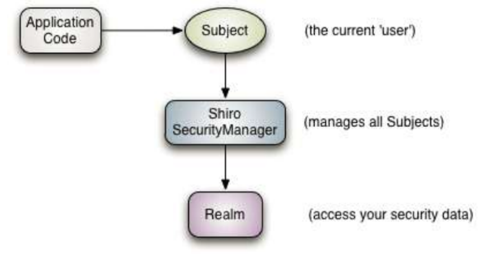
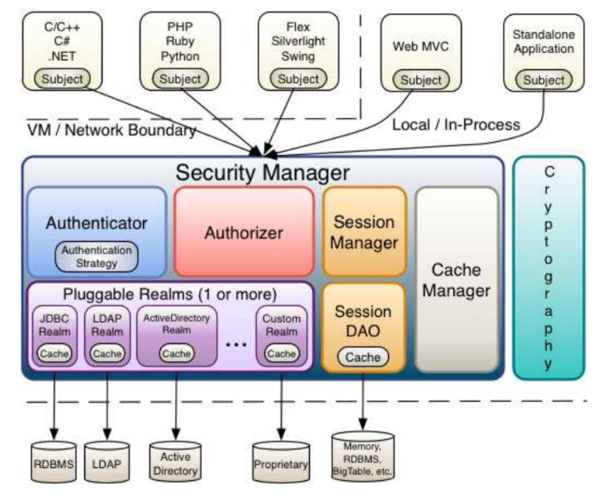

[TOC]

# BOS物流项目40———权限控制2\_Shiro简介

## 一、Shiro简介

Apache Shiro是一个强大而灵活的开源安全框架，它能够干净利落地处理身份认证，授权，企业会话管理和加密。


### 1.1 下载地址

[https://shiro.apache.org/](https://shiro.apache.org/)

### 1.2 Shiro功能

Shiro的4大部分——身份验证，授权，会话管理和加密 
> Authentication：身份验证，简称“登录”。

> Authorization：授权，给用户分配角色或者权限资源

> Session Management：用户session管理器，可以让CS程序也使用session来控制权限

> Cryptography：把JDK中复杂的密码加密方式进行封装。

除了以上功能，shiro还提供很多扩展 
>  Web Support：主要针对web应用提供一些常用功能。 

>  Caching：缓存可以使应用程序运行更有效率。 

>  Concurrency：多线程相关功能。

>  Testing：帮助我们进行测试相关功能 

>  "Run As"：一个允许用户假设为另一个用户身份（如果允许）的功能，有时候在管理脚本很有用。 

>  “Remember Me”：记住用户身份，提供类似购物车功能。

----

## 二、Shiro框架认证流程

Application Code：应用程序代码，由开发人员负责开发的

Subject：框架提供的接口，代表当前用户对象

SecurityManager：框架提供的接口，代表安全管理器对象

Realm：可以开发人员编写，框架也提供一些，类似于DAO，用于访问权限数据


**SecurityManager 是 Shiro的核心**，初始化时协调各个模块运行。然而，一旦 SecurityManager协调完毕，SecurityManager 会被单独留下，且我们只需要去操作Subject即可，无需操作SecurityManager 。 但是我们得知道，当我们正与一个 Subject 进行交互时，实质上是 SecurityManager在处理 Subject 安全操作。

**Realms在 Shiro中作为应用程序和安全数据之间的“桥梁”或“连接器”**。他获取安全数据来判断subject是否能够登录，subject拥有什么权限。他有点类似DAO。在配置realms时，需要至少一个realm。而且Shiro提供了一些常用的 Realms来连接数据源，如LDAP数据源的JndiLdapRealm，JDBC数据源的JdbcRealm，ini文件数据源的IniRealm，properties文件数据源的PropertiesRealm，等等。我们也可以插入自己的 Realm实现来代表自定义的数据源。 像其他组件一样，Realms也是由SecurityManager控制

---

## 三、Shiro框架

1.Subject(org.apache.shiro.subject.Subject):
简称用户


2.SecurityManager(org.apache.shiro.mgt.SecurityManager) 
如上所述，SecurityManager是shiro的核心，协调shiro的各个组件


3.Authenticator(org.apache.shiro.authc.Authenticator)： 
登录控制

注：Authentication Strategy
(org.apache.shiro.authc.pam.AuthenticationStrategy) 
如果存在多个realm，则接口AuthenticationStrategy会确定什么样算是登录成功（例如，如果一个Realm成功，而其他的均失败，是否登录成功？）。 

4.Authorizer(org.apache.shiro.authz.Authorizer) ：
决定subject能拥有什么样角色或者权限。


5.SessionManager(org.apache.shiro.session.SessionManager) ：
创建和管理用户session。通过设置这个管理器，shiro可以在任何环境下使用session。

6.CacheManager(org.apahce.shiro.cache.CacheManager) ：
缓存管理器，可以减少不必要的后台访问。提高应用效率，增加用户体验。

7.Cryptography(org.apache.shiro.crypto.*) :
Shiro的api大幅度简化java api中繁琐的密码加密。


8.Realms(org.apache.shiro.realm.Realm) ：
程序与安全数据的桥梁

---

## 四、源码下载

[https://github.com/wimingxxx/bos-parent](https://github.com/wimingxxx/bos-parent/)