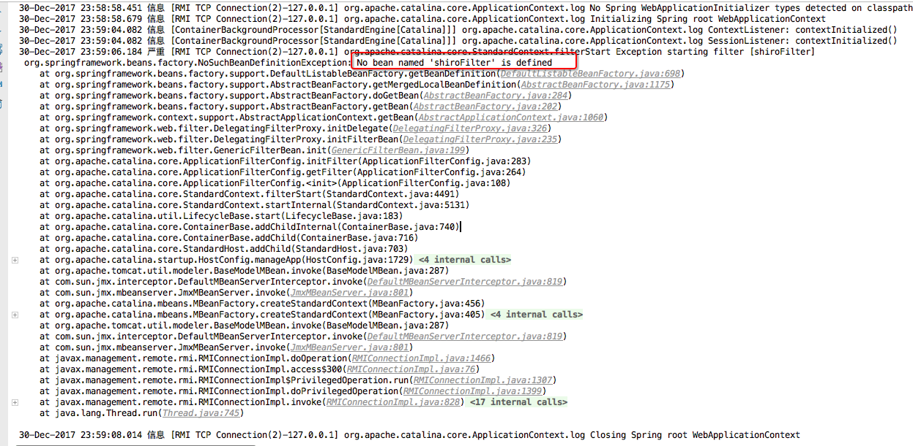
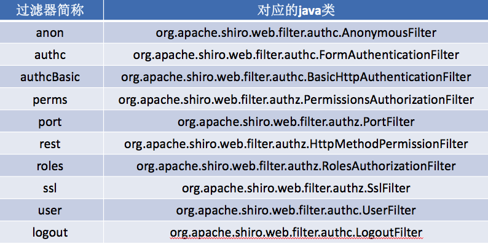
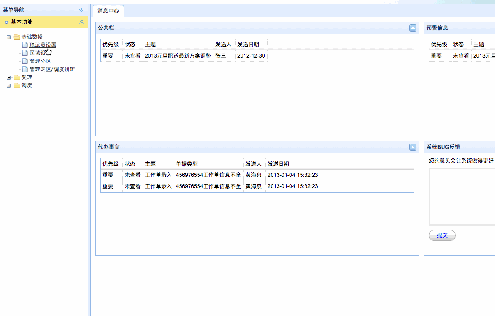

[TOC]


# BOS物流项目41———权限控制3\_Shiro四种权限控制之url拦截


## 一、说明

之前，我们自己写了一个登陆认证的功能，现在我们使用**Shiro**来替换这个功能

主要分为以下的步骤

1. 引入shiro框架相关的jar

2. 在web.xml中配置spring框架提供的用于整合shiro框架的过滤器

3. 在spring配置文件中配置bean

4. 配置安全管理器

5. 修改UserAction中的login方法，使用shiro提供的方式进行认证操作

6. 自定义realm，并注入给安全管理器

----


## 二、引入shiro框架相关的jar

```xml
        <!-- 引入shiro框架的依赖 -->
        <dependency>
            <groupId>org.apache.shiro</groupId>
            <artifactId>shiro-all</artifactId>
            <version>1.2.2</version>
        </dependency>
```

---

## 三、在web.xml中配置spring框架提供的用于整合shiro框架的过滤器

```xml
    <!--配置shiroFilter 一定要配置在struts的前面-->
    <filter>
        <filter-name>shiroFilter</filter-name>
        <filter-class>org.springframework.web.filter.DelegatingFilterProxy</filter-class>
    </filter>
    <filter-mapping>
        <filter-name>shiroFilter</filter-name>
        <url-pattern>/*</url-pattern>
    </filter-mapping>
```

注意的是，这个过滤器一定要配置在 struts2的过滤器的前面，现在我们来启动 Tomcat看一下



我们可以看到,抛出了一个异常，说是 **shiroFilter** 没有定义。所以我们去Spring中创建一个bean


---

## 四、在spring配置文件中配置bean

上面的说到需要配置 shiroFilter，现在我们就去配置。


### 4.1 配置属性说明

我们在配置 **shiroFilter**的时候，需要注意哪些属性是需配置的，如下

|属性|说明|
|---|---|
|securityManager| 安全管理器。这个属性是必须的。 |
| loginUrl  | 没有登录的用户请求需要登录的页面时自动跳转到登录页面，不是必须的属性，不输入地址的话会自动寻找项目web项目的根目录下的”/login.jsp”页面。|
| successUrl  | 登录成功默认跳转页面，不配置则跳转至”/”。如果登陆前点击的一个需要登录的页面，则在登录自动跳转到那个需要登录的页面。不跳转到此 |
| unauthorizedUrl  | 没有权限默认跳转的页面。 |
|  filterChainDefinitions | 指定URL级别拦截策略  |

### 4.2 filterChainDefinitions说明



**认证过滤器**

|过滤器简写|示例|
|---|---|
|anon|例子/admins/\*\*=anon 没有参数，表示可以匿名使用。|
|authc | 例如/admins/user/\*\*=authc表示需要认证(登录)才能使用，没有参数|
|authcBasic|例如/admins/user/\*\*=authcBasic没有参数表示httpBasic认证|
|user|例如/admins/user/\*\*=user没有参数表示必须存在用户，当登入操作时不做检查|


**授权过滤器**

|过滤器简写|示例|
|---|---|
|roles | 例子/admins/user/\*\*=roles[admin],参数可以写多个，多个时必须加上引号，并且参数之间用逗号分割，当有多个参数时，例如admins/user/\*\*=roles["admin,guest"],每个参数通过才算通过，相当于hasAllRoles()方法。|
|perms|例子/admins/user/\*\*=perms[user:add:\*],参数可以写多个，多个时必须加上引号，并且参数之间用逗号分割，例如/admins/user/\*\*=perms["user:add:\*,user:modify:\*"]，当有多个参数时必须每个参数都通过才通过，想当于isPermitedAll()方法。|
|rest|例子/admins/user/\*\*=rest[user],根据请求的方法，相当于/admins/user/\*\*=perms[user:method] ,其中method为post，get，delete等。|
|port|例子/admins/user/\*\*=port[8081],当请求的url的端口不是8081是跳转到schemal://serverName:8081?queryString,其中schmal是协议http或https等，serverName是你访问的host,8081是url配置里port的端口，queryString是你访问的url里的？后面的参数。|
|ssl|例子/admins/user/\*\*=ssl没有参数，表示安全的url请求，协议为https|


### 4.3 配置shiroFilter


```xml
    <!--配置shiroFilter框架的过滤器工程bean-->
    <bean id="shiroFilter" class="org.apache.shiro.spring.web.ShiroFilterFactoryBean">
        <property name="securityManager" ref="securityManager"/>
        <property name="loginUrl" value="/login.jsp"/>
        <property name="successUrl" value="/index.jsp"/>
        <property name="unauthorizedUrl" value="/unauthorized.jsp"/>
        <property name="filterChainDefinitions">
            <value>
                /css/** = anon
                /js/** = anon
                /images/** = anon
                /login.jsp* = anon
                /validatecode.jsp* = anon
                /userAction_login.action = anon
                /page_base_staff.action = perms["staff-list"]
                /* = authc
            </value>
        </property>
    </bean>
```

需要安全管理器，我们需要配合一个给它。这里**page_base_staff.action**这个地址的访问，需要有*staff*的权限才可以。


---

## 五、配置安全管理器

```xml

    <!--配置Shiro的安全管理器-->
    <bean id="securityManager" class="org.apache.shiro.web.mgt.DefaultWebSecurityManager"/>
```

---


## 六、修改UserAction中的login方法，使用shiro提供的方式进行认证操作

修改如下


```java

    /**
     * 用户登陆 使用Shiro框架提供的方式进行认证
     * @return
     */
    public String login(){
        //从Session中获取生成的验证码
        String validatecode = (String) ServletActionContext.getRequest().getSession().getAttribute("key");
        //校验验证码是否正确
        if(StringUtils.isNotBlank(checkcode) && checkcode.equals(validatecode)){
            //验证码正确
            //使用Shiro框架踢提供的方式进行认证
            Subject subject = SecurityUtils.getSubject();//获取当前登录用户对象,现在状态为"未登录"
            //创建用户名密码令牌
            AuthenticationToken token = new UsernamePasswordToken(model.getUsername(), MD5Utils.md5(model.getPassword()));
            //登录
            try{
                //登录,如果错误抛出异常
                subject.login(token);
                //获取登录的用户,这个对象是我们在Realm中存进去的,所以这里能获取到
                User user = (User)subject.getPrincipal();
                //保存用户到Session中
                BOSUtils.setLoginUser(user);
                return HOME;
            }catch (UnknownAccountException e){
                //没有账号,那就说明用户名错误
                this.addActionError("用户名错误！");
                return LOGIN;
            }catch (IncorrectCredentialsException e){
                //认证的凭证错误,我们使用密码作为凭证,所以是密码错误
                this.addActionError("密码错误！");
                return LOGIN;
            } catch (Exception e){
                e.printStackTrace();
                return LOGIN;
            }
        }else{
            this.addActionError("输入的验证码错误");
            return LOGIN;
        }
    }
```

看似没有问题了，其实这里面我们登陆方法中用到的后台数据库存储的用户信息，是需要我们自己去查询的。所以我们还要去自定义 Realm(也可以以用户系统提供的)

----


## 七、自定义realm，并注入给安全管理器

在 **bos-service** 中添加如下类

```java
/**
 * @author: qiwenming(杞文明)
 * @date: 17/12/31 上午12:54
 * @className: BOSRealm
 * @description:
 * 认证和授权的类
 */
public class BOSRealm extends AuthorizingRealm {

    @Autowired
    private IUserDao userDao;

    /**
     * 认证
     * @param authenticationToken
     * @return
     * @throws AuthenticationException
     */
    @Override
    protected AuthenticationInfo doGetAuthenticationInfo(AuthenticationToken authenticationToken) throws AuthenticationException {
        //这里我们完成登录的认证
        //获取到用户名密码令牌,就是UserAction中创建
        UsernamePasswordToken token = (UsernamePasswordToken)authenticationToken;
        //获取界面输入的用户名
        String username = token.getUsername();
        //通过dao查询出对应的用户
        User user = userDao.findUserByUsername(username);
        if(user==null){
            //用户不存在
            return null;
        }
        //封装简单认证信息对象
        //第一个参数是任意对象,这里出入user对象,为了登录方法中能获取到,
        //第二个参数认证凭证,这里使用密码作为凭证
        //第三个参数区分而已
        AuthenticationInfo info = new SimpleAuthenticationInfo(user,user.getPassword(),user.getUsername());
        return info;
    }

    /**
     * 授权
     * @param principalCollection
     * @return
     */
    @Override
    protected AuthorizationInfo doGetAuthorizationInfo(PrincipalCollection principalCollection) {
        return null;
    }
}
```

完成上面的步骤以后，我们需要把我们定义的 Realm 注入给安全管理器，如下

```xml
    <!--配置Shiro的安全管理器-->
    <bean id="securityManager" class="org.apache.shiro.web.mgt.DefaultWebSecurityManager">
        <property name="realm" ref="bosRealm"/>
    </bean>

    <!--注入自定义realm-->
    <bean id="bosRealm" class="com.qwm.bos.realm.BOSRealm"/>
```


---

## 八、图示

### 8.1 用户名错误


### 8.2 密码错误


### 8.3 权限不足



---

## 九、源码下载

[https://github.com/wimingxxx/bos-parent](https://github.com/wimingxxx/bos-parent/)