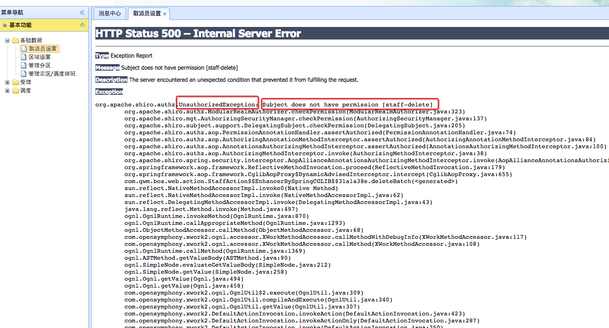
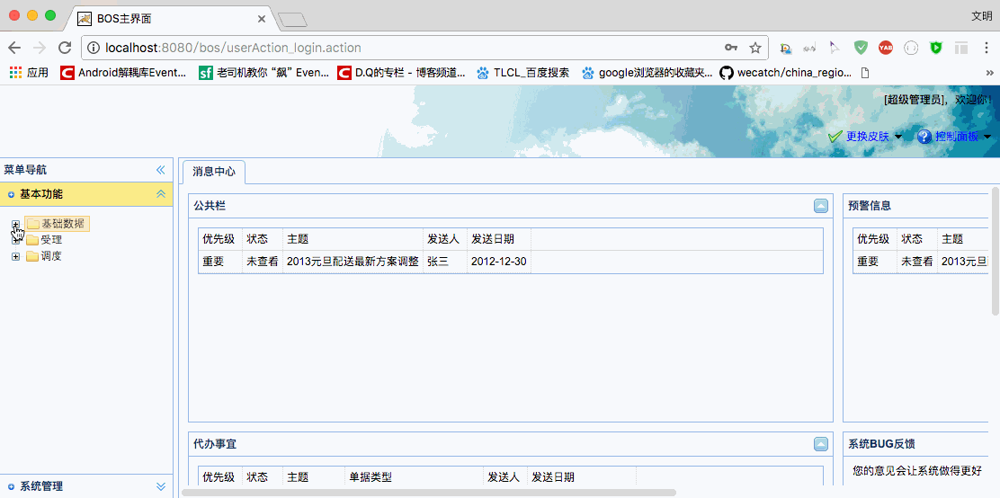

[TOC]


# BOS物流项目42———权限控制4\_Shiro四种权限控制之方法注解


## 一、方法注解方式权限控制步骤

第一步：在spring配置文件中开启shiro注解支持

第二步：在Action的方法上使用shiro注解

第三步：在struts.xml中配置全局异常捕获，当shiro框架抛出权限不足异常时，跳转到权限不足提示页面



---

## 二、修改BOSRealm.java

这里我们使用方法注解权限控制，演示的是 **取派员设置中的删除** 功能的操作。前面我们设置了**取派员设置**需要具有 **staff-list** 这个权限，但是我们没有给任何用户授予这个权限，所以操作不了，这里我们先给任何用户都有这个权限，后面再修改。

修改**doGetAuthorizationInfo**方法

```java

    /**
     * 授权
     * @param principalCollection
     * @return
     */
    @Override
    protected AuthorizationInfo doGetAuthorizationInfo(PrincipalCollection principalCollection) {
        SimpleAuthorizationInfo info = new SimpleAuthorizationInfo();
        //授予staff-list权限
        info.addStringPermission("staff-list");
        //TODO 后期需要修改为根据当前登录用户查询数据库，获取实际对应的权限

        return info;
    }
```


---

## 三、在spring配置文件中开启shiro注解支持


```xml

    <!-- 开启shiro框架注解支持 -->
    <bean id="defaultAdvisorAutoProxyCreator" class="org.springframework.aop.framework.autoproxy.DefaultAdvisorAutoProxyCreator">
        <!-- 必须使用cglib方式为Action对象创建代理对象 -->
        <property name="proxyTargetClass" value="true"/>
    </bean>

    <!-- 配置shiro框架提供的切面类，用于创建代理对象 -->
    <bean class="org.apache.shiro.spring.security.interceptor.AuthorizationAttributeSourceAdvisor"/>
```

---

## 四、在Action的方法上使用shiro注解

我们这里演示的是 StaffAction 的**deleteBatch** 方法。所以在这个方法上加上 **@RequiresPermissions** 注解，如下

```java
    /**
     * 取派员批量删除
     */
    @RequiresPermissions("staff-delete")
    public String deleteBatch(){
        staffService.deleteBatch(ids);
        return LIST;
    }

```

下载我们测试一把，发现抛出以下异常



提示我们**staff-delete**权限，界面上全出现了错误的信息，我们希望出现这个异常的时候，需要跳转到 **权限不足** 的界面上。

所以我们需要定义一个全局的异常捕获。


---


## 五、在struts.xml中配置全局异常捕获，当shiro框架抛出权限不足异常时，跳转到权限不足提示页面

配置如下

```java

        <!--全局结果集配置-->
        <global-results>
            <result name="login">/login.jsp</result>
            <result name="unauthorized">/unauthorized.jsp</result>
        </global-results>

        <!--全局异常捕获-->
        <global-exception-mappings>
            <!--权限不足-->
            <exception-mapping exception="org.apache.shiro.authz.UnauthorizedException" result="unauthorized"></exception-mapping>
        </global-exception-mappings>

```

---


## 六、图示



---

## 七、源码下载

[https://github.com/wimingxxx/bos-parent](https://github.com/wimingxxx/bos-parent/)