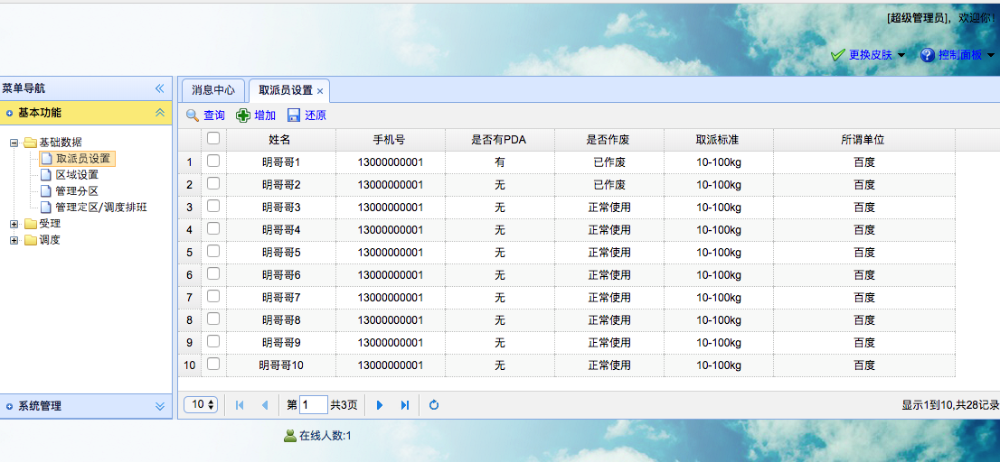

[TOC]


# BOS物流项目43———权限控制5\_Shiro四种权限控制之页面标签

使用 **页面标签权限控制** 只是需改了界面的显示问题，没有真正的解决权限的控制，伪造请求的方式，依然能够执行禁止的功能，所以需要和其他权限控制方式配合使用。

## 一、页面标签方式权限控制步骤

第一步：在jsp页面中引入shiro的标签库

第二步：使用shiro的标签控制页面元素展示

---

## 二、在jsp页面中引入shiro的标签库

```jsp
<%@ taglib prefix="shiro" uri="http://shiro.apache.org/tags" %>
```

---

## 三、使用shiro的标签控制页面元素展示

使用标签中的 **hasPermission** 来判断具不具有 **name** 指定的权限，具有那么显示，不具有不显示。
如下
```jsp
<shiro:hasPermission name="权限名称">
....控制的内容.....
</shiro:hasPermission>	
```

---

## 四、staff.jsp界面修改

这里演示的是，**取派员设置** 的删除功能，那么我们需要对 **staff.jsp界面做如下修改修改**

```jsp
<%@ taglib prefix="shiro" uri="http://shiro.apache.org/tags" %>
.....
	<shiro:hasPermission name="staff-delete">
	{
		id : 'button-delete',
		text : '作废',
		iconCls : 'icon-cancel',
		handler : doDelete
	},
	</shiro:hasPermission>
.....
```

---

## 五、图示

由于现在是没有**staff-delete**权限的，所以**作废** 应该是不显示的。




---


## 六、源码下载

[https://github.com/wimingxxx/bos-parent](https://github.com/wimingxxx/bos-parent/)