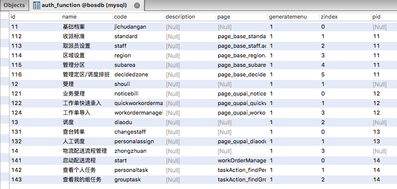

[TOC]


# BOS物流项目46———权限数据管理1\_初始化权限数据


## 一、说明

当项目上线后，如果正常运行，需要依赖一些基础数据支持。权限数据，就属于基础数据，因为系统的菜单是从权限表查询获得的。一般会提供sql脚本文件，导入基础数据。

---

## 二、导入sql

数据库中导入如下sql

```sql
INSERT INTO auth_function(id,name,code,description,page,generatemenu,zindex,pid) VALUES ('11', '基础档案', 'jichudangan', null, null, '1', '0', null);
INSERT INTO auth_function(id,name,code,description,page,generatemenu,zindex,pid) VALUES ('112', '收派标准', 'standard', null, 'page_base_standard.action', '1', '1', '11');
INSERT INTO auth_function(id,name,code,description,page,generatemenu,zindex,pid) VALUES ('113', '取派员设置', 'staff', null, 'page_base_staff.action', '1', '2', '11');
INSERT INTO auth_function(id,name,code,description,page,generatemenu,zindex,pid) VALUES ('114', '区域设置', 'region', null, 'page_base_region.action', '1', '3', '11');
INSERT INTO auth_function(id,name,code,description,page,generatemenu,zindex,pid) VALUES ('115', '管理分区', 'subarea', null, 'page_base_subarea.action', '1', '4', '11');
INSERT INTO auth_function(id,name,code,description,page,generatemenu,zindex,pid) VALUES ('116', '管理定区/调度排班', 'decidedzone', null, 'page_base_decidedzone.action', '1', '5', '11');
INSERT INTO auth_function(id,name,code,description,page,generatemenu,zindex,pid) VALUES ('12', '受理', 'shouli', null, null, '1', '1', null);
INSERT INTO auth_function(id,name,code,description,page,generatemenu,zindex,pid) VALUES ('121', '业务受理', 'noticebill', null, 'page_qupai_noticebill_add.action', '1', '0', '12');
INSERT INTO auth_function(id,name,code,description,page,generatemenu,zindex,pid) VALUES ('122', '工作单快速录入', 'quickworkordermanage', null, 'page_qupai_quickworkorder.action', '1', '1', '12');
INSERT INTO auth_function(id,name,code,description,page,generatemenu,zindex,pid) VALUES ('124', '工作单导入', 'workordermanageimport', null, 'page_qupai_workorderimport.action', '1', '3', '12');
INSERT INTO auth_function(id,name,code,description,page,generatemenu,zindex,pid) VALUES ('13', '调度', 'diaodu', null, null, '1', '2', null);
INSERT INTO auth_function(id,name,code,description,page,generatemenu,zindex,pid) VALUES ('131', '查台转单', 'changestaff', null, null, '1', '0', '13');
INSERT INTO auth_function(id,name,code,description,page,generatemenu,zindex,pid) VALUES ('132', '人工调度', 'personalassign', null, 'page_qupai_diaodu.action', '1', '1', '13');
INSERT INTO auth_function(id,name,code,description,page,generatemenu,zindex,pid) VALUES ('14', '物流配送流程管理', 'zhongzhuan', null, null, '1', '3', null);
INSERT INTO auth_function(id,name,code,description,page,generatemenu,zindex,pid) VALUES ('141', '启动配送流程', 'start', null, 'workOrderManageAction_list.action', '1', '0', '14');
INSERT INTO auth_function(id,name,code,description,page,generatemenu,zindex,pid) VALUES ('142', '查看个人任务', 'personaltask', null, 'taskAction_findPersonalTask.action', '1', '1', '14');
INSERT INTO auth_function(id,name,code,description,page,generatemenu,zindex,pid) VALUES ('143', '查看我的组任务', 'grouptask', null, 'taskAction_findGroupTask.action', '1', '2', '14');
```


---

## 三、数据库表图示




----


## 四、源码下载

[https://github.com/wimingxxx/bos-parent](https://github.com/wimingxxx/bos-parent/)