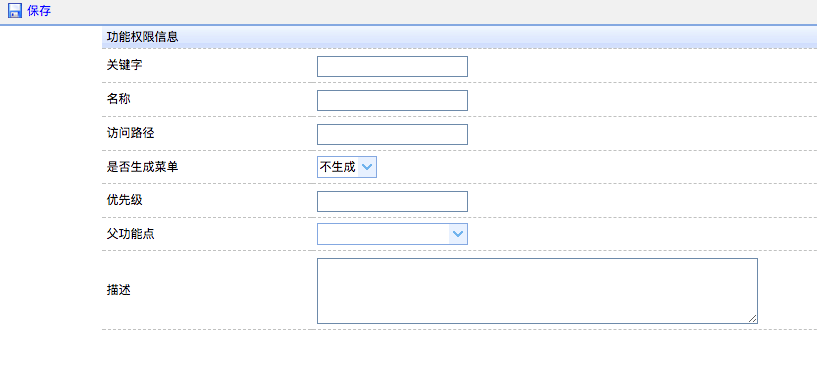
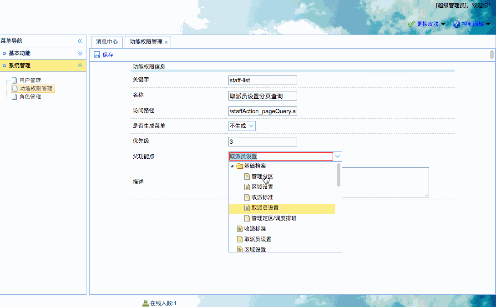

[TOC]


# BOS物流项目47———权限数据管理2\_添加权限数据


页面：WEB-INF/pages/admin/function_add.jsp

## 一、界面图示



---

## 二、页面调整

### 2.1 修改页面中父功能点


```jsp

<tr>
	<td>父功能点</td>
	<td>
		<input class="easyui-combotree" name="parentFunction.id"
			   data-options="url:'functionAction_listajax.action'"
			   style="width:250px;">
	</td>
</tr>
```


### 2.2 修改保存

修改如下

```jsp
	$(function(){
		// 点击保存
		$('#save').click(function(){
			//表单验证
			var v = $("#functionForm").form("validate");
			if(v){
				$("#functionForm").submit();
			}
		});
	});
	
	.....
	
	<form id="functionForm" method="post" action="functionAction_add">
	.....
	</form>
	.....
	
```


----

## 三、服务器后端处理

### 3.1 创建FunctionAction、Service、Dao，查询所有的权限，返回json

**FunctionAction**

```java
/**
 * @author: qiwenming(杞文明)
 * @date: 17/12/31 下午6:33
 * @className: FunctionAction
 * @description:
 * 权限管理
 */
@Controller
@Scope("prototype")
public class FunctionAction extends BaseAction<Function> {

    @Autowired
    private IFunctionService functionService;

    /**
     * 查询所有权限,返回json
     * @return
     */
    public String listajax(){
        List<Function> list = functionService.findAll();
        java2Json(list,new String[]{"parentFunction","roles"});
        return NONE;
    }
}
```

**FunctionService**

```java
/**
 * @author: qiwenming(杞文明)
 * @date: 17/12/31 下午6:38
 * @className: FunctionServiceImpl
 * @description:
 */
@Service
@Transactional
public class FunctionServiceImpl implements IFunctionService {

    @Autowired
    private IFunctionDao functionDao;

    /**
     * 查询所有权限
     *
     * @return
     */
    @Override
    public List<Function> findAll() {
        return functionDao.findAll();
    }
}
```

### 3.2 配置struts.xml

在struts.xml中配置 FunctionAction

```xml
        <!-- 权限 管理 -->
        <action name="functionAction_*" class="functionAction" method="{1}">
            <result name="list">/WEB-INF/pages/admin/function.jsp</result>
        </action>
```

### 3.3 在FunctionAction中创建add方法，添加权限

```java
    /**
     * 添加权限
     * @return
     */
    public String add(){
        functionService.save(model);
        return LIST;
    }
```


### 3.4 在FunctionService中创建save方法，添加权限

```java
    /**
     * 保存权限
     *
     * @param function
     */
    @Override
    public void save(Function function) {
        //如果没有选择功能节点,那么数据是空字符串,不是null.
        //添加到数据库中,就会报错,因为没有id为字符串的权限,
        // 所以这里需要处理
        Function parentFunction = function.getParentFunction();
        //不等于null ,可以处理伪造请求的情况
        if(parentFunction !=null && parentFunction.getId().equals("") ){
            function.setParentFunction(null);
        }
        functionDao.save(function);
    }
```

### 3.5 图示




----


## 四、源码下载

[https://github.com/wimingxxx/bos-parent](https://github.com/wimingxxx/bos-parent/)