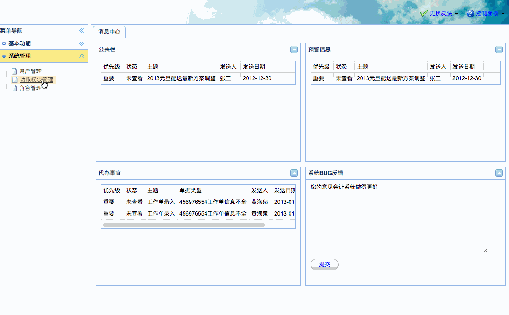
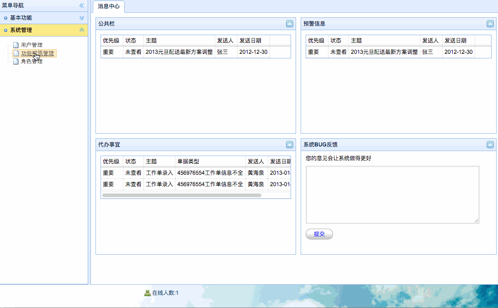

[TOC]


# BOS物流项目48———权限数据管理3\_权限分页查询


页面：WEB-INF/pages/admin/function.jsp

## 一、页面调整

页面的调整，主要就是修改，datagrid的请求路径，如下

```jsp
........
		$("#grid").datagrid({
			toolbar : [
				{
					id : 'add',
					text : '添加权限',
					iconCls : 'icon-add',
					handler : function(){
						location.href='${pageContext.request.contextPath}/page_admin_function_add.action';
					}
				}           
			],
			url : 'functionAction_pageQuery.action',
			pagination:true,
			........
........			
```


---

## 二、服务器后端处理

### 2.1 在Action中提供分页查询方法

在FunctionAction中添加 **pageQuery**方法，如下

```java
    /**
     * 分页查询
     * @return
     */
    public String pageQuery(){
        functionService.pageQuery(pageBean);
        java2Json(pageBean,new String[]{"currentPage","detachedCriteria","pageSize","parentFunction","roles","children"});
        return LISR;
    }
```

### 2.2 图示和产生的问题



我们看到，点击下一页或者其他页的时候，数据没有刷新过来。


### 2.3 问题分析与解决
上面的问题是由什么引起的呢？

原因是这样的,我们的权限对象**Function**中有page这个属性，而我们的分页对象中也有，默认会提交到Model（Function）中，

这样，我们PageBean中，永远都是0，所以我们需要手动设置page进去，修改 FunctionAction的pageQuery方法。如下

```java
    /**
     * 分页查询
     * @return
     */
    public String pageQuery(){
        String page = model.getPage();
        //设置当前页
        pageBean.setCurrentPage( Integer.parseInt(page) );
        functionService.pageQuery(pageBean);
        java2Json(pageBean,new String[]{"currentPage","detachedCriteria","pageSize","parentFunction","roles","children"});
        return LIST;
    }
```


### 2.4 图示




----


## 四、源码下载

[https://github.com/wimingxxx/bos-parent](https://github.com/wimingxxx/bos-parent/)