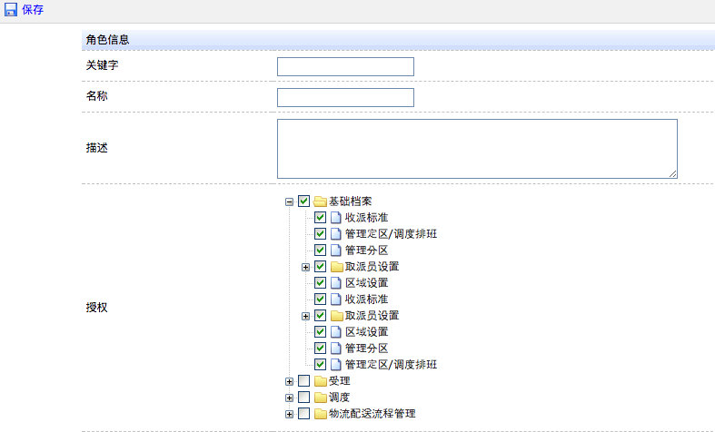
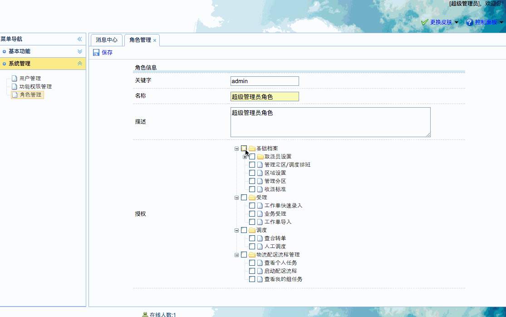

[TOC]


# BOS物流项目49———角色管理1\_添加角色


页面：WEB-INF/pages/admin/role_add.jsp


## 一、页面调整
### 1.1 页面图示




### 1.2 修改页面，使用ztree勾选效果（checkbox）

```html
// 授权树初始化
var setting = {
	data : {
		key : {
			title : "t"
		},
		simpleData : {
			enable : true
		}
	},
	check : {
		enable : true//使用zTree的勾选效果
	}
};
```

### 1.3 修改ajax方法的请求URL地址

授权的选择中，修改ajax方法的请求URL地址

```html
$.ajax({
	url : '${pageContext.request.contextPath}/functionAction_ajax.action',
	type : 'POST',
	dataType : 'json',
	success : function(data) {
		$.fn.zTree.init($("#functionTree"), setting, data);
	},
	error : function(msg) {
		alert('树加载异常!');
	}
});
```

### 1.4 为保存按钮绑定事件，提交表单

zTree 的勾选，不是 checkbox,所以无法自动提交，我们需要自动来获取值，然后提交。如下

```html
		// 点击保存
		$('#save').click(function(){
			//表单验证
			var v = $("#roleForm").form("validate");
			if(v){
				//根据zTree的id获取zTree对象
				var zTreeObj = $.fn.zTree.getZTreeObj("functionTree");
				//获取选中的节点,返回数组对象
				var nodes = zTreeObj.getCheckedNodes(true);
				//组装成数组
				var array = new Array();
				for(var i=0; i<nodes.length; i++){
					var id = nodes[i].id;
					array.push(id);
				}
				//使用逗号分隔数据,拼接成字符串
				var functionIds = array.join(",");
				//为隐藏域设置值
				$("input[name=functionIds]").val(functionIds);
				console.info(functionIds);
				//提交
				$("#roleForm").submit();
			}
		});
```

---

## 二、后端处理

创建角色管理Action、Service、Dao


**RoleAction**

```java
/**
 * @author: qiwenming(杞文明)
 * @date: 17/12/31 下午9:05
 * @className: RoleAction
 * @description:
 * 角色管理
 */
@Controller
public class RoleAction extends BaseAction<Role> {

    @Autowired
    private IRoleService roleService;

    /**
     * 属性驱动的方式,获取权限的ids
     */
    private String functionIds;

    public void setFunctionIds(String functionIds) {
        this.functionIds = functionIds;
    }

    /**
     * 添加角色
     * @return
     */
    public String add(){
        roleService.save(model,functionIds);
        return LIST;
    }
}
```

**RoleService**

```java
/**
 * @author: qiwenming(杞文明)
 * @date: 17/12/31 下午9:10
 * @className: RoleServiceImpl
 * @description:
 */
@Service
@Transactional
public class RoleServiceImpl implements IRoleService {

    @Autowired
    private IRoleDao roleDao;

    /**
     * 保存角色 同时还需要管理权限
     *
     * @param role
     * @param functionIds
     */
    @Override
    public void save(Role role,String functionIds) {
        roleDao.save(role);
        //获取权限
        if(StringUtils.isNotBlank(functionIds)){
            //把id分隔出来
            String[] fIds = functionIds.split(",");
            //循环遍历,给角色设置权限
            //可以通过,每个id查询一次相关权限,然后设置给角色
            //但是角色中,只需要关联权限的id,所以我们自己创建一个就行了
            for (String fId : fIds) {
                //手动创建一个权限对象,设置id,对象状态为托管状态
                Function function = new Function(fId);
                //角色关联权限
                role.getFunctions().add(function);
            }
        }
    }
}
```

在 struts.xml 中添加 角色的配置

```xml
<!-- 角色管理 -->
<action name="roleAction_*" class="roleAction" method="{1}">
	<result name="list">/WEB-INF/pages/admin/role.jsp</result>
</action>
```

---

## 三、图示

我们需要创建两个角色

一个是 **超级管理员角色**, 具有所有权限。

一个是 **普通用户角色**，具有**取派员设置和区域设置** 的权限





----


## 四、源码下载

[https://github.com/wimingxxx/bos-parent](https://github.com/wimingxxx/bos-parent/)