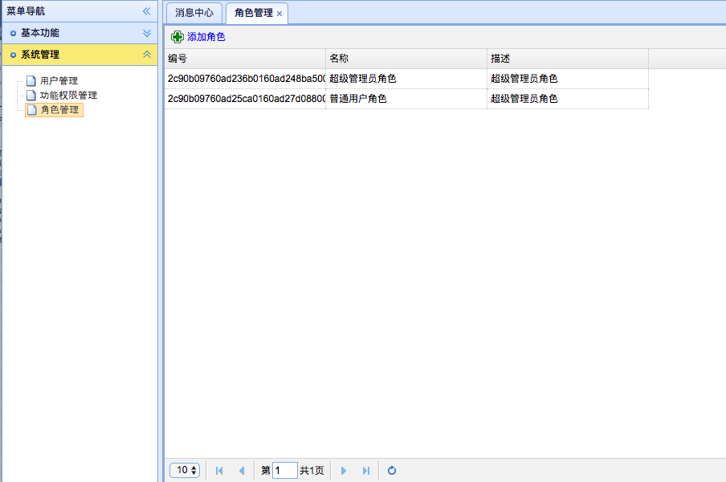

[TOC]


# BOS物流项目50———角色管理2\_分页查询


页面：WEB-INF/pages/admin/role.jsp


## 一、修改role.jsp页面中datagrid的URL地址

```html
      ............
		$("#grid").datagrid({
			toolbar : [
				{
					id : 'add',
					text : '添加角色',
					iconCls : 'icon-add',
					handler : function(){
						location.href='${pageContext.request.contextPath}/page_admin_role_add.action';
					}
				}           
			],
			url : 'roleAction_pageQuery.action',
			pagination:true,
			............
```


---

## 二、在RoleAction中提供分页查询方法

```java
    /**
     * 分页查询
     * @return
     */
    public String pageQuery(){
        roleService.pageQuery(pageBean);
        java2Json(pageBean,new String[]{"currentPage","detachedCriteria","pageSize","functions","users"});
        return NONE;
    }
```


---

## 三、图示





----


## 四、源码下载

[https://github.com/wimingxxx/bos-parent](https://github.com/wimingxxx/bos-parent/)