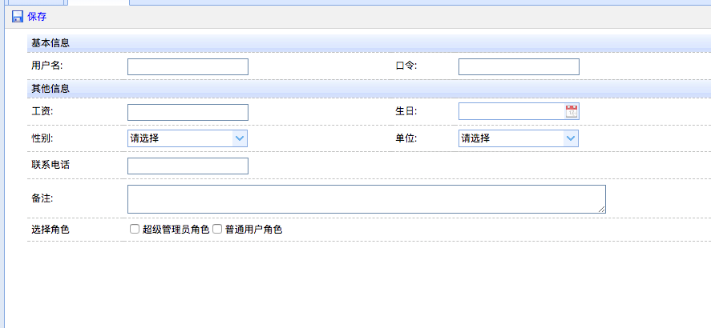
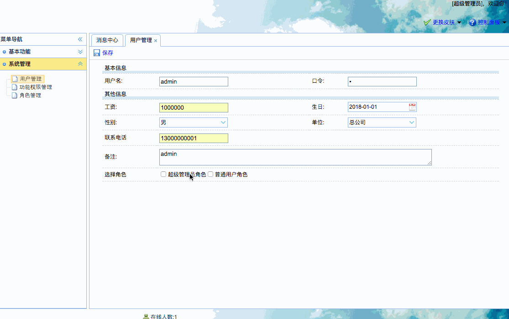

[TOC]


# BOS物流项目51———用户管理1\_添加用户


页面：WEB-INF/pages/admin/userinfo.jsp


## 一、页面调整

### 1.1 页面图示



### 1.2 发送ajax请求，获取角色数据，在回调函数中动态展示角色数据，展示为checkbox

修改如下

```html
<tr>
   <td>选择角色</td>
   <td colspan="3" id="roleTD">
	   <script type="text/javascript">
		   $(function () {
			   //页面加载完成以后,发送ajax请求,获取所有的角色数据
			   $.post('roleAction_listajax.action',function(data){
				   //解析数据,使用checkbox来展示
				   for(var i=0; i<data.length; i++){
					   var id = data[i].id;
					   var name = data[i].name;
					   $("#roleTD").append( '<input type="checkbox" id="'+id+'" name="roleIds" value="'+id+'"><label for="'+id+'">'+name+'</label>' );
				   }
			   });
		   });
	   </script>
   </td>
</tr>
```

### 1.3 为保存按钮绑定事件，提交表单

```html
$(function(){
	$("body").css({visibility:"visible"});
	$('#save').click(function(){
		var v = $("#userForm").form("validate");
		if(v){
			$("#userForm").submit();
		}
	});
});	
```

---

## 二、后端处理

### 2.1 在RoleAction中提供listajax方法，查询所有角色，返回json数据

```java
    /**
     * 查询所有的角色,返回json
     * @return
     */
    public String listajax(){
        List<Role> list = roleService.findAll();
        java2Json(list,new String[]{"functions","users"});
        return NONE;
    }
```


### 2.2 在UserAction中提供add方法，保存一个用户

```java
    /**
     * 属性驱动,接收多个角色id
     */
    private String[] roleIds;

    public void setRoleIds(String[] roleIds) {
        this.roleIds = roleIds;
    }

    /**
     * 添加用户
     * @return
     */
    public String add(){
        userService.save(model,roleIds);
        return LIST;
    }
```


### 2.3 UserService中添加save方法

```java
    /**
     * 保存用户
     *
     * @param user
     * @param roleIds
     */
    @Override
    public void save(User user, String[] roleIds) {
        String password = MD5Utils.md5(user.getPassword());
        user.setPassword(password);
        userDao.save(user);
        if(roleIds!=null && roleIds.length>0){
            for (String roleId : roleIds) {
                Role role = new Role(roleId);
                user.getRoles().add(role);
            }
        }
    }
```

### 2.4 struts.xml中添加配置

```xml
        <!--用户管理-->
        <action name="userAction_*" class="userAction" method="{1}">
            <result name="home">/index.jsp</result>
            <result name="list">/WEB-INF/pages/admin/userlist.jsp</result>
        </action>
```


---

## 三、图示





----


## 四、源码下载

[https://github.com/wimingxxx/bos-parent](https://github.com/wimingxxx/bos-parent/)