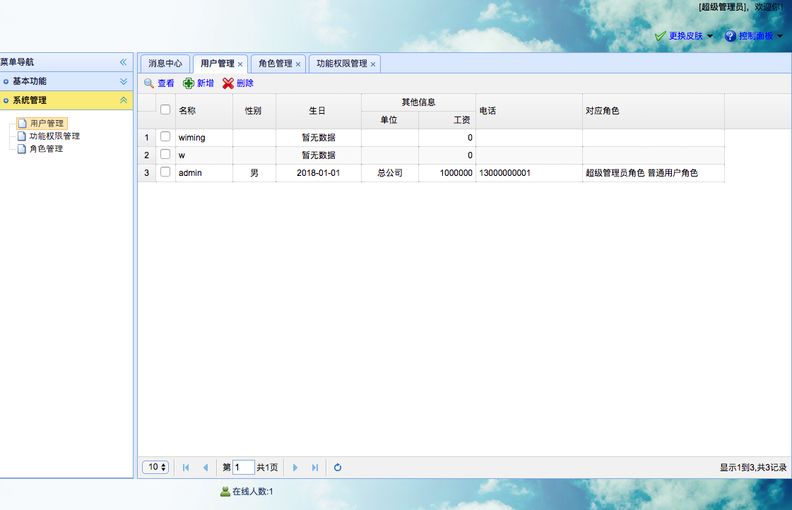

[TOC]


# BOS物流项目52———用户管理2\_分页查询


页面：WEB-INF/pages/admin/userinfo.jsp


## 一、页面调整

### 1.1 页面图示



### 1.2 修改分页获取地址


修改如下

```html
		$('#grid').datagrid( {
			iconCls : 'icon-forward',
			fit : true,
			border : false,
			rownumbers : true,
			striped : true,
			toolbar : toolbar,
			url : "userAction_pageQuery.action",
			pagination:true,
			fit:true,
			idField : 'id', 
			frozenColumns : frozenColumns,
			columns : columns,
			onClickRow : onClickRow,
			onDblClickRow : doDblClickRow
		});
```

---

## 二、后端处理

### 2.1 在UserAction中提供分页查询方法

```java
    /**
     * 分页查询
     * @return
     */
    public String pageQuery(){
        userService.pageQuery(pageBean);
        java2Json(pageBean,new String[]{"currentPage","detachedCriteria","pageSize","noticebills","roles"});
        return NONE;
    }
```


### 2.2 在User类中提供getRoleNames方法，getBirthdayString方法

```java
	public String getRoleNames(){
		String roleNames = "";
		for(Role role : roles){
			String name = role.getName();
			roleNames += name + " ";
		}
		return roleNames;
	}
	
	public String getBirthdayString(){
		if(birthday != null){
			String format = new SimpleDateFormat("yyyy-MM-dd").format(birthday);
			return format;
		}else{
			return "暂无数据";
		}
	}
```


---

## 三、图示


----


## 四、源码下载

[https://github.com/wimingxxx/bos-parent](https://github.com/wimingxxx/bos-parent/)