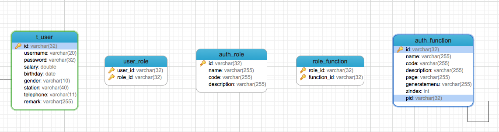

[TOC]


# BOS物流项目53———修改Realm中授权方法(查询数据库)


## 一、说明

之前我们的授权都是写死的，现在我们需要根据用户来判断用户有没有对应的权限，然后进行相应的操作。这个功能的实现就是通过后端的数据库来维护的。

---

## 二、修改Realm中的授权方法

授权方法修改，我们修改如下：

如果是“admin”账户，那么授予全部权限，如果是其他用户，通过用户id查询用户对于的权限。

```java
    /**
     * 授权
     * @param principalCollection
     * @return
     */
    @Override
    protected AuthorizationInfo doGetAuthorizationInfo(PrincipalCollection principalCollection) {
        SimpleAuthorizationInfo info = new SimpleAuthorizationInfo();
        //获取当前登陆用户对象
        User user = (User) principalCollection.getPrimaryPrincipal();
        //根据当前登陆的用户查询数据库,获取实际对应的权限
        List<Function> list = null;
        if(user.getUsername().equals("admin")){
            //admin查询所有权限 这里是查询出所有权限,而不是查询出树形结构的所有权限,所以不使用之前的findAll方法
            DetachedCriteria dc = DetachedCriteria.forClass(Function.class);
            list = functionDao.findByCriteria(dc);
        }else{
            //其他用户,根据用户id查询对应的权限
            list = functionDao.findFunctionListByUserId(user.getId());
        }
        if(list==null)
            return info;
        //循环添加权限
        for (Function function : list) {
            info.addStringPermission(function.getCode());
        }
        return info;
    }
```

---

## 三、FunctionDao中创建 findFunctionListByUserId 方法

### 3.1 说明

我们需要通过用户id来查询权限，现在，我们来看看他们用户表和权限表之间的关系。



我们可以看到，如果我们想要通过用户来查权限，需要关联5个表。

那么我们可以使用什么样的语句呢，这里我们使用的是 HQL，可以使用下面的语句

```sql
FROM Function f LEFT JOIN f.roles r LEFT OUTER JOIN r.users u WHERE u.id=?
``

上面的语句就会查询出数据了，它关联了五个表，那么封装数据的时候，返回的每个数据是这个对个对象的数组。

这个不是我们需要的，我们只需要权限，那么我们可以指定只返回权限的。前面加上 **SELECT f**

```sql
SELECT f FROM Function f LEFT JOIN f.roles r LEFT OUTER JOIN r.users u WHERE u.id=?
```

我们可以再去重一下

```sql
SELECT DISTINCT f FROM Function f LEFT JOIN f.roles r LEFT OUTER JOIN r.users u WHERE u.id=?
```

### 3.2  findFunctionListByUserId方法

```java
    /**
     * 根据用户id获取对应的权限
     *
     * @param uId
     * @return
     */
    @Override
    public List<Function> findFunctionListByUserId(String uId) {
        String hql = "SELECT DISTINCT f FROM Function f LEFT JOIN f.roles r LEFT OUTER JOIN r.users u WHERE u.id=?";
        List<Function> list = (List<Function>)getHibernateTemplate().find(hql,uId);
        return list;
    }
```


然后就可以通过用户来测试了。


----


## 四、源码下载

[https://github.com/wimingxxx/bos-parent](https://github.com/wimingxxx/bos-parent/)