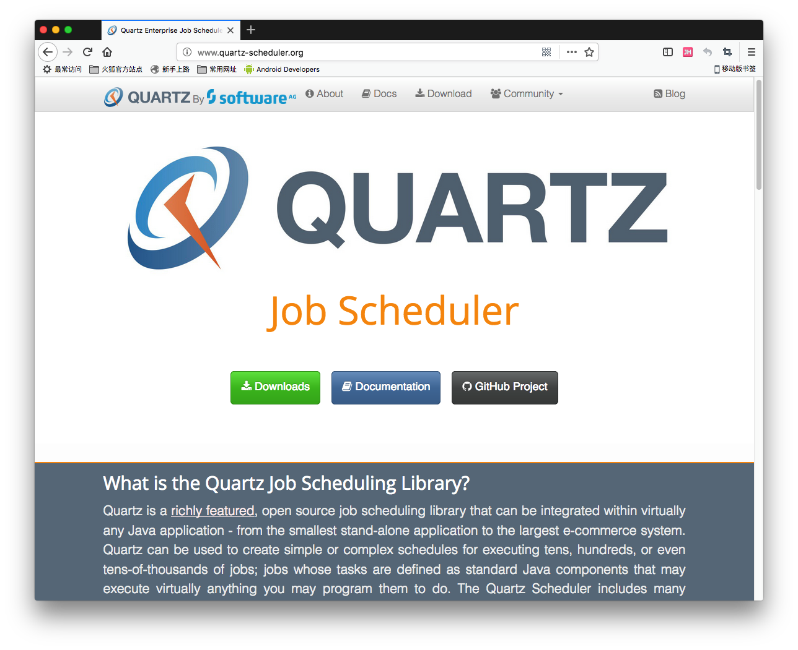
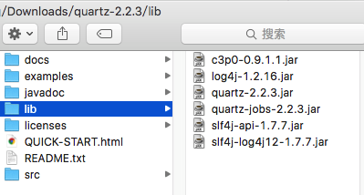

[TOC]

# BOS物流项目56———quartz1\_简介

## 一、简介

Quartz是OpenSymphony开源组织在Job scheduling领域又一个开源项目，它可以与J2EE与J2SE应用程序相结合也可以单独使用。Quartz可以用来创建简单或为运行十个，百个，甚至是好几万个Jobs这样复杂的程序。Jobs可以做成标准的Java组件或 EJBs。

---

## 二、下载

下载地址

[http://www.quartz-scheduler.org/](http://www.quartz-scheduler.org/)

---

## 三、解压以后的目录图示

---

## 四、源码下载

[https://github.com/wimingxxx/bos-parent](https://github.com/wimingxxx/bos-parent/)