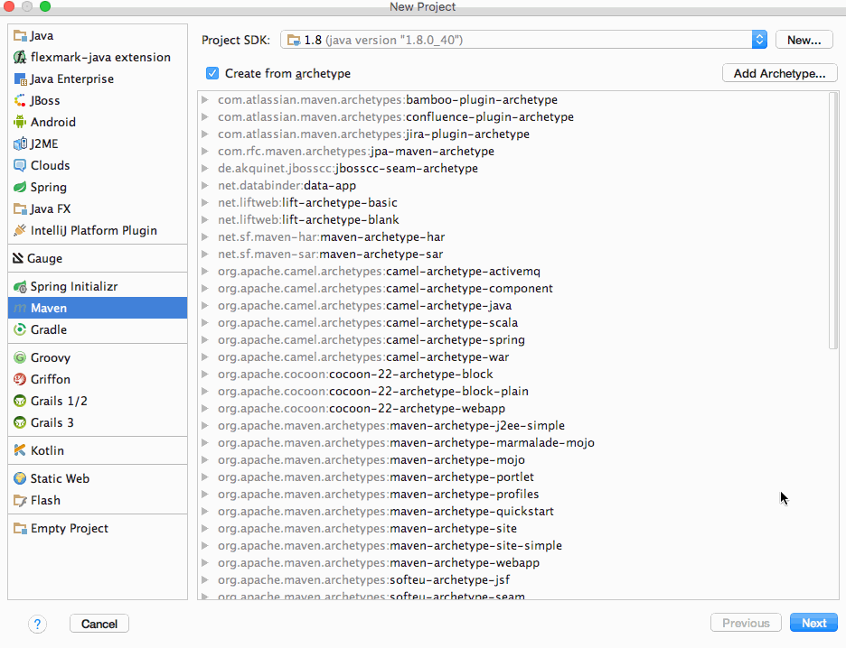

[TOC]


# BOS物流项目57———quartz2\_简单案例

## 一、使用步骤

现在我们创建一个Maven的java项目来测试。quartz使用步骤如下：

第一步：创建maven工程，导入spring和quartz相关依赖

第二步：创建任务类

第三步：在spring配置文件中配置任务类

第四步：在spring配置文件中配置JobDetail

第五步：在spring配置文件中配置触发器

第六步：在spring配置文件中配置scheduler

第七步：加载spring配置文件，创建spring工厂


---

## 二、创建maven工程，导入spring和quartz相关依赖

### 2.1 创建项目



### 2.2 导入spring和quartz相关依赖

```xml
<?xml version="1.0" encoding="UTF-8"?>
<project xmlns="http://maven.apache.org/POM/4.0.0"
         xmlns:xsi="http://www.w3.org/2001/XMLSchema-instance"
         xsi:schemaLocation="http://maven.apache.org/POM/4.0.0 http://maven.apache.org/xsd/maven-4.0.0.xsd">
    <modelVersion>4.0.0</modelVersion>

    <groupId>com.qwm</groupId>
    <artifactId>myquartz</artifactId>
    <version>1.0-SNAPSHOT</version>

    <!-- 通过属性定义指定jar的版本 -->
    <properties>
        <spring.version>4.2.4.RELEASE</spring.version>
        <hibernate.version>5.0.7.Final</hibernate.version>
        <struts2.version>2.3.24</struts2.version>
        <slf4j.version>1.6.6</slf4j.version>
        <log4j.version>1.2.12</log4j.version>
        <shiro.version>1.2.3</shiro.version>
    </properties>

    <dependencies>
        <dependency>
            <groupId>org.springframework</groupId>
            <artifactId>spring-context</artifactId>
            <version>${spring.version}</version>
        </dependency>

        <dependency>
            <groupId>org.springframework</groupId>
            <artifactId>spring-context-support</artifactId>
            <version>${spring.version}</version>
        </dependency>

        <dependency>
            <groupId>org.springframework</groupId>
            <artifactId>spring-web</artifactId>
            <version>${spring.version}</version>
        </dependency>

        <dependency>
            <groupId>org.springframework</groupId>
            <artifactId>spring-orm</artifactId>
            <version>${spring.version}</version>
        </dependency>

        <dependency>
            <groupId>org.springframework</groupId>
            <artifactId>spring-beans</artifactId>
            <version>${spring.version}</version>
        </dependency>

        <dependency>
            <groupId>org.springframework</groupId>
            <artifactId>spring-core</artifactId>
            <version>${spring.version}</version>
        </dependency>

        <dependency>
            <groupId>org.aspectj</groupId>
            <artifactId>aspectjweaver</artifactId>
            <version>1.7.4</version>
        </dependency>

        <!-- struts2 begin -->
        <dependency>
            <groupId>org.apache.struts</groupId>
            <artifactId>struts2-core</artifactId>
            <version>${struts2.version}</version>
            <!-- 排除传递的依赖 -->
            <exclusions>
                <exclusion>
                    <artifactId>javassist</artifactId>
                    <groupId>javassist</groupId>
                </exclusion>
            </exclusions>
        </dependency>
        <dependency>
            <groupId>org.apache.struts</groupId>
            <artifactId>struts2-spring-plugin</artifactId>
            <version>${struts2.version}</version>
        </dependency>
        <dependency>
            <groupId>org.apache.struts</groupId>
            <artifactId>struts2-convention-plugin</artifactId>
            <version>${struts2.version}</version>
        </dependency>
        <!-- struts2 end -->

        <!-- hibernate begin -->
        <dependency>
            <groupId>org.hibernate</groupId>
            <artifactId>hibernate-core</artifactId>
            <version>${hibernate.version}</version>
        </dependency>
        <!-- hibernate end -->

        <!-- log start -->
        <dependency>
            <groupId>log4j</groupId>
            <artifactId>log4j</artifactId>
            <version>${log4j.version}</version>
        </dependency>

        <dependency>
            <groupId>org.slf4j</groupId>
            <artifactId>slf4j-api</artifactId>
            <version>${slf4j.version}</version>
        </dependency>

        <dependency>
            <groupId>org.slf4j</groupId>
            <artifactId>slf4j-log4j12</artifactId>
            <version>${slf4j.version}</version>
        </dependency>
        <!-- log end -->

        <dependency>
            <groupId>org.apache.poi</groupId>
            <artifactId>poi</artifactId>
            <version>3.11</version>
        </dependency>

        <dependency>
            <groupId>org.apache.cxf</groupId>
            <artifactId>cxf-rt-frontend-jaxws</artifactId>
            <version>3.0.1</version>
        </dependency>
        <dependency>
            <groupId>org.apache.cxf</groupId>
            <artifactId>cxf-rt-transports-http</artifactId>
            <version>3.0.1</version>
        </dependency>
        <dependency>
            <groupId>junit</groupId>
            <artifactId>junit</artifactId>
            <version>4.10</version>
            <scope>test</scope>
        </dependency>

        <!-- 加入servlet和jsp的依赖 -->
        <dependency>
            <groupId>javax.servlet</groupId>
            <artifactId>servlet-api</artifactId>
            <version>2.5</version>
            <scope>provided</scope>
        </dependency>
        <dependency>
            <groupId>javax.servlet</groupId>
            <artifactId>jsp-api</artifactId>
            <version>2.0</version>
            <scope>provided</scope>
        </dependency>

        <!-- 引入pinyin4J的依赖 -->
        <dependency>
            <groupId>com.belerweb</groupId>
            <artifactId>pinyin4j</artifactId>
            <version>2.5.0</version>
        </dependency>

        <!-- 引入json-lib的依赖 -->
        <dependency>
            <groupId>net.sf.json-lib</groupId>
            <artifactId>json-lib</artifactId>
            <version>2.4</version>
        </dependency>

        <!-- 引入c3p0jar包 -->
        <dependency>
            <groupId>c3p0</groupId>
            <artifactId>c3p0</artifactId>
            <version>0.9.1.2</version>
        </dependency>

        <!-- 引入ehcache的依赖 -->
        <dependency>
            <groupId>net.sf.ehcache</groupId>
            <artifactId>ehcache-core</artifactId>
            <version>2.6.6</version>
        </dependency>
        <!-- 引入shiro框架的依赖 -->
        <dependency>
            <groupId>org.apache.shiro</groupId>
            <artifactId>shiro-all</artifactId>
            <version>1.2.2</version>
        </dependency>
        <!-- 引入MySQL数据库驱动依赖 -->
        <dependency>
            <groupId>mysql</groupId>
            <artifactId>mysql-connector-java</artifactId>
            <version>5.1.32</version>
        </dependency>

        <!-- 引入quartz对应的依赖 -->
        <dependency>
            <groupId>org.quartz-scheduler</groupId>
            <artifactId>quartz</artifactId>
            <version>2.2.3</version>
        </dependency>
        <dependency>
            <groupId>org.quartz-scheduler</groupId>
            <artifactId>quartz-jobs</artifactId>
            <version>2.2.3</version>
        </dependency>
    </dependencies>

</project>
```

---


## 三、创建任务类

创建任务类

```java
/**
 * @author: qiwenming(杞文明)
 * @date: 18/1/1 下午6:09
 * @className: MyJob
 * @description:
 */
public class MyJob {
    public void run(){
        System.out.println("任务执行了   " +
                new SimpleDateFormat("yyyy-MM-dd HH:mm:ss").format(new Date()));
    }
}
```


---

## 四、在spring配置文件中配置任务类

```xml
    <!--配置任务类-->
    <bean id="myJob" class="com.qwm.myquartz.MyJob"/>
```


---


## 五、在spring配置文件中配置JobDetail

在JobDetail中主要配置，Job的实例，以及实例中的需要调用的方法。

```xml
    <bean id="myJobDetail" class="org.springframework.scheduling.quartz.MethodInvokingJobDetailFactoryBean">
        <!--注入Job实例-->
        <property name="targetObject" ref="myJob"/>
        <!--Job实例中的方法-->
        <property name="targetMethod" value="run"/>
    </bean>
```

----


## 六、在spring配置文件中配置触发器

```xml
    <!--在spring配置文件中配置触发器-->
    <bean id="myTigger" class="org.springframework.scheduling.quartz.CronTriggerFactoryBean">
        <property name="jobDetail" ref="myJobDetail"/>
        <!--每一秒执行一次-->
        <property name="cronExpression" value="0/1 * * * * ?"/>
    </bean>
```


----


## 七、在spring配置文件中配置scheduler

```xml
    <!--配置Scheduler工厂-->
    <bean id="scheduler" class="org.springframework.scheduling.quartz.SchedulerFactoryBean">
        <property name="triggers">
            <list>
                <ref bean="myTigger"/>
            </list>
        </property>
    </bean>
```

---

## 八、加载Spring配置文件，创建spring工厂

```java
/**
 * @author: qiwenming(杞文明)
 * @date: 18/1/1 下午6:35
 * @className: App
 * @description:
 * 测试
 */
public class App {
    public static void main(String[] args){
        ClassPathXmlApplicationContext classPathXmlApplicationContext
                = new ClassPathXmlApplicationContext("applicationContext.xml");
    }
}
```

---

## 九、测试


运行上面的代码以后，我们发现控制台一直在每隔1秒打印一句话，如下

```
任务执行了   2018-01-01 18:37:05
任务执行了   2018-01-01 18:37:06
任务执行了   2018-01-01 18:37:07
任务执行了   2018-01-01 18:37:08
任务执行了   2018-01-01 18:37:09
任务执行了   2018-01-01 18:37:10
任务执行了   2018-01-01 18:37:11
..........
```


---


## 十、源码下载

[https://github.com/wimingxxx/bos-parent](https://github.com/wimingxxx/bos-parent/)

