[TOC]


# BOS物流项目60———Highcharts1\_简介

## 一、Highcharts简介

Highcharts 是一个用纯JavaScript编写的一个图表库， 能够很简单便捷的在web网站或是web应用程序添加有交互性的图表，并且免费提供给个人学习、个人网站和非商业用途使用。HighCharts支持的图表类型有曲线图、区域图、柱状图、饼状图、散状点图和综合图表。

基于jQuery开发一个图形报表工具插件

---

## 二、Highcharts下载

官网

[http://www.hcharts.cn/](http://www.hcharts.cn/)

图示


下载网址 

[https://www.hcharts.cn/download](https://www.hcharts.cn/download)

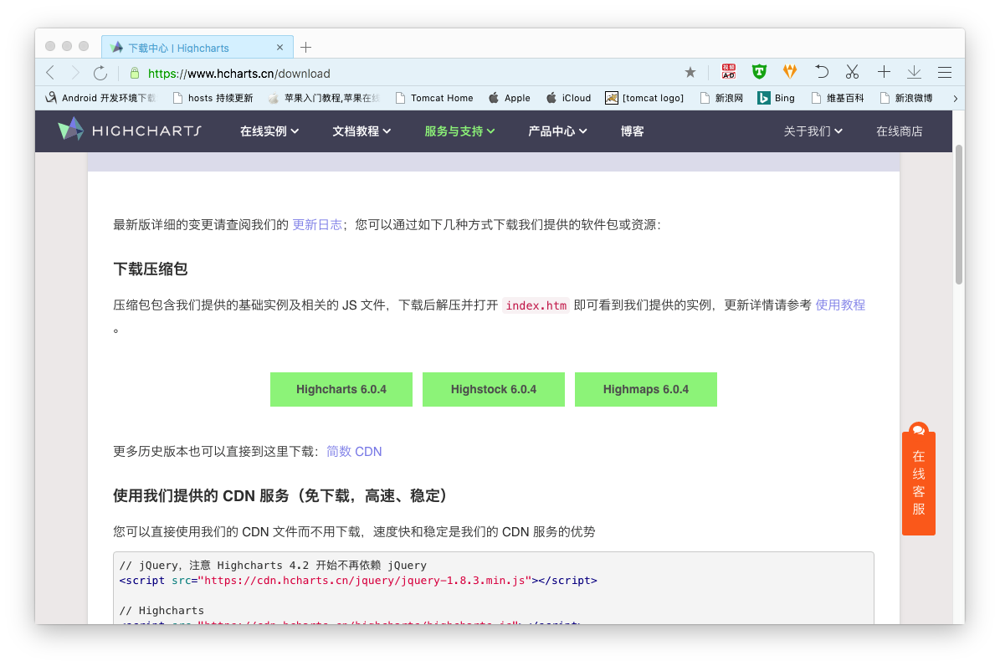

下载以后的解压的图示

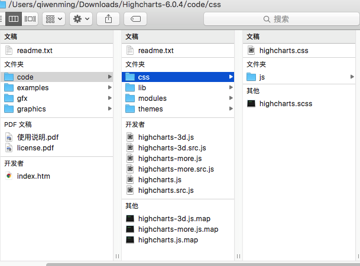


目录结果说明


```java
|-- examples           例子
|-- gfx                例子用到的图片资源
|-- graphics           例子用到的图片资源 
|-- code               所有 js 文件及源代码
    |-- css            Highcharts css 文件（只用于 CSS 版本 Highcharts） 
    |-- lib            相关的库文件
    |-- modules        功能模块文件目录
    |-- themes         主题文件目录
    |-- highcharts.js              highcharts 主文件
    |-- highcharts.src.js          highcharts 主文件源码
    |-- highcharts-3d.js           highcharts 3d 功能文件
    |-- highcharts-3d.src.js       highcharts 3d 功能文件源码
    |-- highcharts-more.js         highcharts 增加功能文件
    |-- highcharts-more.src.js     highcharts 增加功能文件源码
    |-- readme.txt                 源代码目录说明文件
|-- index.htm          例子入口文件 
|-- license.pdf        使用协议文档
|-- readme.txt         说明文件
```

---


## 三、图表主要组成

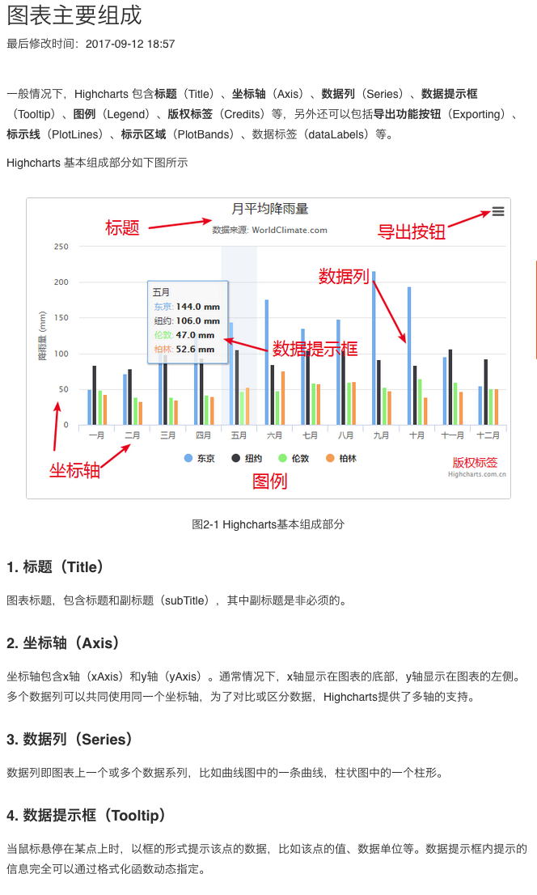

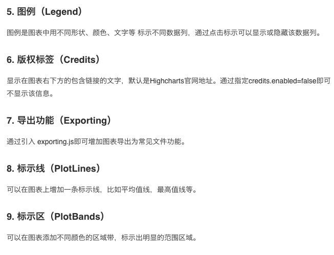


----


## 四、demo图示

地址 

[https://www.hcharts.cn/demo/highcharts](https://www.hcharts.cn/demo/highcharts)


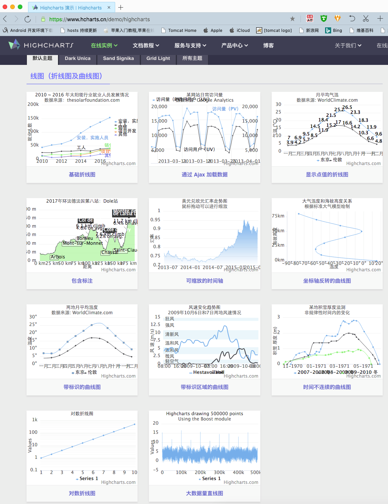

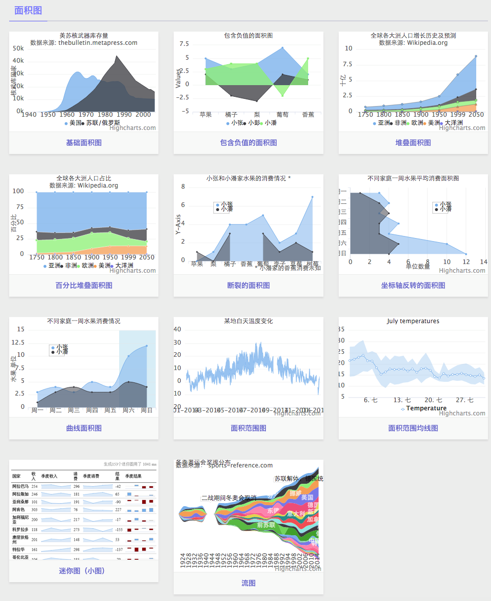

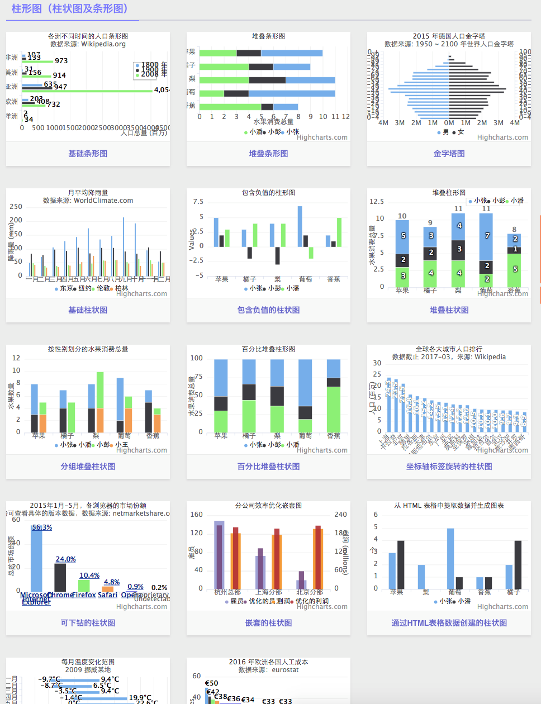

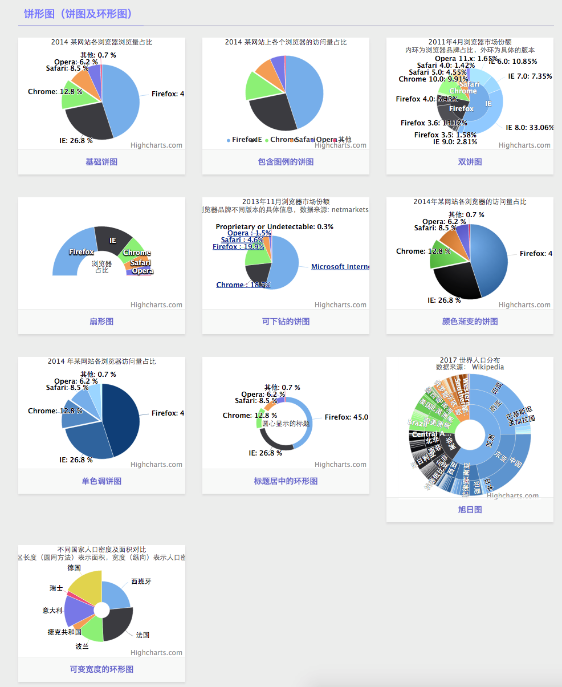

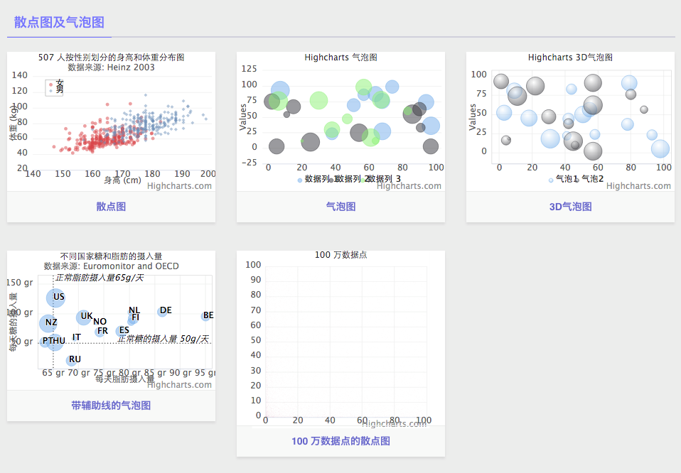

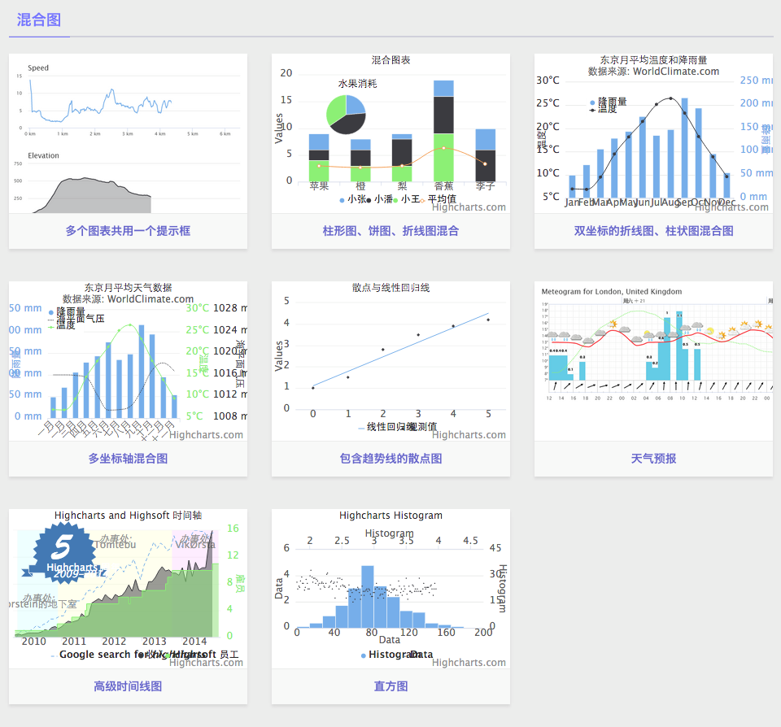

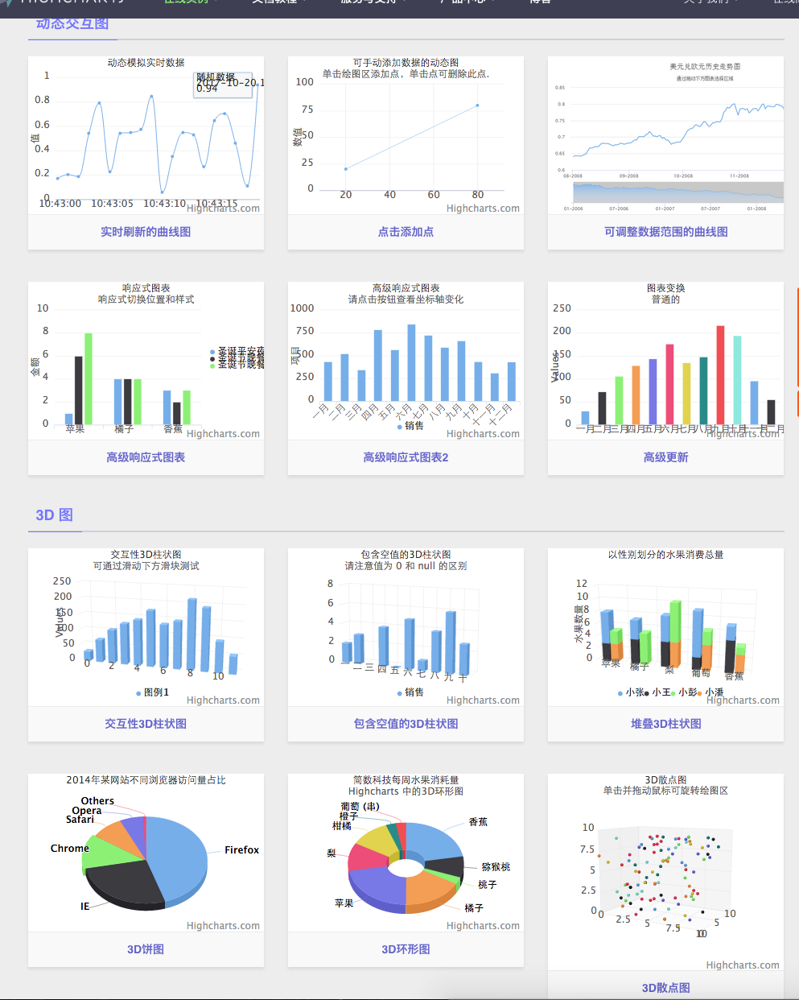

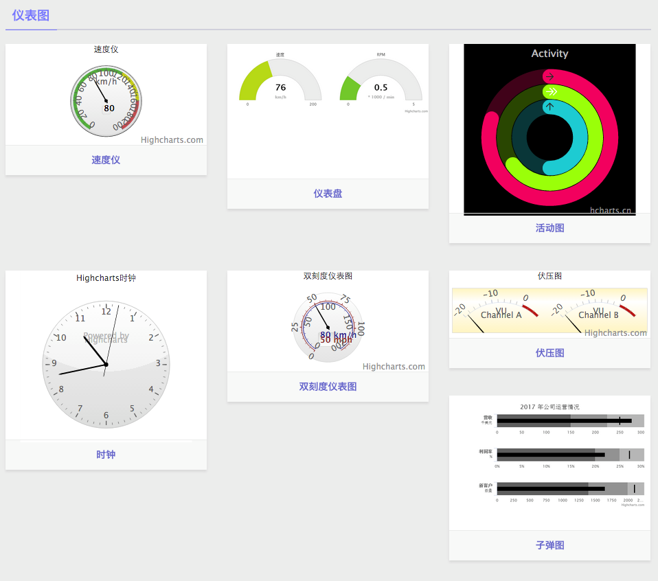

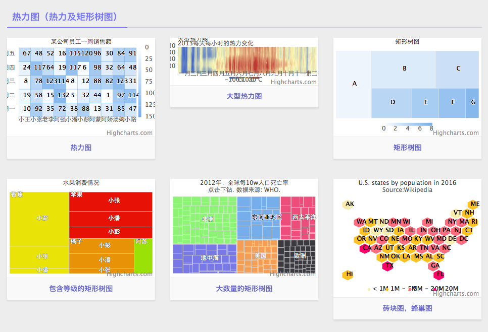

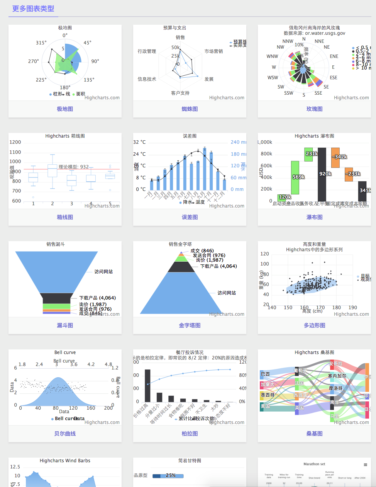


---


## 五、源码下载

[https://github.com/wimingxxx/bos-parent](https://github.com/wimingxxx/bos-parent/)