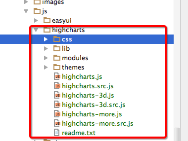
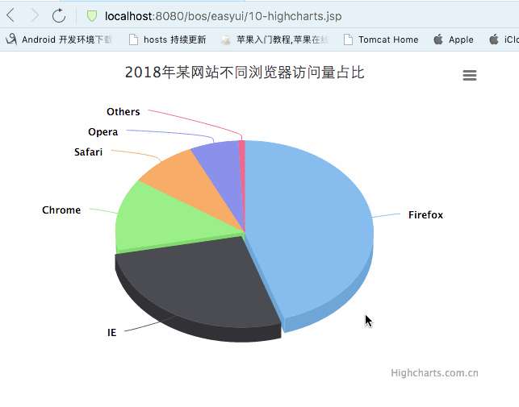

[TOC]


# BOS物流项目61———Highcharts2\_简单例子

## 一、创建jsp页面

首先创建一个测试的jsp页面，名称为 **10-highcharts.jsp**

在 webapp/js中导入 **highcharts** 的js文件，
如下




jsp中导入相关js文件，依赖于jQuery,这里面，我们来演示 3D 的 饼状图。

导入以下文件

```html
    <script type="text/javascript" src="${pageContext.request.contextPath }/js/jquery-1.8.3.js"></script>
    <script type="text/javascript" src="${pageContext.request.contextPath }/js/highcharts/highcharts.js"></script>
    <script type="text/javascript" src="${pageContext.request.contextPath }/js/highcharts/highcharts-3d.js"></script>
    <script type="text/javascript" src="${pageContext.request.contextPath }/js/highcharts/modules/exporting.js"></script>
```


---

## 二、创建一个3d的饼状图

在绘图前我们需要为 Highcharts 准备一个 DOM 容器，并指定其大小

```html
<div id="container" style="width: 600px;height:400px;"></div>
```

然后通过 Highcharts 的初始化函数 Highcharts.chart 来创建图表，该函数接受两个参数，第一个参数是 DOM 容器的 Id，第二个参数是图表配置，代码如下：


```jsp
<%--
  Created by IntelliJ IDEA.
  User: qiwenming
  Date: 17/12/17
  Time: 下午7:20
  To change this template use File | Settings | File Templates.
--%>
<%@ page contentType="text/html;charset=UTF-8" language="java" %>
<html>
<head>
    <title>Combobox测试</title>
    <link rel="stylesheet" type="text/css"/>
    <script type="text/javascript" src="${pageContext.request.contextPath }/js/jquery-1.8.3.js"></script>
    <script type="text/javascript" src="${pageContext.request.contextPath }/js/highcharts/highcharts.js"></script>
    <script type="text/javascript" src="${pageContext.request.contextPath }/js/highcharts/highcharts-3d.js"></script>
    <script type="text/javascript" src="${pageContext.request.contextPath }/js/highcharts/modules/exporting.js"></script>
    <script type="text/javascript" src="${pageContext.request.contextPath }/js/highcharts/plugins/highcharts-zh_CN.js"></script>

</head>
<body>

<div id="container" style="width: 600px;height:400px;"></div>

<script type="text/javascript">
    $(function () {
        $('#container').highcharts({
            chart: {
                type: 'pie',
                options3d: {
                    enabled: true,
                    alpha: 45,
                    beta: 0
                }
            },
            title: {
                text: '2018年某网站不同浏览器访问量占比'
            },
            tooltip: {
                pointFormat: '{series.name}: <b>{point.percentage:.1f}%</b>'
            },
            plotOptions: {
                pie: {
                    allowPointSelect: true,
                    cursor: 'pointer',
                    depth: 35,
                    dataLabels: {
                        enabled: true,
                        format: '{point.name}'
                    }
                }
            },
            series: [{
                type: 'pie',
                name: '浏览器占比',
                data: [
                    ['Firefox',   45.0],
                    ['IE',       26.8],
                    {
                        name: 'Chrome',
                        y: 12.8,
                        sliced: true,
                        selected: true
                    },
                    ['Safari',    8.5],
                    ['Opera',     6.2],
                    ['Others',   0.7]
                ]
            }]
        });
    });
</script>

</body>
</html>

```

---


## 三、图示





---


## 四、源码下载

[https://github.com/wimingxxx/bos-parent](https://github.com/wimingxxx/bos-parent/)